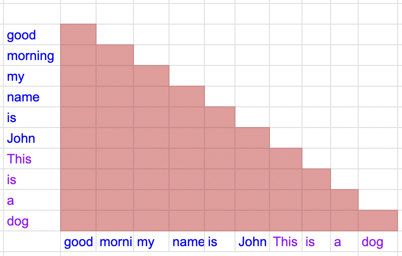
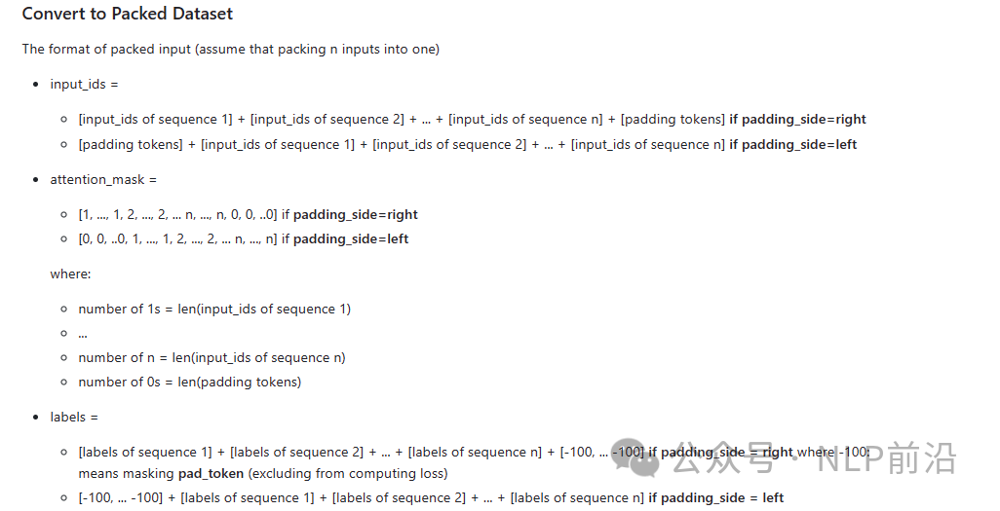

# 1. 简介

- Github: https://github.com/MeetKai/functionary/tree/main/functionary/train/packing
- 核心原理就是把数据拼接起来，处理好attention mask，预训练阶段一般也会这么做

缺点：

- 好像只能使用他的MistralForCausalLM, LlamaForCausalLM or MixtralForCausalLM加载模型

其它类似方案：

- TRL库中有提及：https://huggingface.co/docs/trl/sft_trainer
- LLama Factory中有编写：https://github.com/hiyouga/LLaMA-Factory

# 2. 原理

packing 的概念是将短输入合并/打包成单个输入，从而减少训练数据的数量。

具体来说，当打包输入时，注意力应该只集中在各个序列内部。例如，假设我们正在打包2个输入：打包后的输入 = [输入1] [输入2]。
来自输入1的标记只会关注输入1中的标记，而来自输入2的标记只会关注输入2中的标记。如下图的attention mask就是有问题的



正确的attention mask如下


打包的明显好处是减少训练时间。这种减少取决于pack_length和原始数据点的长度。例如，在我们的模型（functionary）
训练中，我们发现训练时间从15小时减少到5小时，几乎是没有打包时的1/3。对于像tatsu-lab/alpaca这样的短数据，
如果我们选择pack_length=4096，在原始的52k数据点中，我们可以打包成只有1567个数据点。因此，训练时间只有原始训练数据的约3%。

一些注意事项：

- pack_length >= max_length（用于对数据进行标记）。如果pack_length很大，打包后的数据点数量会很小。
- 注意打包后的数据点数量。例如，您的原始数据集包含5000个数据点，打包成：96个数据点。
  如果您在训练中设置batch_size=32 --> 模型的权重只更新3次 --> 结果会很差。因此，在使用打包时，
  您应该注意打包后的数据点数量，以调整训练的超参数，例如：pack_length、gradient_accumulation_steps等。以确保训练步骤的数量足够多。



```python
from packed_dataset import PackedDataset
# Note that pack_length must be >= max_leng used tokenizing the dataset
# original_ds[index] --> {"input_ids": xxx, "attention_mask": xxx, "labels": xxx}, labels is not necessarily required
packed_ds = PackedDataset(original_ds, tokenizer, pack_length)

from monkey_patch_packing import monkey_patch_packing_llama
monkey_patch_packing_llama() # Monkey-patch LlamaForCausalLM
...
# Load the model
model = transformers.AutoModelForCausalLM.from_pretrained(model_path, ...)
model.config.use_cache = False
```

# 参考

[1] Packing inputs：加速大模型微调训练速度的新开源框架，https://mp.weixin.qq.com/s/WyNE3U9cK1YWD_m9NWr4uQ