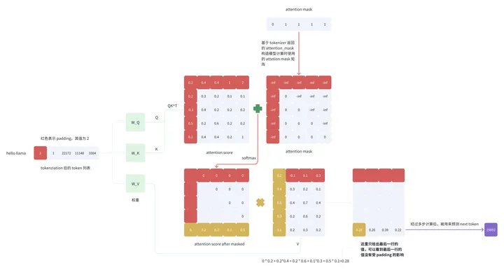

# 1. LLM Padding介绍

如果采用右padding，输出结果

```text
'<s> I want to go to space</s></s>``</s></s>``</s></s>``</s></s>``<s>nobody wants to go',
```

1. encoder-only模型主要采用right-padding的原因是,填充右侧的方式很直观,
   并且我们有时需要获得每个句子的首个token(cls),左侧不对齐不好操作
2. decoder-only模型采用 left-padding的原因是, 
   模型的输入是对模型输入的延续(模型的输出中会带着输入,并在输入后边补充输出),如果采用right-padding,
   会导致大量的[pad]token夹在模型的输入和输入之间,不利于处理结果.并且模型的输出句子的语义也被pad打乱了,
   输入并不直观.此外,decoder-only的模型并不需要cls等开头的token来做额外的处理,
   right-padding在decoder-only的模型中没有任何优势.
3. decoder-only的模型也可以使用right-padding方式,如果设置 skip_special_tokens=True 也应该会获得正确的输入,但是不建议使用.



从图 4 的计算过程可以看到，使用 padding_side='left' 的方式，attention score after masked 
矩阵的最后一行和 V 的第一列进行内积后得到的值为正确且符合期望的值，即最后一个 token 所对应的 logit
的计算没有受 padding 的影响，该 logit 的计算过程正确。

我们接下来看一下 padding_side='right' 的最后一个 logit 的计算过程：


从图 5 的计算过程可以看到，attention score after masked 矩阵的最后一行和 V 的第一列
进行内积后得到的值是不符合期望的，即最后一个 token（pad token）所对应的 logit 的计算不正确，
因为 pad token 也参与了计算，而正确预测 next token 的时候 pad token 是不应该参与计算的。

至此，我们弄清楚了为什么 padding_side='right' 会产生不正确的结果。

# 参考

[1] 大部分的大模型(LLM)采用左填充(left-padding)的原因，https://zhuanlan.zhihu.com/p/646852375
[2] LLM padding 细节，https://zhuanlan.zhihu.com/p/675273498
