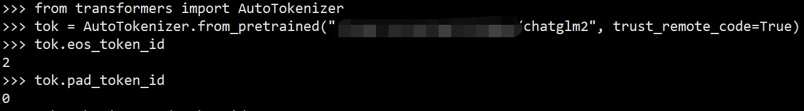

# 1. 问题

```text
我也遇到了相似的问题，在用自己的数据进行微调之后，有的能停止，有的会在后边不断重复
正确的例子：剩余电量还能达到老公家吗？
错误的例子：设置途经点成都行吗途经点吧途经点吧途经点吧途经点吧途经点吧途经点吧途经点吧途经点吧
途经点吧途经点吧途经点吧途经点吧途经点吧途经点吧途经点吧途经点吧途经点吧途经点吧途经点吧途经点吧
途经点吧途经点吧途经点吧途经点吧途经点吧途经点吧途经点吧途经点吧途经点吧途经点吧途经点吧途经点吧
途经点吧途经点吧途经点吧途经点吧途经点吧途经点吧途经点吧途经点吧途经点吧途经点吧途经点吧途经点吧
途经点吧途经点吧途经点吧途经点吧途经点吧途经点吧途经点吧途经点吧途经点吧途经点吧途经点吧途经点吧
途经点吧途经点吧途经点吧途经点吧途经点吧途经点吧途经点吧途经点吧途经点吧途经点吧途经点吧途经点吧
途经点吧途经点吧途经点吧途经点吧途经点吧途经点吧途经点吧途经点吧途经点吧途经点吧途经点吧途经点吧
途经点吧途经点吧途经点吧途经点吧途经点吧途经点吧途经点吧途经点吧途经点吧途经点吧途经点吧途经点吧
```

# 2. 方案

1. token错误导致

    我使用的并不是最新的版本，是最早发布的版本。在我使用的版本中出问题的关键原因是，
    eos_token_id和pad_token_id一样，都是2。代码中在140在对label进行处理的时候，
    将pad_token_id全部替换为ignore（-100）的时候 将eos_token_id也替换成了-100。
    从而导致label最终没有eos_id从而不能停止。目前参考前边进行修改，我已经能够正常停止，
    不再产生停止不能重复的情况。
    
    

    ```python
    print(tokenizer.eos_token_id)
    print(tokenizer.bos_token_id)
    print(tokenizer._convert_token_to_id(tokenizer.bos_token))
    ```

2. 训练数据预处理后是不是eos结尾

3. 解码可以设置惩罚系数，repetition_penalty

4. 解码限制最大输出长度

5. 排查语料问题以及多样性

6. 其它

   调整上下文的长度可能会解决重复输出的问题，这是因为上下文的长度直接影响了模型对输入
   文本的理解和生成输出的方式。让我们来详细解释为什么调整上下文长度可以有助于解决这个问题：

   - 上下文长度影响信息量：模型的上下文长度是指模型在生成回复时可以看到的之前的输入文本的长度。
      如果上下文长度过短，模型可能没有足够的信息来正确地理解输入的含义，从而导致生成不连贯或重复的回复。
   - 避免短期记忆问题：在对话生成任务中，特别是当上下文长度很短时，模型可能会过度依赖于最近的输入，
      而忽略了之前更长期的上下文。这种短期记忆问题可能导致模型在输出中不断重复之前的内容。
   - 提供更多背景信息：增加上下文长度可以提供更多的背景信息，使得模型能够更全面地理解对话上下文，
      并生成更合理、多样化的回复。
   - 缓解过拟合：调整上下文长度可以有效地缓解模型的过拟合问题。较长的上下文有助于模型更好地泛化，
     并减少在微调数据中出现的重复模式。

   解决方案：
    
   - 增加微调数据：尽量提供更多的微调数据，以帮助模型学习更广泛和多样化的文本模式，从而减少过拟合的风险。
   - 添加多样性：在微调数据中包含更多多样化的对话和主题，以确保模型可以在不同情况下表现良好。
   - 调整模型参数：通过调整模型的超参数，例如学习速率、批次大小等，可以减轻模型的过拟合倾向。
   - 早停（Early Stopping）策略：监控模型在验证集上的性能，并在性能停止改善时停止微调，以避免继续训练模型过拟合。
   - 数据增强（Data Augmentation）：尝试在微调数据上应用一些简单的数据增强技术，如随机删除或替换一些词语，以增加数据的多样性。


# 参考

[1] lora 微调长文本，输出内容不断重复, https://github.com/THUDM/ChatGLM2-6B/issues/270
[2] #05【chatglm】lora微调几条数据，硬是重复输出几分钟？那里问题？-已解决，https://zhuanlan.zhihu.com/p/647399542