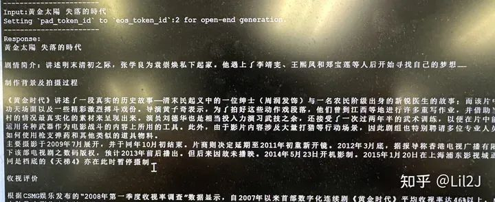
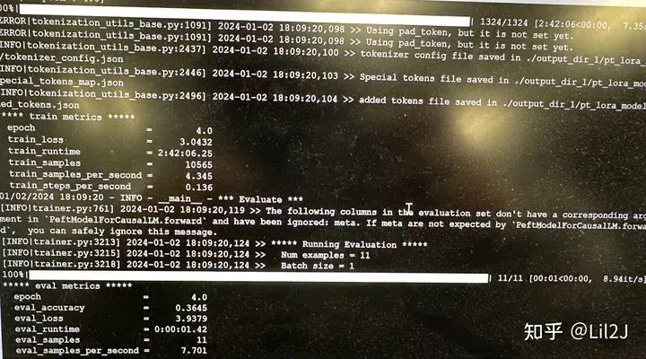
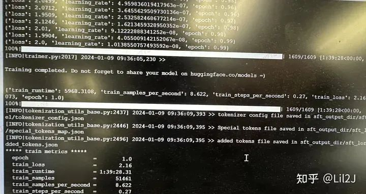

# 1. 简介

文章主要包括：

- 预训练
- Tokenizer 训练
- 指令微调（Instruction Tuning）

基座选取的是llama1-7b。 之所以选定llama1-7b作为基座模型，主要原因在于该模型在中文处理方面的表现尚存在提升空间。
鉴于此，我们在llama1-7b的基础上，对大量中文语料进行额外的预训练，预期能够较为迅速且显著地改善其对中文文本的理解和生成能力。 
通过这样的策略，我们旨在针对中文场景定制优化llama1-7b模型，以期在保持原有性能优势的同时，弥补其在处理中文任务时的不足，
进一步提升模型在中文自然语言处理领域的应用效果。

使用代码框架：
https://github.com/ymcui/Chinese-LLaMA-Alpaca

# 2. 方法
## 2.1 数据集

因为我这次只是为了实践一下使用llama做中文继续预训练的效果，
所以并没有使用太多数据进行训练。我只用了一百万篇中文维基百科数据做预训练的语料和alplca_zn_51k做指令微调的数据集。

维基数据集的下载地址：

https://github.com/brightmart/nlp_chinese_corpus?tab=readme-ov-file

alplca_zn_51k的下载地址：

https://github.com/enze5088/Chatterbox/tree/main/docs/datasets

## 2.2 llama的原生Tokenizer扩充
### 2.2.1 对llama的原生Tokenizer扩充的目的

原版LLaMA模型的较小词表大小（32K），而llama词表中仅包含几百个中文token，
则意味着汉字将被sentencepiece等分词工具有可能拆分成为多个字节码的token，这不仅增加了序列长度，
降低了编码效率，而且可能导致模型理解语义的难度增大。

至于为什么汉字将被sentencepiece等分词工具有可能拆分成为多个字节码的token，
这是因为llama使用的tokenizer分词方法是：BPE。

因此，我们要对对llama的原生Tokenizer扩充。

### 2.2.2 如何进行扩充

```shell
pip install sentencepiece
```

安装完成后，使用sentencepiece训练词表，有两种方法进行训练

1. 直接命令行调度训练

    ```shell
    spm_train --input=<input> --model_prefix=<model_name> --vocab_size=8000 --character_coverage=1.0 --model_type=<type>
    ```

2. 使用python代码进行训练

    ```python
    import sentencepiece as spm
    spm.SentencePieceTrainer.train(input=<input>, model_prefix=<model_name>, vocab_size=8000, character_coverage=1.0, model_type=<type>)
    ```
    
    这里面的参数可以参考这篇文章，他关于参数的详解写的非常仔细了
    
    https://zhuanlan.zhihu.com/p/655281268

### 2.2.3 词表合并

虽然我们通过上面的方式已经训练出来一个新的词表了，但是我们这次项目做的是继续预训练，
所以并不能丢掉之前词表，不然做的就不是继续预训练了，而是完全从头做预训练了。所以，
我们要在原来的词表基础上合并我们刚刚训练好的词表。

合并的脚本在Chinese-LLaMA-Alpaca项目中有

```python
python merge_tokenizers.py \
  --llama_tokenizer_dir llama_tokenizer_dir \
  --chinese_sp_model_file chinese_sp_model_file
```

具体的使用方法：

https://github.com/ymcui/Chinese-LLaMA-Alpaca/wiki/训练细节


Chinese-LLaMA-Alpaca关于词表扩充的介绍

## 2.3 继续预训练

运行Chinese-LLaMA-Alpaca项目中的scripts/training/run_pt.sh[1]

如果是单机单卡运行的话，记得把torchrun和deepspeed去掉，不然会报错

在开始训练之前，Chinese-LLaMA-Alpaca项目中有些代码需要进行修改，可能是peft库的版本问题，
如果你直接使用运行，生成的lora权重只有443b的大小

https://github.com/ymcui/Chinese-LLaMA-Alpaca/issues/711

你要注释以下代码：

```python
old_state_dict = model.state_dict

model.state_dict = (
    lambda self, *_, **__: get_peft_model_state_dict(self, old_state_dict())
).__get__(model, type(model))
```

### 2.3.1 首先只进行embedding训练

主要目标是对新增中文词汇的适应性训练。在这个阶段，我们将原模型的Transformer主体结构参数
（如自注意力层、前馈神经网络层等）进行冻结处理，即不对这些参数进行更新。重点在于仅训练embedding层，
确保新加入的中文词向量能够与原有模型的语义空间相协调，从而在尽可能不改变模型原有性能的基础上，实现对中文词汇的良好表示和理解。

在训练之前，将除了Embedding之外的层设置为param.requires_grad = False，如下所示：

```python
for name, param in model.named_parameters():
    if "model.embed_tokens" not in name:
        param.requires_grad = False
```

训练参数和结果

- 训练语料大小：20w篇中文维基百科
- 训练耗时：1小时

```text
bs=16
最大长度为512
epoch 4
学习率 6e-5
lr_scheduler  cosine
weigth_decay 0.1
```




现在生成的结果已经一股维基百科味道了，但是有两个问题：

1. 模型的输出和我的输入无关
2. 有很多内容是无中生有

### 2.3.2 拿一部分维基百科数据进行预训练

这部分主要是观察，使用wiki百科的语料训练是否有效，如果拿全量的100w篇维基百科数据进行训练，太耗时了。

基于上面的原因，我只用了20w篇维基百科进行实验。

训练参数和结果
- 训练语料大小：20w篇中文维基百科
- 训练耗时：3小时

```text
bs=32
最大长度为512
lora的结构为 q_proj,v_proj,k_proj,o_proj,gate_proj,down_proj,up_proj
modules_to_save embed_tokens,lm_head
lora_rank 64
lora_alpha 32 
lora_dropout 0
epoch 4
学习率 6e-4
lr_scheduler  cosine
weigth_decay 0.1
```



20w篇维基百科训练后的loss

和只进行embedding训练对比，现在生成的结果能关联到我的输入了，但是还有以下的问题：

1. 输出的一部分内容还是在无中生有，有幻想。
2. 推理的结果，生成的序列越长效果越差（缺少外推性）

### 2.3.3 拿全量维基百科数据进行预训练

因为拿一部分数据预训练后，已经出一点效果了，所以在这部分，我拿全量的一百万篇维基百科进行预训练

插曲：这里有个很有意思的地方：就是使用20w篇维基百科进行预训练的时候，loss到3和2.9之间就会收敛了，无论再怎么继续训练，
它的loss也不会下降。可是把数据量增加到100w篇后，虽然只训练了一轮，loss已经能降到2.6左右，我们这次实践也证明出了scaling law
是真实有效的。

训练参数和结果

- 训练语料大小：100w篇中文维基百科
- 训练耗时：40小时

```text
bs=32
最大长度为512
lora的结构为 q_proj,v_proj,k_proj,o_proj,gate_proj,down_proj,up_proj
modules_to_save embed_tokens,lm_head
lora_rank 64
lora_alpha 32 
lora_dropout 0
epoch 1
学习率 2e-4
lr_scheduler  cosine
weigth_decay 0.1
```


100w篇维基百科预训练结果

用了100w篇维基百科训练后，模型的推理生成已经有点模样了，特别是在一些专有类别，
因为这些类别特征很少会和其他的特征重合的，比如 学科解释，地名等。

但是如果是人物解释的话，还是会生成不准，特别是关于歌手明星这种，可能大多数歌手明星的特征都差不多，大模型会变成缝合怪。

然后还有一个缺点是生成生成着就生成偏了，后面的生成跟前面的毫无关系，或者也有一开始就直接生成都是错的。

# 3. 指令微调

运行Chinese-LLaMA-Alpaca项目中的scripts/training/run_sft.sh[2]

如果是单机单卡运行的话，记得把torchrun和deepspeed去掉，不然会报错

在开始训练之前，Chinese-LLaMA-Alpaca项目中有些代码需要进行修改，可能是peft库的版本问题，
如果你直接使用运行，生成的lora权重只有443b的大小

https://github.com/ymcui/Chinese-LLaMA-Alpaca/issues/711

你要注释以下代码：

```python
old_state_dict = model.state_dict

model.state_dict = (
    lambda self, *_, **__: get_peft_model_state_dict(self, old_state_dict())
).__get__(model, type(model))
```

## 3.1 训练参数和结果

训练语料大小：5w1条QA数据


训练耗时：1小时

```text
bs=32
最大长度为512
lora的结构为 q_proj,v_proj,k_proj,o_proj,gate_proj,down_proj,up_proj
lora_rank 8
lora_alpha 32
lora_dropout 0.05
epoch 1
学习率 1e-4
lr_scheduler cosine
weigth_decay 0.1
modules_to_save embed_tokens,lm_head
```



sft结果

经过sft微调之后，已经有一定的回答能力了，并且具有结合中文知识的能力

根据上面的例子，其实我是有点小震惊的，为什么它能输出sft数据集中不存在的output，但是它的输出却十分地正确，
我想这应该就是预训练的发挥的作用吧，让它理解到语料之间的联系，并不是一味地拟合数据集的结果，
而是在预训练中学会了这些知识，然后再sft的训练中被激发出来。

# 4. 总结

经过中文语料训练的模型，能更好地理解中文并且精确地回答出来。而llama其实也能理解到我们的回答，
但是它的输出会混有很多英文，它还是更偏向于英文。

sft后，模型有一定对话能力

对模型进行继续预训练是对模型的效果是有提升的，特别是原模型特别不支持你想要的语料时。
但是，但这种方法需要消耗大量的时间和计算资源，对于资源有限的研究者或开发者来说可能并不实际。

未来，我可能会对其他模型进行同样的继续预训练实验，并且会加大数据集的规模。可能，我还想试一下全参继续预训练的效果
（虽然现在暂时没有这个资源）。

# 参考

[1] 大模型继续预训练实践！让LLM更好地学会中文，https://mp.weixin.qq.com/s/cgW0xMQNn7Q6N92O_4GZPw