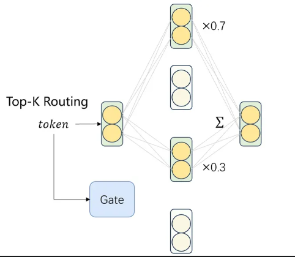
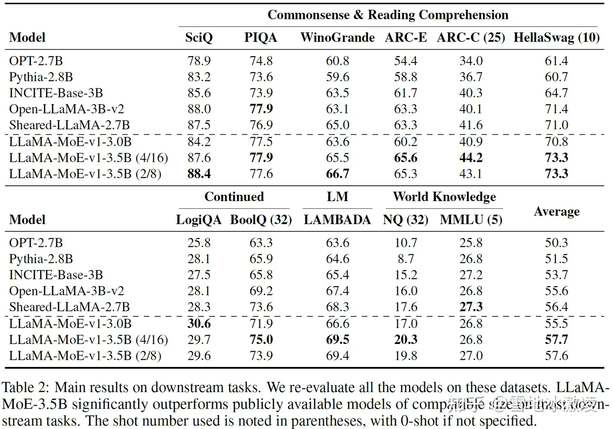

# 1. 开源项目

1. Firefly mixtral 8x7b
   - https://github.com/WangRongsheng/Aurora
   - https://huggingface.co/YeungNLP/firefly-mixtral-8x7b

2. LLaMA-MoE
   - 原有模型拆解为小的专家模型
   - LLaMA-MoE: Building Mixture-of-Experts from LLaMA with Continual Pre-training
   - https://github.com/pjlab-sys4nlp/llama-moe

# 2. LLaMA-MoE详解

## 2.1 摘要

在这篇论文中，作者提出了一种名为LLaMA-MoE的新型稀疏混合专家（MoE）模型。
该模型基于现有的大型语言模型（LLM），如LLaMA和ChatGPT，通过将原始模型的前馈神经网络
（FFN）划分为多个功能模块（即专家），并对转换后的MoE模型进行持续预训练，以保持其语言能力。
与之前的工作不同，LLaMA-MoE专注于解码器风格的LLM，并在每个层次都包含一个MoE模块。

核心观点：

1. 从现有的解码器风格的LLM构建稀疏MoE模型。
2. 对SwiGLU-based FFN进行全面探索，实现有效的专家构建。
3. 构建全MoE模型，使每个层次都包含一个MoE模块。

算法原理：

在构建LLaMA-MoE模型时，首先将原始LLaMA模型的FFN划分为多个专家。
然后，通过持续预训练来改善模型性能。具体而言，作者提出了两种类型的专家构建方法：
神经元独立和神经元共享。在神经元独立方法中，作者将FFN的参数均匀划分为多个子集；
而在神经元共享方法中，作者根据预先聚类的数据组来构建专家。此外，
作者还引入了一个缩放因子，并对专家输出进行重新缩放，以保持模型的表示能力。

结论：

通过实验，作者发现LLaMA-MoE模型在各种任务上的性能显著优于具有相似激活参数的其他流行LLM，
如OpenLLaMA、Sheared LLaMA和Pythia。特别是，
LLaMA-MoE-v1-3.5B模型在激活参数相近的情况下，明显优于其他模型。这表明LLaMA-MoE
提供了一种从现有LLM构建MoE模型的有效方法。值得注意的是，该框架可以很容易地应用到更多解码器风格的LLM。

## 2.2 原理

从头开始训练一个小号MoE模型的代价仍然是非常大的，
依然需要训练trillion级别的tokens。那么有没有一种
方法可以最大化复用之前的参数，从而得到一个小一点的MoE模型呢？

对于transformer block中一个正常的Feed-Forward Network（FFN）层，通常包含两层线性变换：

1. 第一层将hidden size变换为intermediate size（如4096→11008）
2. 第二层将intermediate size转换为原来的hidden size（如11008→4096）

既然MoE由多个FFN组成的专家构成，那我直接把现有的大FFN拆成多个小FFN不就可以了？

原始FFN拆解成小专家

topK路由

不管是以何种拆分方法进行大化小式的专家构建，都破坏了原有的模型结构。这里考虑一种极端情况，
如果将1个FFN拆为4个专家，每次只选择一个专家，那么就相当于丢弃了75%的参数。
这对于一个“dense”模型来说，显然是不可忽略的。

等等，“丢弃参数”，类似dropout吗？

是的没错！对于大化小方案来说，既可以使用MoE的动态路由机制选择需要“丢弃”哪些
（专家）参数，将推理时的激活参数量控制在较小的范围，又可以保留原有模型的容量（因为总参数量没变）。

为了进一步恢复模型在拆分后的性能，我们使用SlimPajama数据对其进行了200B 
tokens的继续预训练。虽然最终结果比7B的dense模型差，但比同等激活参数量的其它dense模型较好。

## 2.3 问题

Q: 什么数据配比比较好？
A: 使用Sheared LLaMA的静态数据采样率就已经很好了。训练时的loss和最终结果的指标不
   是非常对应（loss小不一定代表结果就高）。动态数据采样比较tricky，起始采样率和目标loss对结果影响比较大，效果不一定就好。

Q：不同来源的数据会选择不同的专家吗？
A: 浅层差异不大，层数越深，不同数据源之间的专家选择情况差异越明显。

# 参考

[1] 训不动Mixtral，要不试试LLaMA-MoE？, https://zhuanlan.zhihu.com/p/674085893
[2] 2个开源中文moe大模型 + 1个从大模型到moe模型的continual pretraing开源框架，
https://mp.weixin.qq.com/s/LQ6owGnVxVDHpPsaBTp52g
