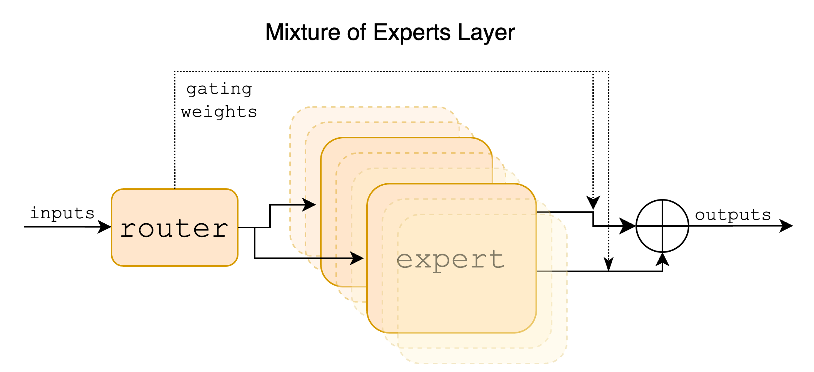
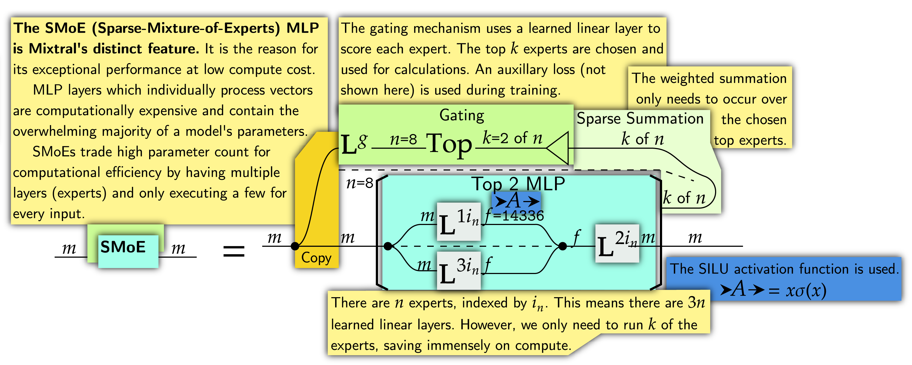
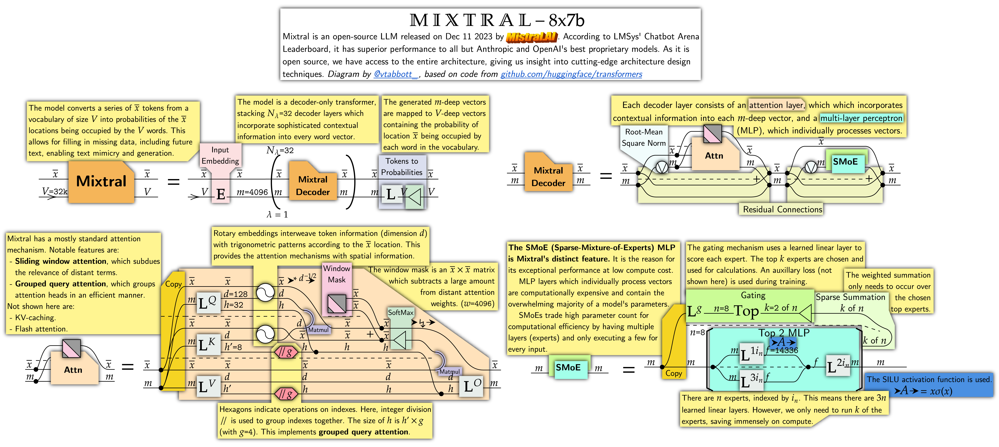
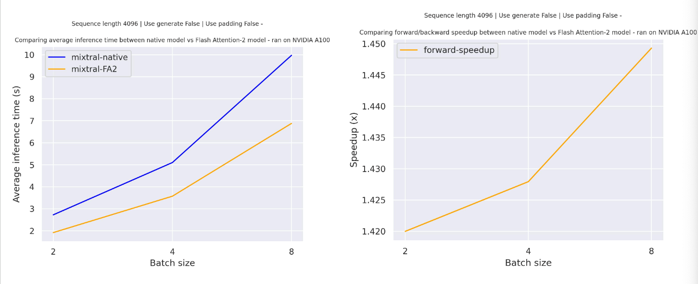
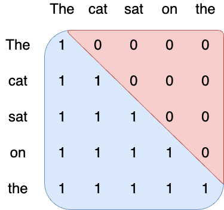
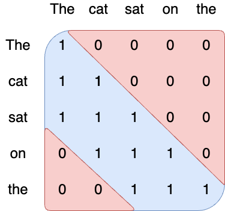
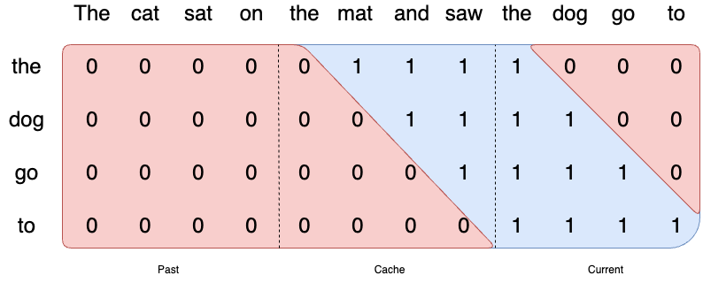
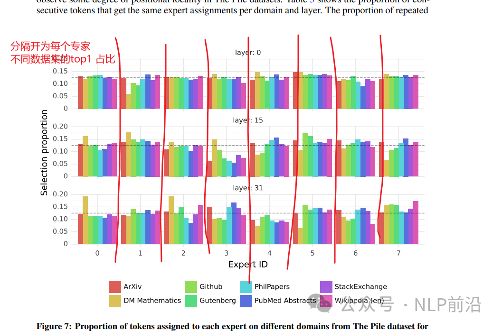
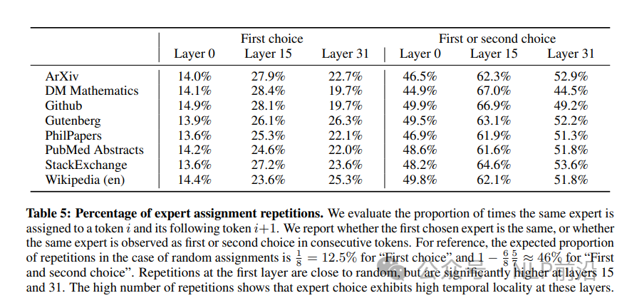

# 0. 资源

- Transformers库中对应结构：https://huggingface.co/docs/transformers/model_doc/mixtral
- 官网：https://mistral.ai/news/mixtral-of-experts/
- 官方对应Github: https://github.com/mistralai/mistral-src
- 论文：https://arxiv.org/pdf/2401.04088.pdf

# 1. 简介



mixtral基础结构跟正常的decoder结构模型一致，可以划分成3个部分，输入embedding层、N个decoder block、lm解码头。如下图所示：


每个decoder layer包含2个大模块，attention和mlp，整体上跟llama这些模型一致


接下来这张图，是描述attention的结构，mixtral中比较特别的是，使用的sliding windown attention、grouped query attention


其中sliding attention是指，指定一个sliding window，每个token往前只能观察到sliding window内的token信息。
（decoder 结构是单向注意力，也就是每个位置的token只能观察到当前位置及之前位置的输入信息），
这个可以很容易的通过attention mask来实现。下图是复制transformers中生成attention mask的代码示例（指定sliding window=3）：


grouped query attention，如下图


multi-head attention每个注意力头都有自己的query、key、value；multi-query attention：
在所有的注意力头上共享key、value，训练过程，不会明显影响训练过程，训练速度基本不变，会引起非常细微的模型效果损失。
但是推理速度更快，显存占用更低，因为推理时，反复加载很大的kv cache，内存开销比较大，性能收到内存受限。
（GPU的内存由多个大小不同，读写速度不同的内存组成，对于A100-40G，SRAM内存大小为20MB、HBM内存大小为40GB。
一般memory bound的问题，比如flash attention这些策略就是减少对HBM内存的读写次数）；
grouped query attention：介于multi head和multi query之间，具有多个key、value

最后是Mixtral的核心模块，Sparse Mixture of Experts (SMoE)，如下图所示。SMoE具有多个层
（“专家”）可用。对于每个输入，将对最相关专家的输出进行加权求和。



```pycon
class MixtralBLockSparseTop2MLP(nn.Module):
    def __init__(self, config: MixtralConfig):
        super().__init__()
        self.ffn_dim = config.intermediate_size
        self.hidden_dim = config.hidden_size

        self.w1 = nn.Linear(self.hidden_dim, self.ffn_dim, bias=False)
        self.w2 = nn.Linear(self.ffn_dim, self.hidden_dim, bias=False)
        self.w3 = nn.Linear(self.hidden_dim, self.ffn_dim, bias=False)

        self.act_fn = ACT2FN[config.hidden_act]

    def forward(self, hidden_states):
        current_hidden_states = self.act_fn(self.w1(hidden_states)) * self.w3(hidden_states)
        current_hidden_states = self.w2(current_hidden_states)
        return current_hidden_states
```

mlp层一般分为2种，一个是传统的：FFN(x) = f(x * w1 + b1) * w2 + b2；激活函数为Gelu、Swish

一种是使用GLU门控的: FFN(x) = (f(x * w1) X   (x * V) ) * w2；同样激活函数可以用Gelu、Swish；
中间有个X 是点乘，这种有3个训练权重，比传统的多一个训练权重，像llama是用的swiGLU的mlp，但是chatglm 6b就是用的gelu。

上面的每个expert的代码也是基于GLU门控的。

有了8个专家之后，就可以来看sparseMOE模块了，分为2步，第一步是针对每个token，选topk个专家，第二步是，加权得到每个token的mlp特征

```python
self.gate = nn.Linear(self.hidden_dim, self.num_experts, bias=False)

获取到每个token的mlp层输入特征 
batch_size, sequence_length, hidden_dim = hidden_states.shape
hidden_states = hidden_states.view(-1, hidden_dim)

得到每个专家的打分，维度是batch * sequence, num_experts，取topk个专家
router_logits = self.gate(hidden_states)
routing_weights = F.softmax(router_logits, dim=1, dtype=torch.float)
routing_weights, selected_experts = torch.topk(routing_weights, self.top_k, dim=-1)

取到topk个专家的打分，需要计算在归一化一下，用于对后面的expert计算出来的
结果进行加权
routing_weights /= routing_weights.sum(dim=-1, keepdim=True)
routing_weights = routing_weights.to(hidden_states.dtype)

routing_weights、selected_experts 维度是一致的，取了topk   (bs * sl, topk)


final_hidden_states = torch.zeros(
            (batch_size * sequence_length, hidden_dim), dtype=hidden_states.dtype, device=hidden_states.device
        )

如果不做后面的维度切换，那expert_mask的维度是 (bs*sl, topk, n_experts)，但是后面要遍历n_experts来计算，所以颠倒一下，得到(n_experts, topk, bs * sl); 
expert_mask = torch.nn.functional.one_hot(selected_experts, num_classes=self.num_experts).permute(2, 1, 0)

for expert_idx in range(self.num_experts):
    expert_layer = self.experts[expert_idx]
    idx, top_x = torch.where(expert_mask[expert_idx])
    
这样取到expert_mask[expert_idx]，从上面的注释可以知道维度是
    [topk, bs * sl]；torch.where的结果，第一个结果代表选到了哪一行，第二个代表选择了哪一列
    
    对应到实际意义，top_x表示取的列，也就是取哪些token
    而行表示，取到的这些token，根据路由gate计算，当前expert是排行第几；
    所以这里变量名字可能有点混淆，
    
    
    if top_x.shape[0] == 0:
    没有token需要当前的expert计算
        continue
    
    tensor index使用list比tensor快
    top_x_list = top_x.tolist()
    idx_list = idx.tolist()

    前面hidden states已经转成了 [bs * sl, hs]，根据top_x
    可以找到需要计算的token
    current_state = hidden_states[None, top_x_list].reshape(-1, hidden_dim)
    
    找到这个expert对应的权重 乘进去
    上面计算的权重是routing_weights，维度是bs * sl, topk
    根据top_x_list 对应的token，idx_list表示topk中第几个
    可以直接取到相应的权重
    current_hidden_states = expert_layer(current_state) * routing_weights[top_x_list, idx_list, None]

    合到最终的特征里边去
    final_hidden_states.index_add_(0, top_x, current_hidden_states.to(hidden_states.dtype))
    
final_hidden_states = final_hidden_states.reshape(batch_size, sequence_length, hidden_dim)
```




# 2. 主要特点

Mixtral-84B is a decoder-based LM with the following architectural choices:

Mixtral is a Mixture of Expert (MOE) model with 8 experts per MLP, 
with a total of 85B paramateres but the compute required is the same as a 14B model. 
This is because even though each experts have to be loaded in RAM (70B like ram requirement) 
each token from the hidden states are dipatched twice (top 2 routing) and thus 
the compute (the operation required at each foward computation) is just 2 X sequence_length.

The following implementation details are shared with Mistral AI’s first model mistral:

- Sliding Window Attention - Trained with 8k context length and fixed cache size, 
  with a theoretical attention span of 128K tokens
- GQA (Grouped Query Attention) - allowing faster inference and lower cache size.
- Byte-fallback BPE tokenizer - ensures that characters are never mapped to out of vocabulary tokens.

使用flash attention 2和不适用的速度对比



## 2.1 滑窗attention

1. 传统attention

    Attention is how information is shared between tokens in a sequence. 
    In vanilla transformers, attention follows a causal mask: each token 
    in the sequence can attend to itself and all the tokens in the past. 
    This ensures that the model is causal, i.e. it can only use information 
    from the past to predict the future.
    
    

2. Sliding window Attention

    The number of operations of attention is quadratic in the sequence length, 
    and the memory pressure is linear in the sequence length. At inference time, 
    this incurs higher latency and smaller throughput due to reduced cache availability. 
    To alleviate this issue, we use a sliding window attention [1,2]: 
    each token can attend to at most W tokens in the past (here, W=3).

    

    Note that tokens outside the sliding window still influence next word prediction. 
    At each attention layer, information can move forward by W tokens at most:
    after two attention layers, information can move forward by 2W tokens, etc. 
    For instance in a sequence of length 16K and a sliding window of 4K, after 4 layers, 
    information has propagated to the full sequence length.

    

    Empirically, we see that longer contexts do help even outside the sliding window 
    but when the sequence length becomes too large, the model does not use the full context anymore.
    
    The current implementation supports the sliding window attention mechanism and memory 
    efficient cache management. To enable sliding window attention, just make sure to have 
    a flash-attn version that is compatible with sliding window attention (>=2.3.0).
    
    The Flash Attention-2 model uses also a more memory efficient cache slicing mechanism - 
    as recommended per the official implementation of Mistral model that use rolling 
    cache mechanism we keep the cache size fixed (self.config.sliding_window), 
    support batched generation only for padding_side="left" and use the absolute position 
    of the current token to compute the positional embedding.

3. 滚动缓存
    
   We implement a rolling buffer cache. The cache has a fixed size of W, and we store the (key, value) 
   for position i in cache position i % W. When the position i is larger than W, past values in the 
   cache are overwritten. 

    

4. Pre-fill and chunking

    When generating a sequence, we need to predict tokens one-by-one, as each token is conditioned 
    on the previous ones. However, the prompt is known in advance, and we can pre-fill the (k, v) 
    cache with the prompt. If the prompt is very large, we can chunk it into smaller pieces, 
    and pre-fill the cache with each chunk. For this we can choose as chunk size the window size. 
    For each chunk, we thus need to compute the attention over the cache and over the chunk.

    

5. Pipeline Parallelism

    Pipeline parallelism is a set of techniques for partitioning models, 
    enabling the distribution of a large model across multiple GPUs. 
    We provide a simple implementation of pipeline parallelism, which allows our 
    larger models to be executed within the memory constraints of modern GPUs. 
    Note that this implementation favours simplicity over throughput efficiency, 
    and most notabably does not include microbatching.
    
## 2.2 分类

The Mixtral Model transformer with a sequence classification head on top (linear layer).

MixtralForSequenceClassification uses the last token in order to do the classification, 
as other causal models (e.g. GPT-2) do.

Since it does classification on the last token, it requires to know the position of the last token. 
If a pad_token_id is defined in the configuration, it finds the last token that is not a padding 
token in each row. If no pad_token_id is defined, it simply takes the last value in each row 
of the batch. Since it cannot guess the padding tokens when inputs_embeds are passed instead 
of input_ids, it does the same (take the last value in each row of the batch).

This model inherits from PreTrainedModel. Check the superclass documentation for the generic 
methods the library implements for all its model (such as downloading or saving, resizing the 
input embeddings, pruning heads etc.)

This model is also a PyTorch torch.nn.Module subclass. Use it as a regular PyTorch 
Module and refer to the PyTorch documentation for all matter related to general usage and behavior.

# 3. 实验结论

分析了一下路由的情况，主要是想要了解在训练过程中，是否有些专家会专门化于某些特定领域（例如数学、生物学、哲学等）。
为了调查这一点，他们测量了在The Pile验证数据集的不同子集上选择专家的分布情况。结果呈现在下图中，针对模型的第0层、
第15层和第31层（分别是模型的第一层和最后一层）进行了观察。



从上图，并没有观察到基于话题的专家分配有明显的模式。例如，在所有层中，对于ArXiv论文（用LaTeX编写）、
生物学（PubMed摘要）和哲学（PhilPapers）文档，专家分配的分布非常相似。只有在DM Mathematics
（数字数学）领域，他们注意到专家分配的分布略有不同。这种差异可能是由于数据集的合成性质及其对自然语言谱的有限覆盖，
特别是在第一层和最后一层，这些层的隐藏状态与输入和输出嵌入非常相关。

这表明路由器确实表现出了一些结构化的句法行为。下图展示了来自不同领域（Python代码、数学和英语）的文本样本，
其中每个标记都被高亮显示，背景颜色对应于其选择的专家。下图显示，像Python中的'self'和英语中的'Question'这样的词，
即使涉及多个标记，也经常通过同一个专家路由。类似地，在代码中，缩进标记总是被分配给相同的专家，
尤其是在第一层和最后一层，这些层的隐藏状态与模型的输入和输出嵌入更相关。


研究者还注意到，连续的标记经常被分配给相同的专家。事实上，他们观察到在The Pile数据集中，
连续标记的专家选择具有一定程度的位置局部性。下表显示了在不同领域和层中，连续标记获得相同专家分配的比例。
在第15层和第31层，连续分配的比例显著高于随机分配。这种高比例表明，在这些层中，专家选择表现出高时间局部性。



这些发现对如何优化模型以实现快速训练和推理有影响。例如，具有高局部性的案例更可能导致在进行专家并行处理时某些专家的过载。
相反，这种局部性可以被利用于缓存。


# 参考

[1] 理解Mixtral Moe模型原理与代码实现，https://mp.weixin.qq.com/s?__biz=MzkyOTU5NzY1Mw==&mid=2247484906&idx=1&sn=300708df9444615928613ca833179565&chksm=c2065450f571dd467092b7481d1cf41f198bdadffdb59ccae328dbae04f39551285854f0c157&scene=21#wechat_redirect   
[2] （[1]对应的原文）Understanding Mixtral-8x7b，https://huggingface.co/blog/vtabbott/mixtral   
[3] https://huggingface.co/docs/transformers/model_doc/mixtral   
[4] mixtralai，https://github.com/mistralai/mistral-src   
[5] mixtral of experts官方论文发布，https://mp.weixin.qq.com/s/li9TOFULxlKB_Ku665Ifuw
