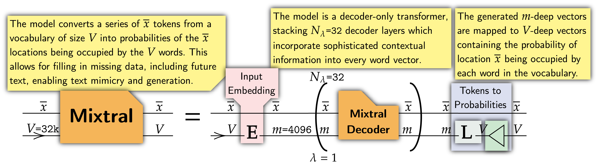
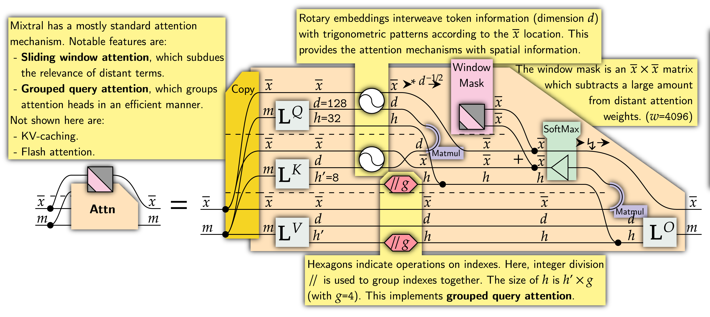

# 1. 简介

mixtral基础结构跟正常的decoder结构模型一致，可以划分成3个部分，输入embedding层、N个decoder block、lm解码头。如下图所示：

每个decoder layer包含2个大模块，attention和mlp，整体上跟llama这些模型一致

接下来这张图，是描述attention的结构，mixtral中比较特别的是，使用的sliding windown attention、grouped query attention

# 参考

[1] 理解Mixtral Moe模型原理与代码实现，https://mp.weixin.qq.com/s?__biz=MzkyOTU5NzY1Mw==&mid=2247484906&idx=1&sn=300708df9444615928613ca833179565&chksm=c2065450f571dd467092b7481d1cf41f198bdadffdb59ccae328dbae04f39551285854f0c157&scene=21#wechat_redirect   
[2] （[1]对应的原文）Understanding Mixtral-8x7b，https://huggingface.co/blog/vtabbott/mixtral