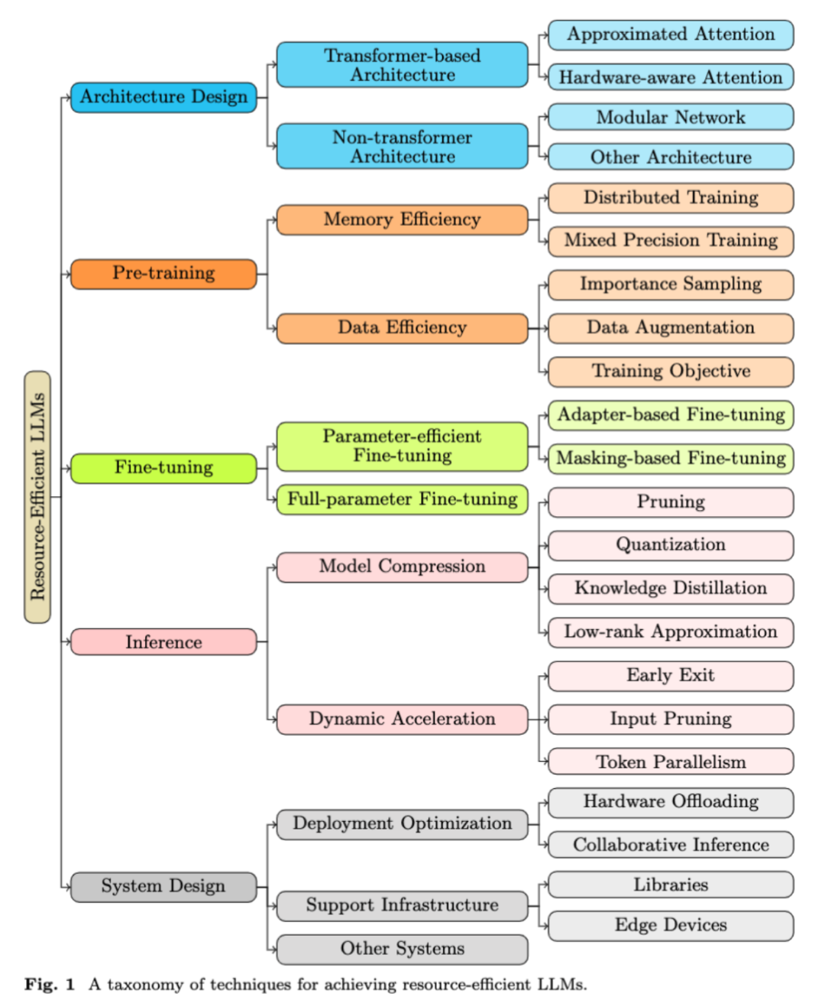

论文链接：https://arxiv.org/pdf/2401.00625

架构

- 高效的 Transformer 结构：这一类别包括了通过创新技术优化 Transformer 模型的架构，
  旨在降低计算和内存需求。例如，Reformer 通过局部敏感哈希技术来改进注意力机制，
  而 Linear Transformer 则利用线性映射来减少计算复杂度。AFT 和 KDEFormer
  等其他方法则通过不同方式实现时间和内存效率的大幅提升。
- 非 Transformer 架构：这一类别探索了替代 Transformer 的新型架构。例如，
  模块化网络（MoE）技术通过结合多个专业化模型来处理复杂任务，Switch Transformer 和 
  GLaM 等则利用稀疏路由技术在增加模型参数的同时保持效率。另外，像 RWKV 这样的架构则结合了
  Transformer 的训练效率和 RNN 的推理效率。

内存效率

- 分布式训练：将模型训练任务分配给多个节点，以加速训练过程。数据并行（DP）和模型并行（MP）是两种主要的策略。
  DP 通过将初始数据集分割并由多个加速器并行训练，而 MP 则将模型的层或张量分布到多个加速器上。
- 混合精度训练：这种技术通过同时使用 16 位和 32 位浮点类型来加速深度学习模型的训练，特别适用于大型语言模型的训练。

数据效率

- 重要性采样：这种方法通过优先处理信息丰富的训练实例来提高模型的数据效率。
- 数据增强：通过创建现有数据的修改副本，使当前数据得到充分利用。
- 训练目标：预训练目标的选择是决定数据效率的另一个因素。这通常涉及模型架构、输入 / 目标构建和遮蔽策略的设计。

参数高效微调

- 基于遮蔽的微调：仅更新模型参数的子集，其他参数在反向传播过程中被「冻结」或遮蔽。
- 基于适配器的微调：在预训练模型的现有层之间插入额外的轻量级层（适配器）。在微调期间，
  只更新这些适配器层的参数，而原始模型参数保持固定。
- 全参数微调：与参数高效微调不同，全参数微调涉及修改所有参数。尽管训练成本更高，
  但通常可以获得比参数高效方法更好的性能。然而，这种方法在简单数据集上可能并不总是有效，
  且在训练成本和 GPU 内存消耗方面也面临挑战。

动态加速

- 早期退出：根据某些标准提前终止模型的某些层的计算，用于简化输入样本的处理。
- 输入裁剪：动态减少输入序列长度，根据内容来分配不同的计算资源给不同的输入标记。
- 标记并行：利用技术如推测执行来并行生成多个标记，而非传统的顺序方式。

支持基础设施

- 库：介绍了几个著名的大型语言模型框架，如 DeepSpeed、Megatron-LM、Colossal-AI、
  Mesh-TensorFlow 和 GPT-NeoX，它们为大规模分布式训练提供多级并行策略。
- 边缘设备：探索在边缘设备上部署 LLM 的研究趋势，这些设备通常具有有限的计算资源。
  例如，通过低秩适应和噪声对比估计等技术来降低 LLM 在边缘设备上的内存需求。

其他系统

- Tabi：提出了一个多级推断引擎的推断系统，通过使用多个 DNN 处理任务中的异构查询来减少 LLM 的推断延迟。
- 近重复序列搜索：利用最小哈希技术来提高 LLM 的近重复序列搜索的效率和可扩展性。

计算效率指标

- FLOPs：浮点运算次数，量化计算效率。
- 训练时间：训练 LLM 所需的总时间，反映了模型复杂性。
- 推断时间 / 延迟：LLM 生成输出所需的时间，关键评估实际应用中的实用性。
- 吞吐量：LLM 处理请求的效率，以每秒生成的标记或完成任务的速度衡量。
- 加速比：与基准模型相比推断速度的改善程度。

内存效率指标
- 参数数量：LLM 神经网络中可调变量的数量。
- 模型大小：存储整个模型所需的存储空间。

数据集和基准测试

- Dynaboard：动态基准，评估内存使用、吞吐量、公平性和鲁棒性等指标。
- EfficientQA：聚焦建立准确、内存高效的开放领域问答系统。
- SustaiNLP 2020：挑战参与者开发能源高效的 NLP 模型。
- ELUE 和 VLUE：专注于评估 NLP 和视觉语言模型的效率和性能。
- Long-Range Arena：专为评估长内容任务上高效 Transformer 模型而设计。
- Efficiency-aware MS MARCO：在 MS MARCO 信息检索基准测试中增加了效率指标。

# 参考

[1] 五种资源类别，如何提高大语言模型的资源效率，超详细综述来了，
    https://mp.weixin.qq.com/s/5w5QhwCFwvnUaHXvfDlPSQ