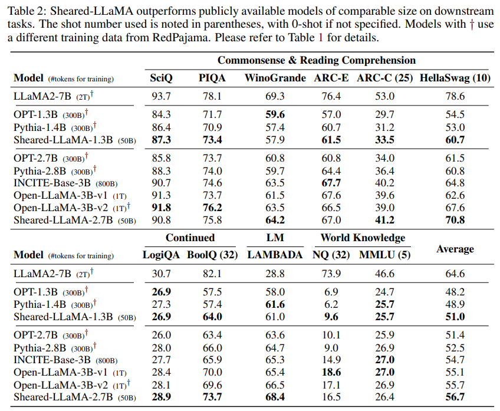
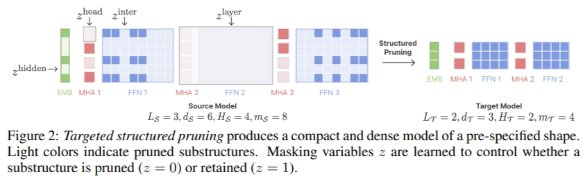
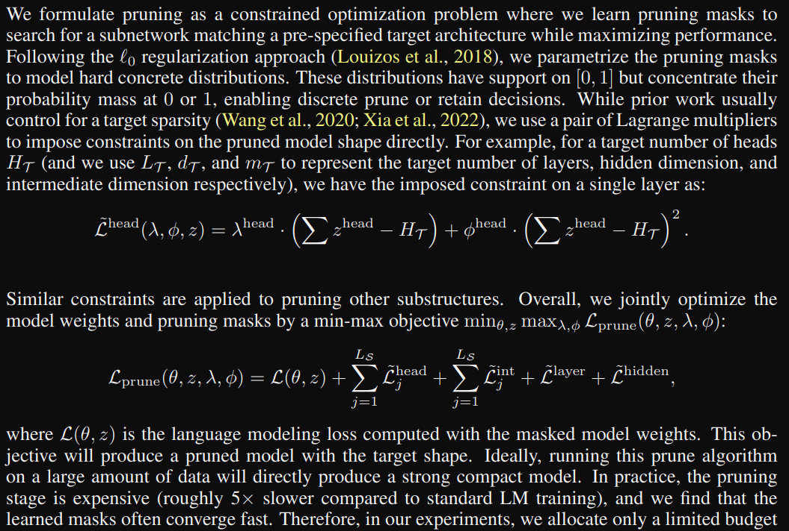
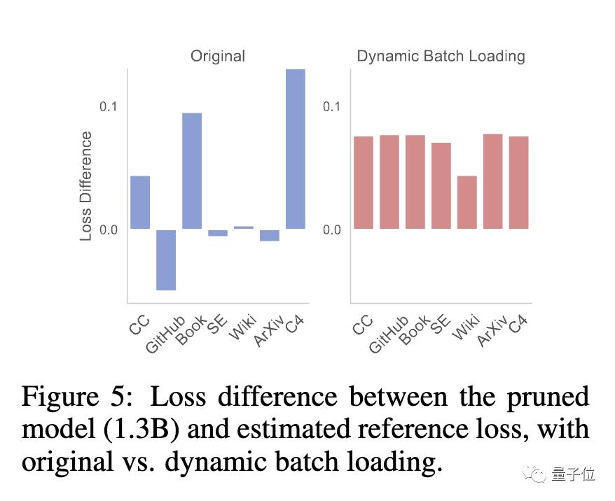
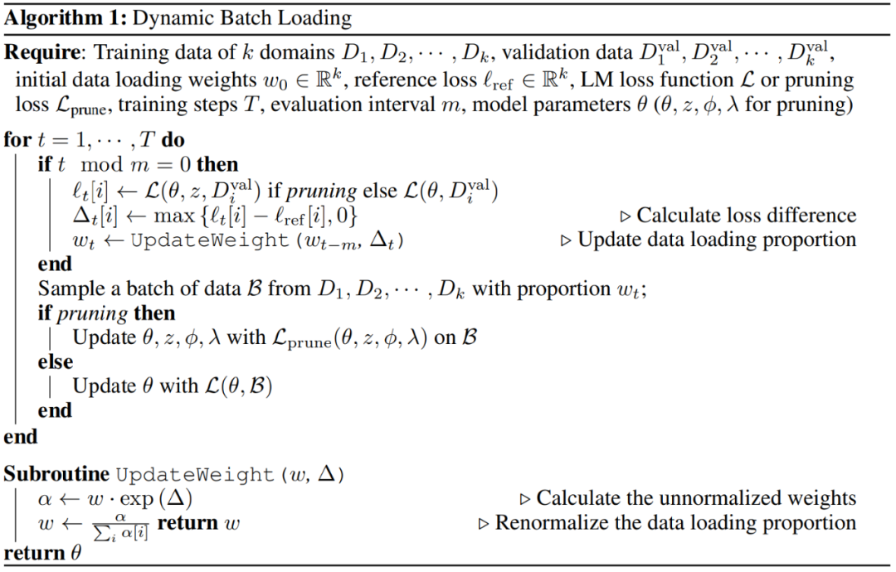

# 1. 资源

- 博客介绍：https://xiamengzhou.github.io/sheared-llama/
- Github (335 Stars): https://github.com/princeton-nlp/LLM-Shearing
- 论文：https://arxiv.org/pdf/2310.06694.pdf

# 2. 简介

- 只用3%的计算量、5%的成本取得SOTA，统治了1B-3B规模的开源大模型。
- 以羊驼LLaMA 2 7B为基础，通过定向结构化剪枝得到1.3B和3B剪枝后的Sheared-LLama模型
- 比从头开始预训练划算的多

主要亮点：
- 结构化剪枝
- 动态batch

缺点：
- 训练速度比普通预训练慢5倍

# 3. 方法

LLM-Shearing，具体来说是一种定向结构化剪枝，将一个大模型剪枝到指定的目标结构。

之前的剪枝方法可能会导致模型性能下降，因为会删除一些结构，影响表达能力。

新方法将剪枝看成一种约束优化问题，学习剪枝掩码矩阵来搜索与指定结构匹配的子网络，同时以最大化性能为目标。

接下来对剪枝过的模型进行继续预训练，在一定程度上恢复剪枝造成的性能损失。

在这个阶段，团队发现剪枝过的模型与从头训练的模型对不同数据集的损失下降速率不一样，
产生数据使用效率低下的问题。

为此团队提出了动态批量加载（Dynamic Batch Loading），根据模型在不同域数据
上的损失下降速率动态调整每个域的数据所占比例，提高数据使用效率。

实验发现，虽然剪枝模型与从头训练的同等规模模型相比，虽然一开始表现差得多，
但继续预训练可以迅速提高，最终超越。

这表明从强大的基础模型中剪枝，可以为继续预训练提供更好的初始化条件。

# 4. 实验结果

训练：研究者在所有实验中最多使用了 16 个 Nvidia A100 GPU (80GB)。

SHEARED-LLAMA 优于同等大小的 LM

本文表明，Sheared-LLaMA 明显优于现有的类似规模的 LLM，同时只使用一小部分计算预算来从头开始训练这些模型。

下游任务：表 2 展示了 Sheared-LLaMA 和类似大小的现有预训练模型的零样本和少样本在下游任务上的性能。

与其他剪枝方法的对比

此外，研究者将 LLM-shearing 方法与其他剪枝方法进行了比较，并报告了验证困惑度，它是衡量整体模型能力的一个有力指标。

由于计算上的限制，下面的实验控制了所有比较方法的总计算预算，而不是将每种方法运行到最后。

如表 4 所示，在相同稀疏度下，本文的目标剪枝模型的推理吞吐量比非均匀剪枝 CoFiPruning 模型更高，但困惑度略高。

其他分析

表 5 显示，在控制 token 总量的情况下，增加剪枝开销可以持续改善困惑度。然而，
由于剪枝比持续的预训练更昂贵，研究者将 0.4B 的 token 分配给剪枝。

# 参考

[1] Sheared LLaMA: Accelerating Language Model Pre-training via Structured Pruning，
    https://xiamengzhou.github.io/sheared-llama/
[2] 陈丹琦团队新作：5%成本拿下SOTA，“羊驼剪毛”大法火了，https://www.36kr.com/p/2471329505515393
[3] 为 Llama2 剪「驼毛」，清华 & 普林斯顿 | 提出最新大模型剪枝法：LLM-Shearing，
    https://cloud.tencent.com/developer/article/2346755
