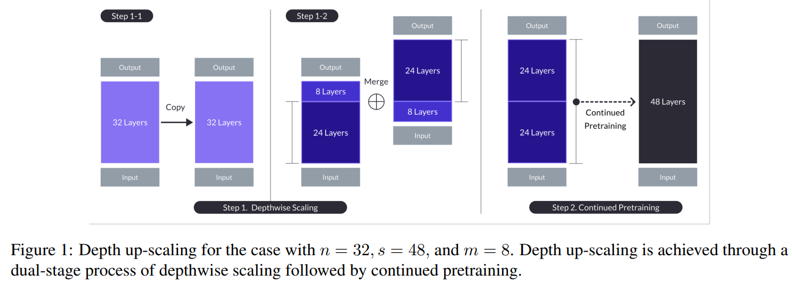
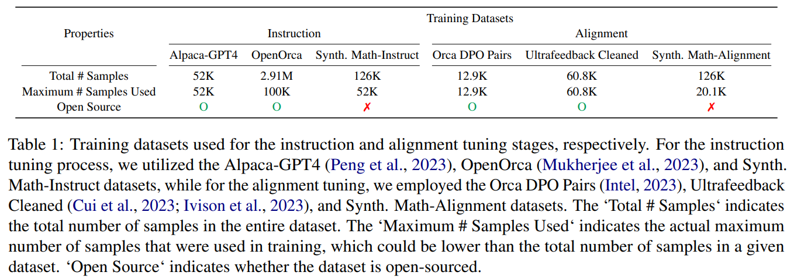
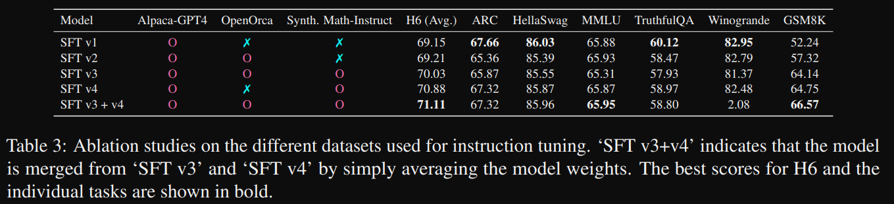
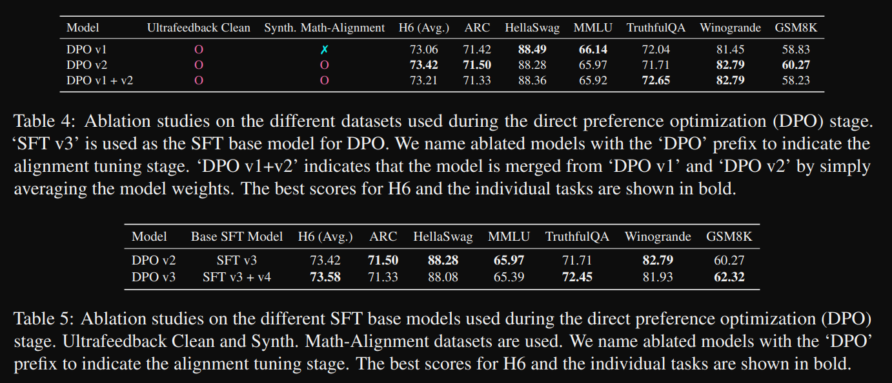
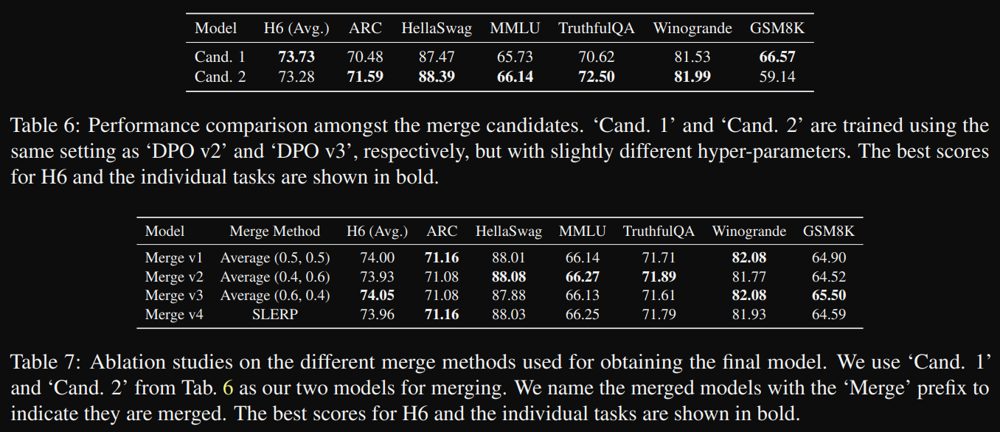

# 1. 简介

SOLAR提出了一种名为深度扩展（Depth Up-Scaling, DUS）的LLM扩展方法，该方法包含了深度方向的拓展和持续预训练过程。
与采用混合专家架构进行LLM扩展的其他方法不同，DUS无需进行复杂的更改即可实现高效的训练和推理。

通过实验验证，发现DUS方法既简单又有效，能够成功将高性能的小型LLM扩展至更大规模。基于DUS模型，进一步提出了专为
指令遵循能力优化的变体——SOLAR 10.7B-Instruct，其性能超越了Mixtral-8x7B-Instruct。

简而言之，这一过程可以形象地比喻为对两个参数量均为7B的llama模型进行改造。首先，我们分别从每只llama的结构中摘取核心部分：
一只去掉头部的前8层，另一只则去除尾部的后8层。

随后，我们将这两部分保留下来的24层结构巧妙地对接起来，形成一个全新的一个拥有48层且参数量达到10.7B的新模型。
这种创新的模型构建方式，通过合理利用和组合已有模型的优势部分，旨在实现性能提升和资源的有效利用。

更重要的是DUS不使用额外的模块或动态机制，这使得它无需像MoE那样改变训练或推理框架，可以直接与与其他模型兼容，实现最大效率。

# 2. 方法

理论上可以采用任意层数的Transformer架构，SOLAR选择32层的Llama 2架构作为基础模型。

接下来，在这个基础上，采用深度扩展策略，增加模型的层数，并对其进行持续的预训练，最终生成了SOLAR 10.7B
这一具有107亿参数的大型语言模型。这种深度扩展方法不仅避免了引入额外模块或动态机制带来的复杂性，
无需修改训练和推理框架，从而实现高效、便捷且有效的LLM规模扩展。

Depthwise scaling
Depthwise scaling的过程如下：

1. 从32层的基础模型开始，我们将该模型复制一份以进行后续修改。

    然后，从原始模型中移除最后m层，并从其复制体中移除最初的m层，这样就形成了两个各有(n-m)层的独特模型。

2. 将这两个模型拼接在一起，构建一个具有s = 2·(n−m)层的扩展模型。

    在SOLAR 10.7B-Instruct中，由于基础模型n为32层，并且考虑到硬件限制以及扩展模型效率
    模型参数量介于70亿至130亿之间），SOLAR 10.7B-Instruct设置s为48层。因此，需要移除的中间层数目m计算得出为8层（即m=8）。

# 3. 训练

指令微调

在指令微调阶段，我们训练模型以遵循问答（QA）格式的指令。SOLAR主要使用开源数据集，
同时为了增强模型的数学能力，还合成了一份数学问答数据集。以下是我们构建该数据集的详细步骤：

首先，从Math数据集中仅收集种子数据，目的是避免与常用的基准数据集如GSM8K产生交叉污染。
接下来，将这些种子数据中的问题和答案进行重新措辞。通过这个过程，我们将重述过的问题-答案对作为新的问答数据集来使用。

最后，在这个经过处理的数学问答数据集上(‘Synth. Math-Instruct‘)，对模型进行微调，
使其能够更好地理解和执行数学相关任务的指令。这样不仅提高了模型在数学领域的表现，也确保了其具备更好的泛化能力和在新场景下的适应性。

RLHF对齐
已经经过指令微调的模型会进一步通过直接偏好优化（Direct Preference Optimization, DPO）技术进行微调。

与指令微调阶段相似，我们主要使用开源数据集，并结合合成一个针对数学领域的对齐数据集，该数据集利用了指令微调阶段中提到的“Synth. Math-Instruct”数据集。

对齐数据合成过程如下：

1. 充分利用“Synth. Math-Instruct”数据集中重新措辞的问题-答案对有助于提升模型数学能力这一事实。推测认为，相对于原始答案，
   经过中间重述步骤后得出的重新措辞的答案可能是更好的答案。

2. 因此，将重新措辞过的问题作为提示，将重新措辞过的答案视为首选响应，而将原始答案视为被拒绝的响应，从而创建{prompt, chosen, rejected}这样的DPO元组。

3. 将所有从重新措辞过的问题-答案对中提取出的DPO元组合并在一起，由此生成的数据集称之为“Synth. Math-Alignment”。
   这个数据集旨在通过训练模型以模仿和学习更强的人工智能或人类专家对于数学问题解答的偏好，从而使其在数学领域内更加精准、高效地执行任务。

# 4. 实验结果

SOLAR 10.7B模型在与类似规模的预训练模型如Qwen 14B和Mistral 7B比较时，性能更优。这一表现证实了
DUS是一种有效的大型语言模型（LLMs）基础模型上扩缩放技术。

另外值得注意的是，尽管尺寸较小，但经过指令微调后的SOLAR 10.7B-Instruct模型在H6评测指标上得分最高，
甚至超过了最近表现出色的开源LLM模型Mixtral 8x7B-Instruct-v0.1或Qwen 72B。这意味着采用
DUS方法不仅能够提升模型的基础能力，而且即便是在较小规模下也能通过精调达到行业领先的性能水平。
这些结果进一步验证了DUS技术在提高模型效率和性能方面的显著作用。

## 4.1 消融实验

1. 指令对齐消融实验

    SOLAR展示了使用不同训练数据集进行指令微调的消融研究。这些经过微调的模型均以前缀"SFT"（Supervised Fine-Tuning）标记。具体来说：
    
    "SFT v1"仅使用了Alpaca-GPT4数据集进行训练。
    
    "SFT v2"在此基础上，还加入了OpenOrca数据集进行联合训练。
    
    "SFT v3"除了"SFT v2"使用的那些数据集外，还包括了Synth. Math-Instruct数据集。
    
    同理，"SFT v4"则是在"SFT v1"所用数据集的基础上，添加了Synth. Math-Instruct数据集来进行训练。
    
    通过对比这些采用不同数据集组合训练得到的模型性能差异，我们可以深入理解各种数据集对于模型指令理解和执行能力的影响，
    以及如何优化训练策略以提高模型的指令跟随效果。

    

2. RLHF对齐消融实验

    针对DPO过程中使用的不同对齐数据集进行了消融研究。将"SFT v3"作为进行DPO的基础模型。具体如下：
    
    "DPO v1"仅使用了Ultrafeedback Clean数据集进行对齐训练。
    
    "DPO v2"则在此基础上，进一步加入了Synth. Math-Alignment数据集一同用于对齐训练。
    
    "DPO v2"模型以"SFT v3"作为指令微调（SFT）的基础模型；而"DPO v3"模型则选择了"SFT v3+v4"组合作为其SFT基础模型
    
    通过比较"DPO v1"和"DPO v2"在不同对齐数据集下的表现差异，可以深入探究这些特定数据集对于提升模型对人类
    偏好理解和遵循指令能力的影响程度，并确定哪种数据集组合策略能更有效地优化模型的性能和准确性。
    
    通过比较"DPO v2"和"DPO v3"，在SFT基础模型中特定任务的性能差距并不总是会延续到对齐调整后的模型中。
    这意味着，即使在指令微调阶段（SFT）中某些任务上存在显著的性能差异，在进行直接偏好优化（DPO）和对齐训练后，
    这些差距可能缩小或消失，表明对齐训练能够有效地弥补SFT阶段不同模型间的部分性能不足，并让最终模型在多个任务上达到更均衡的表现。

    

3. 方法融合消融实验

    为了进一步优化模型性能并充分利用各自的优势，SOLOAR基于与"DPO v2"和"DPO v3"
    相同的训练数据集和SFT基础模型，分别训练了两个模型，命名为“Cand. 1”和“Cand. 2”。
    不同之处在于，这两个候选模型采用了不同的超参数设置，旨在最大限度地发挥每个模型的独特优势。
    
    采用了两种模型合并方法：
    
    - 平均法（Average (a, b)）：其中a和b分别代表在对“Cand. 1”和“Cand. 2”的权重进行平均时，赋予两者的权重值。
    - SLERP（Spherical Linear Interpolation，球面线性插值，Shoemake, 1985提出的方法）。
    
    不同的合并方法对H6指标得分的影响相对较小。同时，各个独立任务的得分差异也不大，这表明只要待合并的候选模型具有足够的互补优势，
    具体采用哪种合并方法可能并不是决定性的关键因素。
    
    因此，SOLAR选择了“Merge v1”作为最终的SOLAR 10.7B-Instruct模型。这一选择基于实验结果中不同合并策略下模型性能表现相近的事实，
    同时也考虑了实际应用中的便捷性和稳定性。
    
    

# 5. 讨论

在SOLAR huggfacing的交流issue中，有人讨论SOLAR 生成的幻觉更少。

但有人回复，这是因为SOLAR更偏向于生成短回复才导致看起来幻觉更少

这是一个值得思考和以后优化的点

# 参考

[1] 缝合模型能让模型更强：SOLAR，https://zhuanlan.zhihu.com/p/676833130
