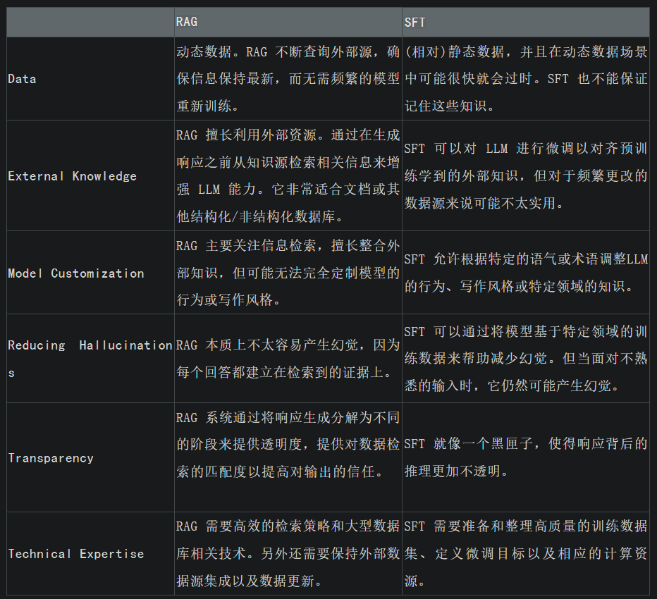
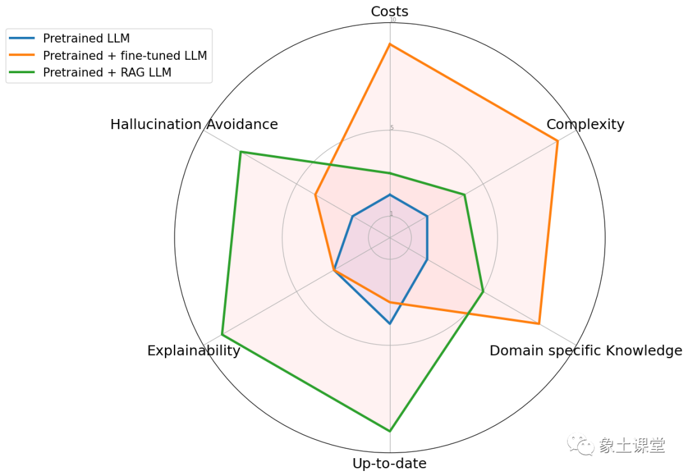

# 1. 简介

## 1.1 大模型的局限性

- 幻觉问题：LLM 文本生成的底层原理是基于概率的 token by token 的形式，因此会不可避免地产生“一本正经的胡说八道”的情况。
- 知识盲点于实时性：大模型通过预训练获得通用语言能力，但不具备专业领域的知识。对某些专业问题无法做出准确回答。
  有些知识不停的有更新，大模型需要在训练和微调时才能灌入新知识。
- 记忆力有限：大语言模型参数量虽然很大，但仍然无法记住大量具体的事实知识。容易在需要记忆的任务上表现不佳。
- 时效性问题：大语言模型的规模越大，大模型训练的成本越高，周期也就越长。那么具有时效性的数据也就无法参与训练，
  所以也就无法直接回答时效性相关的问题，例如“帮我推荐几部热映的电影？”。    
- 数据安全问题：通用大语言模型没有企业内部数据和用户数据，那么企业想要在保证安全的前提下使用大语言模型，
  最好的方式就是把数据全部放在本地，企业数据的业务计算全部在本地完成。而在线的大模型仅仅完成一个归纳的功能。
- 没有外部世界感知：大语言模型无法感知外部世界，缺少视觉、听觉输入。对涉及感知的问题无法直接建模。
- 无用户建模：大语言模型没有建模特定用户的能力，对不同用户给出同样的反应和回复，无法进行个性化的对话。

## 1.2 数据向量化

文本、图像和音频等非结构化数据缺乏预定义格式，这给传统数据库带来了挑战。为了在人工智能和机器学习应用中利用这些数据，
需要使用嵌入将其转换为数字表示。我们先来探讨一个概念：什么是 Embedding？

为了储存非结构化数据，我们需要对其进行编码为向量表示，但原始的向量通常高度稀疏，
这对计算机的计算和处理不利，Embedding 的主要作用是就将高维的稀疏向量转化为稠密向量以方便对模型进一步处理。

## 1.3 RAG v.s. 微调

雷达图具体比较了三种不同的方法：预训练大语言模型、预训练 + 微调 LLM 、预训练 + RAG LLM。

# 参考

[1] 基于大语言模型构建知识问答系统，https://zhuanlan.zhihu.com/p/627655485