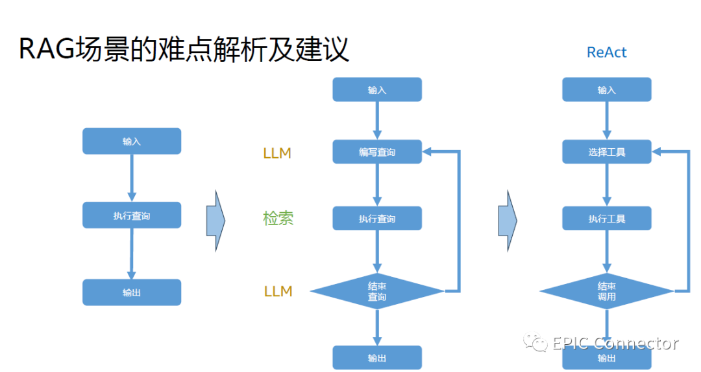

# 1. 简介

## 1.1 难点一：整理好知识数据

“如果人都找不到合适的知识片段，那RAG大概率不会奏效。”

技术层面上，整个用RAG检索的过程可以分两个阶段：第一阶段是预处理，第二阶段是RAG 精调搜索。其中第一阶段预处理又包括知识抽取、
知识增强、知识向量化处理和知识注入；第二阶段RAG包括意图分类、知识提取（多对话重写）、大模型调用、大模型输出。

目前开源的一些方案更多关注第二阶段，但第一阶段同样重要。首先需要提取知识，但这会涉及一些问题，
例如在企业场景中会有很多复杂的文件格式知识，国内的话可能很多会是PDF，整个解析是一件很难的事情。

现在有一些方案如引入视觉模型等也做了这方面的工作，即通过视觉去进行PDF的整体转换。第二，也需要考
虑一些更好的切块方式，目前的切割较为简单粗暴，很容易将一些主题给劈开。我们也在探索通过直接扩大
模型去切割并将相似的内容放置到一起等智能化的方式，但目前成本较高。第三，还可以去做一些额外的知识
分享和问答对合成。第四，也可以在垂直领域进行关键词提取，对整个过程进行全链路打通。

## 1.2 难点二：考虑更多的检索方式

“可能需要多种检索方式，比如基于关键词。”

除了刚提到的整理好知识数据，我们还要去考虑更多的检索方式。
现在检索系统已经比较容易组合变化，加上检索增强的方式，可以考虑和业务结合的更多方式。

## 1.3 难点三：引入Reranker模块

“实现前置拒答。”

说回模块，在多数检索召回后，众多知识条目通过同一模型去判断其是否与这种提问相关，
可以实现前置拒答。我们发现现在很多企业客户在该场景里不希望大模型利用自己内部知识去进行回答，
所以在此可以通过Reranker模块去实现前置拒答：当知识库没有找到合适内容时就直接拒答，
或当场判断大模型知识库中没有合适知识后直接转入人工客服的流程。

## 1.4 难点四：考虑重写查询

“人的表述方式和检索最优方式可能不一致，进行多轮对话·分解查询”

通常用户使用搜索引擎时并不会直接把问题送到引擎去搜索，而是会先在脑子里进行转换，
形成一个适合搜索的查询语句。目前可以通过大模型实现这种转换，可以把复杂查询进行拆解。我们也在一些企业产品里进行了尝试。

实际上，如果考虑到查询重写的话，整个过程会有一定的变化。从最左侧看起，从我们原始的一个输入过来、
执行查询、做大规模计算输出。当我们考虑到查询重写的时候，就可以把整个流程变成中间式：输入过来后，
先通过大模型去编写查询，然后通过检索系统执行查询，查询完后判断是直接输出还是重新触发一次查询。

在OpenAI 发布会上GPT Assistants大概也是这样的实现方式，可以自己去定义Function、
定义方式名字、方式的描述及Function的接口等。然后其额外会有一个下拉机器，
把这个功能打开后可以看到它右侧的标注日志，并通过GPT 3.5的能力去判断应该选择怎样的Tools，
如何做出下一步的Action。

# 参考

[1] 都在讲RAG，这些真实难点你知道吗？｜EPIC Talks，https://mp.weixin.qq.com/s/cy2Nosh1Ik4i7GXcN0n6iA