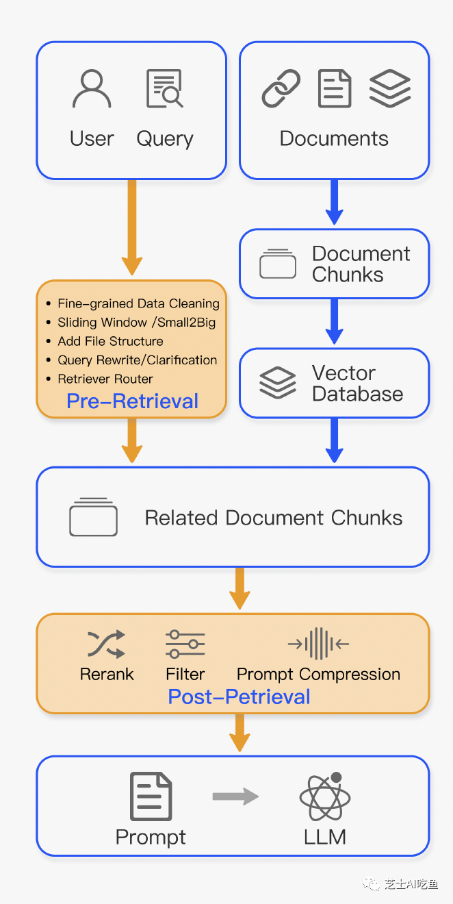

# 1. 简介

为了解决初级RAG遇到的索引问题，高级RAG通过滑动窗口、细粒度分段和元数据等方法优化了索引。
同时，它也提出了各种方法来优化检索过程。在具体实现方面，高级RAG可以通过管道或端到端的方式进行调整。

# 2. 检索前过程
## 2.1. 优化数据索引

优化数据索引的目的是提高索引内容的质量。目前，为此目的采用了五种主要策略：
提高索引数据的粒度、优化索引结构、添加元数据、对齐优化和混合检索。

1. 提高数据粒度：

    预索引优化的目标是提高文本标准化、一致性，并确保事实准确性和情境丰富性，
    以保证RAG系统的性能。文本标准化涉及去除无关信息和特殊字符，以提高检索器的效率。
    在一致性方面，主要任务是消除实体和术语中的歧义，并消除重复或冗余信息，
    以简化检索器的焦点。确保事实准确性至关重要，且在可能的情况下，
    应验证每一条数据的准确性。通过添加具有领域特定注释的另一层上下文，
    以及通过用户反馈循环的持续更新，可以实现保留上下文，以适应系统在现实世界中的交互情境。
    时间敏感性是重要的情境信息，应设计机制以更新过时文档。总之，
    优化索引数据的焦点应放在清晰性、情境和正确性上，以使系统高效可靠。以下介绍最佳实践。

2. 优化索引结构：
   
   这可以通过调整块的大小、改变索引路径和纳入图结构信息来实现。
   调整块的大小（从小到大）的方法涉及尽可能收集相关上下文并最小化噪声。
   在构建RAG系统时，块大小是一个关键参数。有不同的评估框架来比较单个块的大小。
   LlamaIndex2使用GPT4来评估忠实度和相关性，而LLaMA索引具有不同分块方法的自动评估功能。
   通过多个索引路径进行查询的方法与先前的元数据过滤和分块方法密切相关，
   可能涉及同时跨不同索引进行查询。可以使用标准索引来查询特定查询，
   或使用独立索引来基于元数据关键字（例如特定的“日期”索引）进行搜索或过滤。

引入图结构涉及将实体转换为节点，将它们的关系转换为关联。
这可以通过利用节点之间的关系来提高准确性，特别是对于多跳问题。
使用图数据索引可以增加检索的相关性。

1. 添加元数据信息：

    这里的重点是将引用的元数据嵌入到块中，
    例如用于过滤的日期和用途。添加元数据，如参考文献的章节和小节，也有利于提高检索效果。
    当我们将索引分为许多块时，检索效率成为一个关注点。首先通过元数据进行过滤可以提高效率和相关性。

2. 对齐优化：
   
   这种策略主要解决文档之间的对齐问题和差异。
   对齐概念涉及引入假设性问题，创建适合用每个文档回答的问题，
   并将这些问题嵌入（或替换）到文档中。这有助于解决文档之间的对齐问题和差异。

3. 混合检索：
   
   这种策略的优势在于利用不同检索技术的优势。智能地结合各种技术，
   包括基于关键字的搜索、语义搜索和向量搜索，适应不同的查询类型和信息需求，
   确保一致地检索到最相关和内容丰富的信息。混合检索可以作为检索策略的强大补充，
   提高RAG管道的整体性能。

## 2.2 嵌入

1. 微调嵌入：

   微调嵌入模型直接影响RAG的有效性。微调的目的是增强检索内容与查询之间的相关性。
   微调嵌入的作用类似于在生成语音之前调整耳朵，优化检索内容对生成输出的影响。
   通常，微调嵌入的方法归为两类：在特定领域上下文中调整嵌入和优化检索步骤。
   特别是在处理不断演变或罕见术语的专业领域中，这些定制的嵌入方法可以提高检索的相关性。
   BGE嵌入模型是一种微调和高性能的嵌入模型，例如BAAI开发的BGE-large-EN 3。
   为了为微调BGE模型创建训练数据，首先使用像gpt-3.5-turbo这样的LLM根据文档块提出问题，
   其中问题和答案（文档块）形成微调过程中的微调对。

2. 动态嵌入：
   
   动态嵌入根据单词出现的上下文进行调整，不同于使用每个单词的单一向量的静态嵌入。
   例如，在像BERT这样的变压器模型中，同一个单词可以根据周围的单词有不同的嵌入。
   特别是在文本长度小于5个标记时，OpenAI的text-embedding-ada-002模型4
   显示出意外的高余弦相似性结果。理想情况下，嵌入应包含尽可能多的上下文，以确保“健康”的结果。
   基于像GPT这样的大型语言模型的原理，OpenAI的embeddings-ada-02比静态嵌入模型更复杂，
   能够捕捉到一定程度的上下文。尽管它在上下文理解方面表现出色，但它可能不会像最新的全尺寸
   语言模型GPT-4那样对上下文敏感。

# 3. 检索后过程

从数据库检索到有价值的上下文后，将其与查询合并并输入到LLM中带来挑战。
一次性向LLM展示所有相关文档可能会超出上下文窗口限制。
将众多文档连接成一个冗长的检索提示是无效的，会引入噪声并妨碍LLM专注于关键信息。
需要对检索到的内容进行额外处理来解决这些问题。

1. 重新排序：

    将最相关信息重新定位到提示的边缘是一个直接的想法。
    这一概念已在框架如LlamaIndex、LangChain和HayStack 中实现。
    例如，Diversity Ranker优先考虑基于文档多样性的重新排序，
    而LostInTheMiddleRanker则交替地将最佳文档放在上下文窗口的开头和结尾。
    同时，在解决基于向量的模拟搜索语义相似性的挑战方面，
    像cohereAI rerank bgererank5或LongLLMLingua这样的方法重新计算
    相关文本与查询之间的语义相似性。

2. 提示压缩：

    研究表明，检索到的文档中的噪声对RAG性能产生不利影响。在后处理中，
    重点在于压缩无关上下文，突出关键段落，并减少整体上下文长度。例如“选择性上下文”
    和LLMLingua 等方法利用小型语言模型计算提示的互信息或困惑度，估算元素的重要性。
    然而，这些方法在RAG或长上下文场景中可能会丢失关键信息。
    Recomp 通过训练不同粒度的压缩器来解决这个问题。长上下文 在处理广泛的上下文时，
    进行分解和压缩，而“在记忆迷宫中行走” 设计了一个分层的总结树，以增强LLM对关键信息的感知。

# 4. RAG管道优化

检索过程的优化旨在提高RAG系统的效率和信息质量。当前研究主要集中在智能结合各种搜索技术、
优化检索步骤、引入认知回溯概念、灵活应用多样的查询策略以及利用嵌入相似性上。
这些努力共同致力于在RAG检索中实现效率和情境信息丰富度之间的平衡。

- 探索混合搜索：   
  通过智能地融合各种技术，如基于关键字的搜索、语义搜索和向量搜索，
  RAG系统可以利用每种方法的优势。这种方法使RAG系统能够适应不同的查询类型和信息需求，
  确保一致地检索到最相关和内容丰富的信息。混合搜索作为检索策略的有力补充，增强了RAG管道的整体性能。

- 递归检索和查询引擎：   
  在RAG系统中优化检索的另一种强大方法是实现递归检索和
  复杂的查询引擎。递归检索包括在初始检索阶段获取较小的文档块，以捕获关键语义含义。
  在此过程的后期阶段，提供更多上下文信息的较大块给语言模型（LM）。
  这种两步检索方法有助于在效率和丰富的上下文响应之间实现平衡。

- StepBack-prompt：  
  集成到RAG过程中的StepBack-prompt方法鼓励LLM从特定实例中退后，
  从而进行关于潜在一般概念或原则的推理。实验结果表明，在各种具有挑战性、
  推理密集型任务中，结合了向后提示的情况下性能显著提高，展示了其对RAG的自然适应性。
  检索增强步骤可以应用于对向后提示的回答生成以及最终的问答过程中。

- 子查询：   
  在不同场景中，可以采用多种查询策略，包括使用像LlamaIndex这样的框架提供的查询引擎，
  采用树查询、利用向量查询或采用最基本的块的顺序查询。

- HyDE：
  这种方法基于假设生成的答案可能在嵌入空间中比直接查询更接近。
  利用LLM，HyDE生成一个假设性文档（答案）作为对

查询的响应，嵌入文档，并利用这个嵌入来检索与假设文档相似的真实文档。
与基于查询的嵌入相似性搜索相比，这种方法强调从答案到答案的嵌入相似性。
然而，它可能不会始终产生有利结果，特别是在语言模型对讨论的主题不熟悉的情况下，
可能会导致生成更多错误倾向的实例。

# 参考

[1] 【RAG系列探索之旅·第五弹】超越初级RAG：高级RAG的索引与检索新篇章，
     https://mp.weixin.qq.com/s?__biz=MzIxMjY3NzMwNw==&mid=2247484576&idx=1&sn=5fe2df194c3fccf05edf522acf767769&chksm=97432374a034aa620b4c381807e32584664356c16e4b1c6d5f45dce3ea172fcd1652cae31e1f&cur_album_id=3115717872405921793&scene=189#wechat_redirect
[2] 翻译：图文并茂讲解高级 RAG 技术, https://mp.weixin.qq.com/s/QD2UgYXP1F4ysAi_hCbRmQ