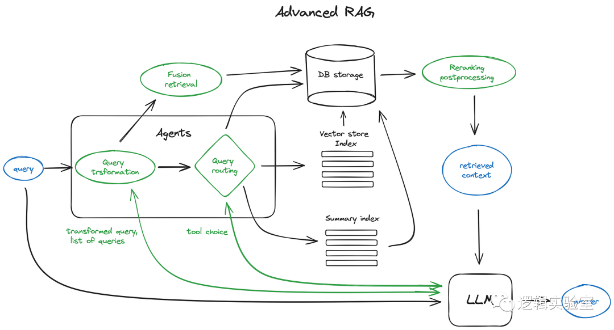
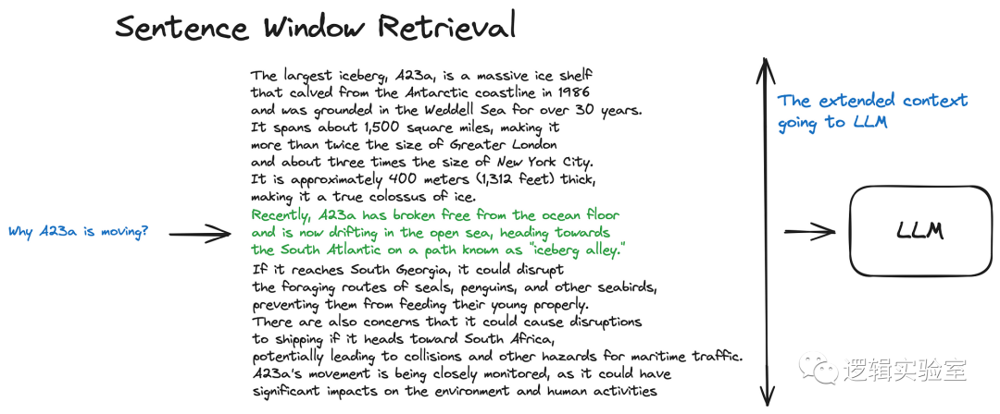

# 1. 简介

高级 RAG 架构的关键部分更像是一系列可选的技术手段，而非固定的设计蓝图。

示意图中的绿色部分代表了我们接下来要深入讨论的核心 RAG 技术，蓝色部分则代表文本。
并不是所有高级 RAG 的理念都能在一张简单的图示中直观地展现出来，比如，
一些用于扩展上下文的技术就被省略了 — 我们会在接下来的内容中逐步深入这些话题。

## 1.1 分块与向量化
   
   首先，我们需要创建一个向量索引库，用以表示我们文档内容的向量。
   然后，在程序运行过程中，我们会寻找所有这些向量与查询向量之间的最小余弦距离，
   以此来找到最匹配的语义含义。

   1.1 选择合适的块大小是一个关键问题 这个决定基于你所采用的嵌入
   模型以及它能够处理的 Token 数量。例如，传统的 Transformer Encoder 
   模型，比如基于 BERT 的 Sentence Transformers，最多能处理 512 个 Token。
   而 OpenAI 的 ada-002 模型则能处理更长的序列，达到 8191 个 Token。
   但是，我们需要在确保大语言模型 (LLM) 有充分的上下文进行推理与生成足够
   具体的文本嵌入以高效进行搜索之间找到一个平衡点。此处 有一篇研究详细讨论
   了如何选择块大小。在 LlamaIndex 中，这一问题可以通过 NodeParser 
   类 来解决，该类提供了一些高级功能，比如自定义文本分割器、元数据以及节点/块之间的关系等。

   1.2 数据向量化 接下来，我们需要选择一个模型来处理并嵌入数据段 — 
   有许多可供选择的模型，我倾向于使用如 bge-large 或 E5 这样的为
   搜索而优化的嵌入模型 — 想要了解最新的模型表现，可以查阅 MTEB 排行榜。

   想要了解从数据分段到向量化完整流程的一体化实施，请参考 LlamaIndex 中的一个完整数据处理流程示例。

# 2. 构建搜索索引

## 2.1 构建向量索引库

在本文中，为了简化说明，我没有包括编码器（Encoder）环节，
而是直接将查询内容送入索引。当然，在这个过程中，查询内容首先会被转换成向量形式。
关于最匹配的前 k 个结果（top k chunks）也是同理 — 索引返回的是最匹配的前 
k 个向量，并非实际的数据段。不过，我在这里用“数据段”来代指这些向量，
因为从向量中恢复出数据段是一个非常简单的操作。

RAG处理流程的核心是搜索索引，这个索引负责存储我们之前步骤中生成的向量化数据。
最基本的实现方法是采用平面索引 —— 这种方法会直接计算查询向量与所有数据块向量之间的距离。

为了在拥有超过 10000+ 数据点的大规模集合中实现高效的信息检索，我们需要一个经过
优化的搜索索引，也就是向量索引，比如 faiss、nmslib 或 annoy 这样的工具，
它们采用了近似最近邻技术，比如聚类、树结构或 HNSW 算法来实现。

除了 OpenSearch 或 ElasticSearch 这类托管解决方案，还有如 
Pinecone、Weaviate 或 Chroma 这样的向量数据库，它们能够自动处理数据摄取流程。

在你的索引选择、数据和搜索需求的基础上，你可以将元数据与向量一同存储，
并利用元数据过滤器来精确搜索，比如根据特定的日期或数据来源进行筛选。

LlamaIndex 不仅支持多种向量存储索引，还支持其他一些更为简单的索引方式，
包括列表式索引、树状索引和关键字表格索引。关于这些索引方式的更多细节，
我们会在后续的融合检索部分进行详细介绍。

## 2.2 层级索引

当您需要从大量文档中检索信息时，高效的搜索、定位相关内容并整合成一个
提及来源的完整答案就显得尤为重要。对于庞大的数据库，一个高效处理的
策略是建立两种索引 —— 一种是基于文档摘要的索引，另一种是基于文档片段的索引。
这样可以通过两阶段的搜索来操作：首先利用摘要索引过滤出相关的文档，
然后在这些筛选出的文档中进行深入搜索。

## 2.3 假设性问题与 HyDE 方法

另一种策略是指导大语言模型（LLM）为每段文本生成一个问题，
并将这些问题转化为向量形式。在实际操作中，通过与这些问题向量
构成的索引进行查询搜索（即在索引中将文本块的向量替换为问题的向量），
检索到相关问题后，再追溯到原始的文本段落，并把这些段落作为上下文提供给大语言模型，
以此来得到答案。这种方法能够提升搜索的准确性，因为与实际文本块相比，
查询内容与生成的假设性问题之间存在着更高的语义相似性。

有一种被称为 HyDE 的逆向逻辑方法 —— 你可以指导一个大语言模型（LLM）
根据查询生成一个理论上的文档，然后将此文档的向量与查询的向量结合使用，
以此来增强搜索的准确性和效率。

## 2.4 丰富检索上下文

核心思想是检索更小的信息片段以提升搜索的准确性, 
同时附加相关上下文以便大语言模型 (LLM) 进行逻辑推理。有两种策略 —— 
一是在已检索的小片段周围增加句子来扩展上下文，二是将文档递归划分为多个更大的父级片段，
这些父级片段中包含了更小的子片段。

### 2.4.1 句子窗口检索技术 在这种方法中，文档的每个句子都分别进行嵌入处理，
这样做能够极大提高根据查询与上下文之间的余弦距离进行搜索的准确度。
为了在找到最相关的那一句话后更好地分析整个上下文，我们会在提取出的句子的前后
扩展出一个包含 k 个句子的窗口，然后将这个更广的上下文送至大语言模型
(Large Language Model) 进行处理。

搜索索引时，标记为绿色的部分代表找到的句子嵌入，这是进行精确搜索的关键信息。
而将这个绿色部分与周围的黑色文本一起组成的段落，会一同输入到大语言模型（LLM）中，
目的是在处理查询时能够考虑到更加广泛的上下文信息。

### 2.4.2 自动合并检索技术 (也称作 父级文档检索技术)

这一技术的核心思想与“句子级窗口检索”类似 —— 它首先寻找更具体的信息片段，
然后在将这些片段提供给大语言模型（LLM）进行逻辑推理前，扩大其上下文范围。
具体做法是将文档分割成更小的子片段，并将这些子片段与它们所属的更大的父片段关联起来。

文档被拆分成多层次的块结构，最小的叶子块随后会被加入索引。在检索阶段，
我们会获取 k 个叶子块，如果这些块中有 n 个以上属于同一个父块，
那么我们会用这个父块来代替它们，并把父块提交给大语言模型（LLM）来生成答案。

先检索较小的块，如果在最初检索到的 k 个块中，超过 n 个块与同一个父节点相关联，
我们就用这个父节点来替换给 LLM 的上下文。这种方法相当于自动把多个检索
到的小块合并成一个大的父块。值得一提的是，搜索仅限于子节点的索引范围内。
想要更深入的了解，可以查阅 LlamaIndex 提供的递归检索器 + 节点引用教程。

## 2.5 融合检索或混合搜索

在信息检索领域，有一个经典的概念：结合传统的基于关键词的搜索技术 —— 
例如稀疏检索算法 tf-idf 和被广泛认可的搜索行业标准 BM25 —— 
以及现代的语义或向量搜索技术，把它们融合到同一个检索结果中。 
关键在于如何有效地融合这些具有不同相似度分数的检索结果。
这一挑战通常可以通过 Reciprocal Rank Fusion 算法来克服，
该算法通过重新排列检索结果来优化最终输出。

# 参考

[1] 翻译：图文并茂讲解高级 RAG 技术, https://mp.weixin.qq.com/s/QD2UgYXP1F4ysAi_hCbRmQ
