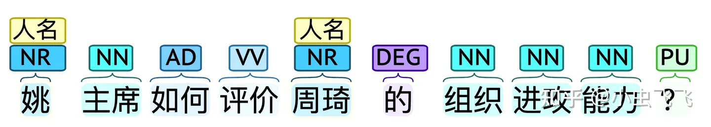
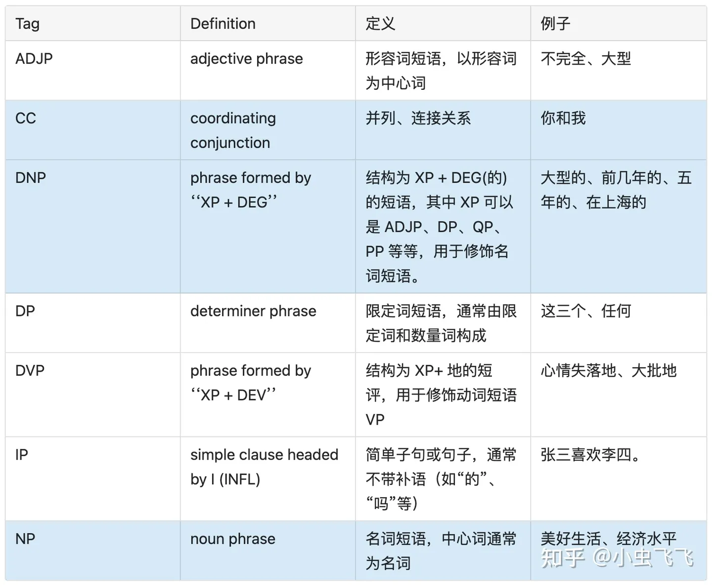
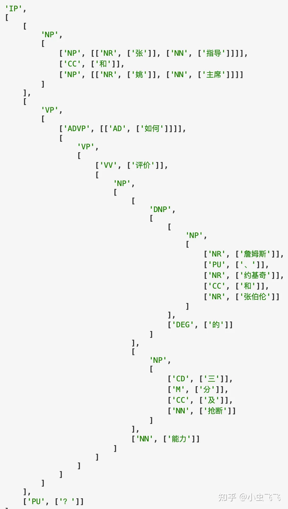

# 1. 主要方法

1. HyDE: 
   - LLM在虚构文档生成后，再使用无监督检索器进行 Embedding；然后将生成的向量在本地知识库中进行相似性检索，寻找最终结果。
   - LangChain和Llama-index中都有实现
   - 结论：效果不一定好，且开销大结论：效果不一定好，且开销大

# 2. 问题

1. 基于检索的主要方法：

   - 将用户问题和本地知识进行 Embedding，通过向量相似度(Vector Similarity)实现召回；
   - 通过LLM对用户问题进行意图识别；并对原始答案加工整合。

2. 现有问题：

   (1) 知识点聚合处理场景下，Embedding-Search 召回精度较低 的问题。典型应用范式是：

    - 一个仓库有 N 条记录，每个记录有 M 个属性；
    - 用户希望对 x 条记录的y 个属性进行查询、对比、统计等处理。

    这种场景在游戏攻略问答中很常见，以体育游戏 NBA2K Online2 为例：
    
    - 多知识点——简单查询   
      Q: 皮蓬、英格利什和布兰德的身高、体重各是多少？
    - 多知识点——筛选过滤   
      Q: 皮蓬、英格利什和布兰德谁的第一位置是 PF？
    - 多知识点——求最值   
      Q: 皮蓬、英格利什和布兰德谁的金徽章数最多？

   (2) 单个知识点方便建索引，不同知识点排列组合建索引，开销巨大。

    

   (3) 原始问题直接 Embedding ，和单条知识点的向量相似度比较低。
   
     降低 相似度评分下限(vector similarity score threshold)，同时提高召回结果数量上限(top k)。并产生不好的副效应：

     - 召回结果，有效信息密度大幅降低；score threshold 过高或 top k 过低，会导致某些有效知识点无法命中；
       反之，很多无效知识点或噪声会被引入。且由于总 token 数量的限制，导致本地知识点被截断，遗漏相似度较低但有效的知识点。
     - 召回结果的膨胀，增加了和 LLM 交互的 token 开销；增加了 LLM 处理的时间复杂度。再直白点：既慢又花钱。
     - 更糟糕的是，给 LLM 的分析处理带来额外噪声，影响最终答案的正确性。
   
    对召回结果整合后的反馈，耗时高，且结果不正确。

# 3. 解决方案

## 3.1 不同方案对比

通过问题理解，准确识别用户意图解决

1. HyDE (Hypothetical Document Embeddings)
   
   结论：效果不一定好，且开销大
 
   原理：

   - 根据意图，制定计划，拆分为若干步骤；在每个步骤选择合适的工具进行处理；
     根据每个步骤返回的结果，动态决定下一步的方案。比如：要分析球员的位置，应按下述步骤拆解：
     - 了解到底有哪些球员
     - 查询这些球员的位置各是什么
     - 对位置信息进行处理：基于召回结果，对用户问题进行推理。
   - 规划生成的单个步骤，做好抽象和封装，明确输入和输出以及执行逻辑。

   有了 Agents 和 Chains的标准抽象，下面再来看看摸清用户意图的几种方法，这样才能开发合适的工具：

   - Precise Zero-Shot Dense Retrieval without Relevance Labels 一文面向 zero-shot场景下的稠密检索 ，
     使用基础模型在训练过程中已经掌握的相关语料，面向用户问题，生成虚构的文档。该文档的作用，不是输出最终结果，
     而是通过 LLM 对问题的理解能力，生成与之相关的内容。这相当于自动化生成相关性标签，避免外部输入。虚构文档生成后，
     再使用无监督检索器进行 Embedding；然后将生成的向量在本地知识库中进行相似性检索，寻找最终结果。上述过程在原论文中也提供了示意图：
   
     
   
     HyDE 要求与用户问题相关的知识，已经存在于 LLM 基础模型中。但专业领域知识，可能本来就是未联网、未公开的；LLM 生成的虚构文档，
     可能包含很多噪音，所以效果不一定很明显；另外生成文档的额外交互，进一步增加了时间开销。目前，LangChain 提供了
     HyDE Chain，LlamaIndex 也提供了类似的能力；大家有兴趣可以尝试，面对中文可能需要自定义 Prompt Template。

2. 实体+槽位填充
    
   方法介绍：
  
   - 在为用户提供服务的预设场景下，细分用户各种意图的类别，定制对应的语义槽，每个槽位可以视为在语义层面体现意图的基本单位。
   - 通过深度学习、统计学习，甚至 LLM ，理解用户问题提取语义槽中需要的内容。
   - ```shell
        "球员打法" : {
        "球员名称" : ____,
        "年代" : ____,
        "比赛模式": ____,
      }
      ```
   

   优点：   
   将用户的诉求转化为语义槽后，可以较为准确的体现问答意图，这有助于提升搜索命中精度。
   原始知识点在建立索引时，除了原始的 Embedding 方法，可以做更多优化：

   - 增加 关键词、主题词检索。主题词由机构定义和发布的规范词，通常是专有名词或名词短语；
     主题词检索结果包括检索词的近义词、同义词以及同一概念词的不同书写形式等，
     通过主题词检索可以很大程度降低漏检和误检。关键词由作者自定义或自动分析提取，
     通常是可以高度概括该文章主题的，使用关键词搜索可搜出更加明确的主题方向的文章。
   - 对相同知识点建立多级索引。同一知识点通常涉及多个维度，建立多级索引可以让其在多维度查询下发挥作用。
     比如，球员信息涉及：姓名、球队、年龄、进攻、防守、荣誉等多项属性。可以针对多属性分别建立索引，
     这样可以高效查询指定的属性数据，而不必每次将所有内容全部提取。
   - 把原始知识库转化为知识图谱。知识图谱的三元组：实体、属性和关系。实体表示现实世界中的某个事物或对象，
     属性表示这个事物或对象的特征或属性，关系表示实体之间的关系。知识三元组可以帮助人们更好地理解和组织知识，
     并支持推理和问题解决。在问答系统中可以通过提示词引导 LLM 从用户的问题中提取知识三元组，然后在知识图数据库中进行查询。
   
   缺点：意图识别和召回优化，属于一体两面，均有助于提升问答系统的精度。搜索层面知识图谱相对于 Embedding 方式，加工成本较高。


   解决思路：
   - 关键词/主题词提取：
     - 面向知识点，提取的结果作为索引入口。
     - 面向问题，提取的结果作为语义槽内容。
   - 复用 Embedding 框架。从原始问题和知识点直接 Embedding 后的匹配，转化为对两者提取的关键词进行 Embedding 后再进行匹配。
    
   

    
   这种方式怎么解决原始 Embedding 存在的几个局限呢？

   多知识点聚合处理局限。在关键词提取过程中，可以将并列的关键词短语拆分，
   平铺后分别检索。这样就可以降低 Embedding 的噪音，提高命中精度。
   最后将生成不同关键词短语召回的结果组合即可。举个例子：

   ```text
   语句：姚明和奥尼尔的内线与三分能力。

    关键词提取后，按照从属关系叉乘，得到的结果应该是：
    - 姚明内线
    - 姚明三分
    - 奥尼尔内线
    - 奥尼尔三分
   ``` 
    
   LLM 过度依赖导致的性能开销。首先通过关键词短语召回已经可以大大提升命中精度，所以 不必设置 较低的
   score threshold 或者较大的 top k，这本来就过滤了很多无关词条。另外，关键词提取如果可以不依赖于
   LLM，而是使用传统的 NLP 技术，那么可以避免和 LLM 的多轮交互，节省了响应时间。这样，
   对于大量的知识点文档，也可以做关键词提取。    

## 3.2 关键词方案详解

- 关键词提取

   我们的目标是，从无标注文本（零样本）是实现信息抽取（Information Extraction，IE），
   因为很少涉及人为干预，该问题非常具有挑战性。IE 包含三类任务：

   - 实体关系三元组抽取(RE, Relation Extraction )。三元组(triples)即 (主体, 关系, 客体) ，
     用英文表示为 (Subject, Relation, Object) 。关系抽取，即实体三元组抽取。涉及两件事：
     - 识别文本中的主体、客体，即实体识别任务。
     - 判断这两个实体属于哪种关系，即关系分类。
   - 命名实体识别(NER, Name-Entity Recognition)。又称作专名识别、命名实体，
     是指识别文本中具有特定意义的实体，主要包括人名、地名、机构名、专有名词等，以及时间、
     数量、货币、比例数值等文字。指的是可以用专有名词（名称）标识的事物，一个命名实体
     一般代表唯一一个具体事物个体，包括人名、地名等。
   - 事件抽取(EE, Event Extraction)。指的是若干与特定矛盾相关的事物，
     在某一时空内的运动，从自然语言角度通过“主谓宾”等语义单元体现。事件抽取就是从半结构化、
     非结构化数据中，识别一个与目标相关的事件的重要元素识别出来。    

针对知识问答这样的特定场景，将上述三类任务简化为两个过程：

1. 名词短语提取。即：主语、宾语。通常由名词，和名词的限定词或者修饰词组成。比如：
  
   ```text
   姚主席如何评价周琦的组织进攻能力？
    主语：姚主席
    宾语：能力。但真正具有实际意义的是能力的限定修饰词，即“周琦组织进攻能力”。
    ```
2. 谓语。体现名词短语之间的事件。比如：评价。在更多场景中是：比较、查询、过滤、统计等，
   存在动态计算、处理的需求。因此即使忽略谓语，仅通过名词短语的组合也可以获得完备的知识。
   谓语所代表的事件，可以交给 LLM 处理。
    
   关键词提取方式：

   - 关键词只考虑名词短语，将其作为知识点的索引用于召回。
   - 事件体现的是不同知识点的关系。重点在于事件关联者，获取事件关联者对应的语料后，通过 LLM 理解事件进行处理：
     - 知识点通常不是按照事件组织的，而是按实体。因此索引建立和关键词抽取，应该以名词短语为主要目标。
     - 主语、宾语之间存在并列和限定关系。将限定关系按级联方式处理，同一名词短语内如果存在并列关系则与其他部分叉乘。


将该思路应用到上面的例子中：



如图所示，使用 NLU 的基本处理流程，分析原始问句：

1. 分词

2. 词性标注(Part-Of-Speech Tagging, Penn Chinese Treebank)，
   用于识别名词短语。比如：NR 表示人名、机构、地名等专有名词；NT 表示时间名词，
   NOI表示汉字顺序颠倒产生的噪声，NN 表示其它类型名词。

3. NER 识别。比如姚，周琦等。

4. 然后还需要考虑语义间的依存关系，确定名词间的关系，比如：

   - 并列
   - 修饰。比如：“组织进攻能力”
   - 从属、限定等等。比如：[周琦, 组织进攻能力]

这样不难得到应该搜索的关键词列表：[姚主席, 周琦, 组织进攻能力]。下面来看看这种思路究竟如何实现，
还是分为两大类：LLM、传统 NLP。

### 3.2.1 基于LLM提取

LLM已经天然具备 NLU 和 NLG 的能力，所以做名词短语提取按道理应该手到擒来。
业界已经有尝试，比如《Zero-Shot Information Extraction via Chatting with ChatGPT》一文，
提出两阶段多轮问答信息提取方式：


在该思想的启发下，笔者使用 langchain 开发了信息提取 Chain，LLM 使用的是 ChatGLM-6B本地部署，提取部分测试片段如下所示：


发现问题了吗：明明是分析张三丰；结果李四和王五怎么冒出来了。要知道，Prompt 已经添加了“不要编造内容”的说明，但无济于事。总体而言，使用 LLM 提取信息效果如下：

- 可以支持部分程度的 NER；对非专业名词、或业务自定义术语识别不好，需要Fine-Tuning。
- 可以提取名词短语，但无法做精确的语义分析，大量测试案例下总是存在不少偏差。
- 即使明确了输出格式，但还是频繁出错。
- 耗时较长。提取 6 条测试案例耗时 12s。

简单而言：不是不能做，但对 LLM 的要求较高；结果不准确、开销也大。

### 3.2.2 传统NLP提取

在 LLM 做信息提取，效果不尽如人意的情况下，转而尝试传统 NLP 技术。
前面提到的：分词、词性标注、NER 等，业界已经有不少传统 NLP 工具可以使用。

- spacy，测试结果较差，很多语句识别不出来，比如：

    ```text
    请比较詹姆斯和麦迪的属性”
    —— 无法识别任何人名
    “詹姆斯、字母哥和杰林.布朗的金徽章有何差异？”
    —— 只能识别出布朗，且将 "杰林" 抛弃
    ```
  
- CoreNLP 和 HanLP 均可正确识别。
  经过测试后最终选择 HanLP作为基础工具，原因在于：

  - 对中文支持好
  - 依赖少，开箱即用
  - 基础工具完备，接口整洁，便于二次开发
  
下面基于 HanLP，看看究竟如何解决前文提出的：多知识点聚合查询问题？其核心点在于三步：

- 词性标注
- 名词短语关系分析：修饰、限定、并列等
- 名词短语重新组织：修饰、限定关系级联；并列关系与其他部分叉乘。

名词短语提取与整合

举一个更加复杂的例子，在主语和宾语中添加：并列和修饰关系。首先分词，然后添加词性标注，结果如下：


***

依存分析

词性有了，下面需要进一步提取句子中单词与单词之间的语法关系，即 依存句法分析；笔者采取 
Stanford Dependencies Chinese (SDC) 标准进行分析，并且为了清晰展示，将分析结果转化为 
Pandas DataFrame 的形式，如下图所示：


- dep_tok_id，表示当前分词所依赖的中心词的id。比如：“指导” 的中心词 ID是 5。
- dep_rel，表示当前分词和中心词的关系。比如：“指导”和中心词“主席”的关系是 
  conj ，根据 SDC 标准其含义为“连接”，即指导和主席属于并列关系。类似的，“詹姆斯”、
  “约基奇”和“张伯伦”都属于并列关系；但是“张伯伦”的中心词是“能力”，关系为 assmod ，即关联关系（修饰限定）。
- sdp_tok_ids 和 sdp_rel。是在依存句法分析的基础上，进一步提供 语义依存分析，
  旨在分析一个句子中单词与单词之间的语义关系(sdp_rel)，并将其表示为图结构的任务。
  不同于依存句法分析的地方是：图结构中每个节点可以有任意个目标节点。在本例当中，
  特别需要关注的是：Agt（施事者），Poss（领事者），eCoo（并列关系）等。

根据 DataFrame 中提供的依赖关系，可以直观地获取名词短语：

- 主体：并列关系 [张指导, 姚主席]
- 客体：[三分能力]，三分和能力是修饰关系
- 客体还存在三个并列的领事关系（所属关系）：[詹姆斯, 约基奇, 张伯伦]

所以实际的客体，应该将并列的领事关系和本体叉乘后平铺，结果就是：

[詹姆斯三分能力, 约基奇三分能力, 张伯伦三分能力]

用这三个关键词，Embedding 后去本地知识库搜索就可大大提升命中精度。
不过大家如果细心的话可以发现：语义依存分析的结果其实 不准确，比如：

- 指导”一词的 sdp_rel 为 root，即被识别为动词作为语义树的根部
- “和”与“主席”被识别为领事关系

这种语义偏差的原因在于：同一个分词的语义容易产生混淆。比如“指导”既可以作为名词，
也可以作为动词。中文多义词和语境比较复杂，导致语义依存分析有不小的概率会出现误判。
那么怎么解决这个问题呢？一定要使用有监督训练方式，对基础语义依存分析模型进行 
Fine-Tuning吗？一旦涉及有监督，成本就不容小区了。不过幸好：
词性标注和依存句法分析，相对语义依存分析，准确率是更高的，所以笔者想到另外一种方式：

```text
基于正确的词性标注，构建出语法树，从语法角度提取名词短语。
```

***

成分句法分析

分析一个句子在语法上的递归构成，在 NLU 领域是经典的 
成分句法分析 问题。下面罗列 Chinese Treebank 标准片段，描述对分词单元类型的定义，请大家关注蓝色背景内容。



再次回顾我们要解决的多知识点聚合处理的目标：

- 名词短语(Noun Phrase)提取。即提取 NP;
- 处理好修饰名词短语间的修饰限定问题。比如：DNP 等
- 处理好并列、连接关系。比如：CC 等
- 将修饰关系的名词短语级联；将并列关系的NP和修饰关系的NP 叉乘。

基于该思路，上文提到实例，可以转化为下面的成分句法分析树：



这是典型的树结构：

- 顶层的 NP 有两个：分别是主体和客体。客体是 VP(动词短语)，表示主体的施事对象，和施事行为。
- 每个 NP 是一颗子树。变种很多，但核心有三种形式：
  - 并列。比如：[张指导, 姚主席]通过明确的连接词 "和" 建立关系；[詹姆斯, 约基奇, 张伯伦] 则通过非终结的标点服务建立关系。
  - 堆叠。由修饰词和名词联合形成一个名词短语。
  - 从属。通过"的"这样 DEG 词性的结构，明确表示前后两个短语间的从属关系。比如："三分及抢断"，隶属于"詹姆斯"。

这样来看，NP 的提取非常简单，通过递归方式对三种基础形式的树结构进行识别即可，提取时注意区分：

- 主体、客体。
- NP 子树中各个单元的组织关系。并列单元在和其它单元组合时，需要叉乘输出；其它邻接单元直接合并即可。


- 第一个列表为主语列表
- 第二个列表为平铺后的宾语列表
- 在性能方面，单条语句处理方式是 5ms；之前基于 LLM 的方式处理 6 条语句，需要 12s；性能相差数百倍。

至此，已经介绍完笔者关于关键词提取的基本思路，完整的处理流程如下图所示：


# 4. 应用效果

关键词提取实现后，配合前文提到的召回方法，应用到文章开始的几个示例问题，结果如下所示：


最后汇总笔者提出的解决多知识点聚合处理问题的方案：

- 基于传统 NLP 的成分句法分析，提取名词短语；再通过短语间的依存关系，生成关键词列表
- 从完整语句的 Embedding，切换为关键词 Embedding：
  - 知识库构建时。基于单知识点入库，入库时提取关键词列表进行 Embedding，用于检索。
  - 查询时。对用户的问题提取关键词列表进行 Embedding 后，从本地知识库命中多条记录。
- 将单问句中的多知识点拆解后检索，将召回的多条记录交付给 LLM 整合。

该方法的优势在于：

- 相比传统 Embedding，大幅提升召回精准度。
- 支持单次交互，对多知识点进行聚合处理。而不必让用户，手动分别查询单个知识点，然后让 LLM 对会话历史中的单个知识点进行汇总。
  使用传统 NLP 在专项问题处理上，相比 LLM 提供更好的精度和性能。
- 减少了对 LLM 的交互频次；提升了交付给 LLM 的有效信息密度；大大提升问答系统的交互速度。

# 5. 总结

LLM 的出现，推动下游应用激烈变革，各种探索如火如荼地展开。但在热潮背后，
我们还有一些细节问题需要仔细对待。LLM 的未来是伟大的，甚至可能是迈向 AGI 的重要里程碑；但
现在并不能宣判传统 NLP 技术的死亡。

本文提供了传统 NLP 和 LLM 结合的一种可能，通过用户问题和本地知识库关键词提取，
能较好的解决 Embedding 精度缺失，以及 HyDE、LLM NLU的精度和性能问题。
实现单轮对话，对多知识点的聚合处理。后续将继续探索 LLM 和传统技术的角色分工，进一步提升综合收益。


# 参考

[1] LLM+Embedding构建问答系统的局限性及优化方案, https://zhuanlan.zhihu.com/p/641132245
[2] Precise Zero-Shot Dense Retrieval without Relevance Labels, https://arxiv.org/pdf/2212.10496.pdf
[3] Zero-Shot Information Extraction via Chatting with ChatGPT, https://arxiv.org/pdf/2302.10205.pdf