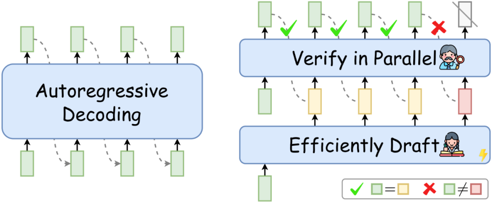
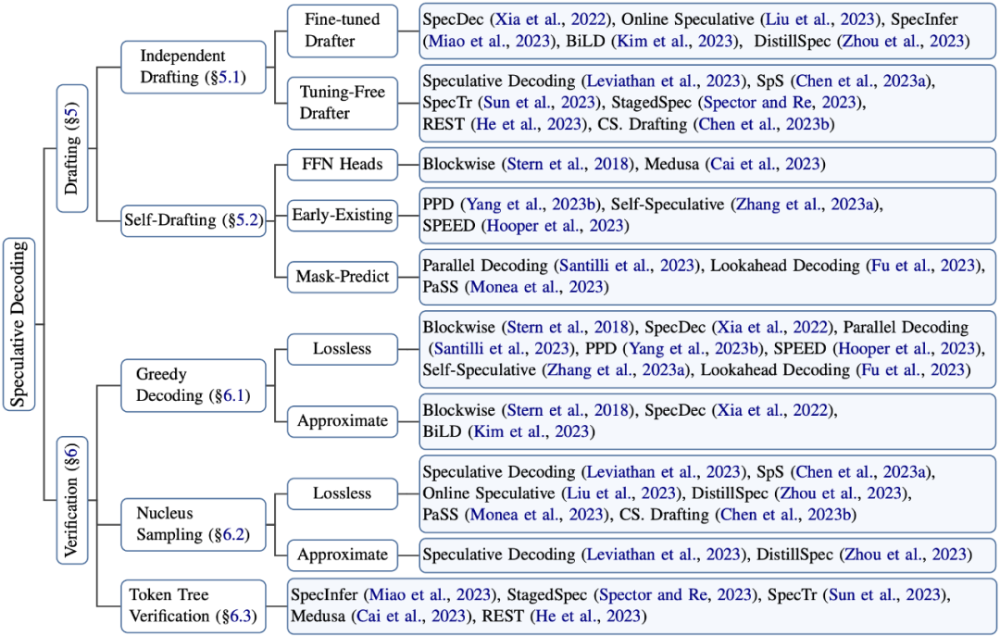
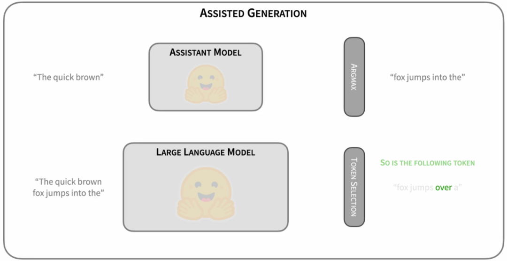
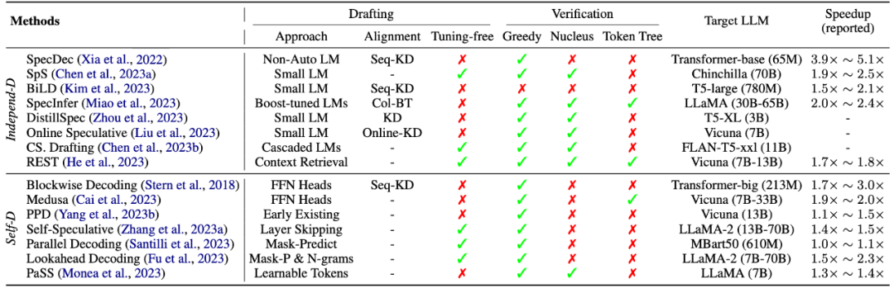

# 1. 简介

- 推测解码（Speculative Decoding）的综述
- 论文：Unlocking Efficiency in Large Language Model Inference: A Comprehensive Survey of Speculative Decoding
- Abs: https://arxiv.org/abs/2401.07851
- Repo: https://github.com/hemingkx/SpeculativeDecodingPapers

问题：

LLM推理主要是受内存带宽限制的（memory-bandwidth bound）[3][4]-- LLM每个解码步所用的推理时间大部分并
不是用于模型的前向计算，而是消耗在了将LLM巨量的参数从GPU显存（High-Bandwidth Memory，HBM）迁移到高速缓存
（cache）上（以进行运算操作）。

图1: 自回归解码（左），推测解码（右）

# 2. 方法

通过增加每个解码步LLM计算的并行性，减少总的解码步数（即减少了LLM参数的反复读写），从而实现推理加速。

如上右图所示，在每个解码步，推测解码首先高效地“推测”target LLM（待加速的LLM）未来多个解码步可能生成的token，
然后再用target LLM同时验证这些token。通过验证的token作为当前解码步的解码结果。如果“推测”足够准确，
推测解码就可以在单个解码步并行生成多个token，从而实现LLM推理加速。并且，使用target 
LLM的验证过程可以在理论上保证解码结果和target LLM自回归解码结果的完全一致[5][6]。

也就是说，推测解码在实现对target LLM推理加速的同时，不损失LLM的解码质量。

定义：

推测解码是一种“先推测后验证” (Draft-then-Verify) 的解码算法：在每个解码步，
该算法首先高效地“推测”target LLM未来多个解码步的结果，然后用target LLM同时进行验证，以加速推理。

也就是说，所有符合在每个解码步“高效推测->并行验证“模式的推理算法，都可以称为是推测解码（或其变体）。
推测解码实现加速的关键要素，主要在于如下三点：

- 相比于生成单一token，LLM并行计算额外引入的latency很小，甚至可以忽略；
- “推测”的高效性&准确性：如何又快又准地“推测”LLM未来多个解码步的生成结果；
- “验证“策略的选择：如何在确保质量的同时，让尽可能多的“推测”token通过验证，提高解码并行性。

图3: 推测解码相关研究的归纳分类

## 2.1 Independent Drafting

最简单的Drafting思路是，拿一个跟target LLM同系列的smaller LM进行“推测”[12][13]。
比如OPT-70B的加速可以用OPT-125M进行推测，T5-XXL可以用T5-small。这样的好处是可以直接利用现有的模型资源，
无需进行额外的训练。而且，由于同系列的模型使用相近的模型结构、分词方法、训练语料和训练流程，
小模型本身就存在一定的和target LLM之间的“行为相似性“（behavior alignment），适合用来作为高效的“推测“模型。

图4: https://huggingface.co/blog/assisted-generation

这一思路由Google和Deepmind同时提出[12][13]。作为Speculative Decoding的早期探索，
这种“推测”思路易于实践和部署。并且，这两篇工作同时在理论上证明了推测解码不仅支持greedy decoding，
还支持nucleus sampling的无损加速（我们下文会讲到）。这两种解码策略涵盖了LLM应用的大多数场景。因此，
这两篇工作极大地促进推测解码在LLM推理加速中的应用，吸引了工业界和学术界的大量关注。

## 2.2 Self-Drafting
然而，采用一个独立的“推测”模型也有缺点：

- 首先，并不是所有的LLM都能找到现成的小模型，比如LLaMA-7B。重新训练一个小模型需要较多的额外投入。
- 另外，引入一个额外的小模型增加了推理过程的计算复杂度，尤其不利于分布式部署场景。

因此，相关研究工作提出利用target LLM自己进行“高效推测”。比如Blockwise Decoding[5]和Medusa[8]在target 
LLM最后一层decoder layer之上引入了多个额外的FFN Heads（如下所示），使得模型可以在每个解码步并行生成多个token，作为“推测”结果。

图5: https://sites.google.com/view/medusa-llm

然而，这些FFN Heads依然需要进行额外的训练。除了这两个工作，还有一些研究提出利用Early-Existing或者
Layer-Skipping来进行“高效推测“[16][17]，甚至仅仅是在模型输入的最后插入多个[PAD] token，
从而实现并行的“推测”[18]。然而，“部署的便捷性”和“推测精度”之间依然存在一定的权衡关系。
如何选择合适的“推测”策略，达到令人满意的加速效果，就见仁见智了。

# 3. 验证策略的选择

如下图所示，在给定“草稿”（即推测结果）时，LLM的并行验证其实和训练阶段teacher-forcing的形式是一致的——在
生成每个token时，都假设LLM的前缀输入是正确的。比如，在验证第三个“推测”token时，LLM以绿色前缀
和两个黄色的"推测“token作为前缀输入。以贪婪解码（greedy decoding）为例，以该前缀作为输入时，
LLM会自己生成一个概率最大的token。如果这个token（绿色）和第三个“推测”token相同，
就说明第三个“推测”token通过了“验证”——这个token本来就是LLM自己会生成的结果。

因此，第一个没有通过验证的“推测”token （图中的红色token）后续的“推测”token都将被丢弃。
因为这个红色token不是LLM自己会生成的结果，那么前缀正确性假设就被打破，这些后续token的验证都无法保证前缀输入是“正确”的了。

图6：recap of Speculative Decoding

由此可见，推测解码是可以保证最终解码结果和target LLM原先的贪婪解码结果完全一致的。
因此，贪婪解码经常被用于推测解码的demo展示[8]，用以清晰直观地表示推测解码在保持和target 
LLM解码结果等同的前提下，实现了数倍的推理加速。

然而，严格要求和target LLM解码结果完全匹配（exact-match）是最好的策略吗？

显然，并不是所有概率最大的token都是最合适的解码结果（比如beam search）。
当推测模型的性能较好时，严格要求和target LLM结果匹配会导致大量高质量的“推测”token被丢弃，
仅仅是因为它们和target LLM top-1解码结果不一致。这导致通过验证的“推测”token数量较小，从而影响推测解码的加速比。

因此，有一些工作提出可以适当地放松“验证”要求，使得更多高质量的“推测”token被接受，
增大每个解码步通过验证的“推测”token数量，进一步提升加速比[12][14][15]。

除了支持贪婪解码，推测解码还可以在理论上保障和target LLM nucleus sampling的分布相同[12][13]，

另外，相比于只验证单一的“推测”序列，相关研究还提出可以让target LLM并行验证多条“推测”序列，
从而进一步增大通过验证的“推测”token数量[19]。

# 4. 总结

表1: 推测解码算法总结

在上表中，我们给出目前常用的推测解码算法的总结～。作为一种新兴的推理加速算法，
推测解码在实现对target LLM推理加速的同时保障了解码结果的质量，具有广阔的应用前景和极大的科研潜力，
个人比较看好～。然而，推测解码研究本身也存在许多尚未解答的问题，比如如何更好地实现target 
LLM和“推测”模型之间的行为对齐、如何结合具体任务的特点设计相应的推测解码策略（比如多模态模型加速），都是值得思考的问题。

# 参考
[1] LLM推理加速新范式！推测解码（Speculative Decoding）最新综述，https://mp.weixin.qq.com/s/S5VrbhAdTIeyL1UviJEvLA
[2] https://chat.openai.com/
[3] https://bard.google.com/
[4] Latency lags bandwith https://dl.acm.org/doi/10.1145/1022594.1022596
[5] Fast Transformer Decoding: One Write-Head is All You Need https://arxiv.org/abs/1911.02150
[6] Blockwise Parallel Decoding for Deep Autoregressive Models https://arxiv.org/pdf/1811.03115.pdf
[7] Fast Inference from Transformers via Speculative Decoding https://arxiv.org/abs/2211.17192
[8] Assisted Generation: a new direction toward low-latency text generation https://huggingface.co/blog/assisted-generation
[9] Medusa: Simple Framework for Accelerating LLM Generation with Multiple Decoding Heads https://github.com/FasterDecoding/Medusa
[10] Break the Sequential Dependency of LLM Inference Using Lookahead Decoding https://lmsys.org/blog/2023-11-21-lookahead-decoding/
[11] Non-Autoregressive Neural Machine Translation https://arxiv.org/abs/1711.02281
[12] Glancing Transformer for Non-Autoregressive Neural Machine Translation https://arxiv.org/abs/2008.07905
[13] Fast Inference from Transformers via Speculative Decoding https://arxiv.org/abs/2211.17192
[14] Accelerating Large Language Model Decoding with Speculative Sampling https://arxiv.org/abs/2302.01318
[15] Speculative Decoding: Exploiting Speculative Execution for Accelerating Seq2seq Generation https://arxiv.org/abs/2203.16487
[16] DistillSpec: Improving Speculative Decoding via Knowledge Distillation https://arxiv.org/abs/2310.08461
[17] Predictive Pipelined Decoding: A Compute-Latency Trade-off for Exact LLM Decoding https://arxiv.org/abs/2307.05908
[18] Draft & Verify: Lossless Large Language Model Acceleration via Self-Speculative Decoding https://arxiv.org/abs/2309.08168
[19] Accelerating Transformer Inference for Translation via Parallel Decoding https://arxiv.org/abs/2305.10427
[20] SpecInfer: Accelerating Generative Large Language Model Serving with Speculative Inference and Token Tree Verification https://arxiv.org/abs/2305.09781