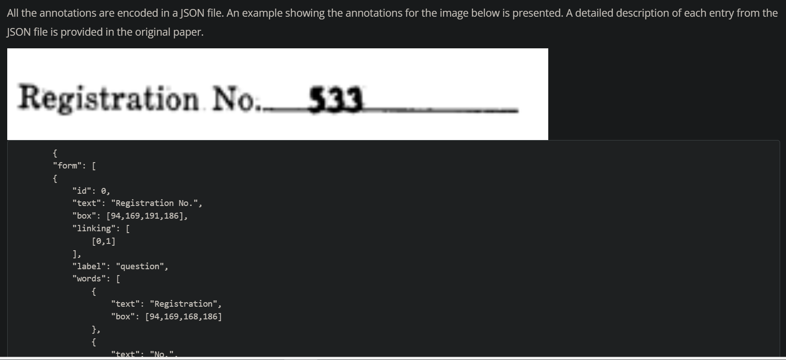

# 1. 文档信息抽取
## 1.1 cord

- 用于收据理解
- size: 2.05 GB
- 下载路径：https://huggingface.co/datasets/katanaml/cord

## 1.2 XFUND

- 多语种
- 下载：https://github.com/doc-analysis/XFUND/releases/tag/v1.0
- 数据结构和cord相似

## 1.3 FUNSD

下载：https://guillaumejaume.github.io/FUNSD/download/

# 2. 文档视觉问答

## 2.1 DocVQA

# 3. 文档分类

## 3.1 RVL-CDIP

# 4.布局分析

## 4.1 PubLayNet