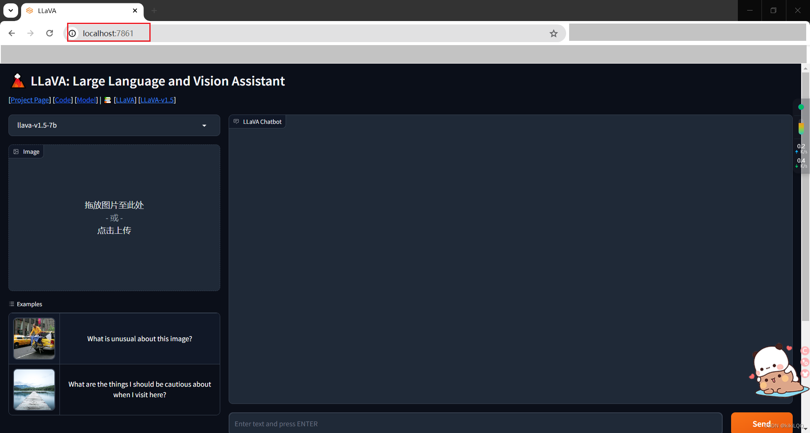

# 1. 安装

当前的记录，基于2023-03-14版本

参考：

Github: https://github.com/haotian-liu/LLaVA

If you are not using Linux, do *NOT* proceed, see instructions for [macOS](https://github.com/haotian-liu/LLaVA/blob/main/docs/macOS.md) and [Windows](https://github.com/haotian-liu/LLaVA/blob/main/docs/Windows.md).

1. Clone this repository and navigate to LLaVA folder
    ```bash
    git clone https://github.com/haotian-liu/LLaVA.git
    cd LLaVA
    ```

2. Install Package
    ```Shell
    conda create -n llava python=3.10 -y
    conda activate llava
    pip install --upgrade pip  # enable PEP 660 support
    pip install -e .
    ```

3. Install additional packages for training cases
   (此步骤会把代码作为一个python报安装到conda环境，每次修改代码都得重新执行如下步骤，
    如果可能频繁修改代码，忽略这一步的安装)
    ```
    pip install -e ".[train]"
    pip install flash-attn --no-build-isolation
    ```

# 2. 使用
## 2.1 模型下载及配置

1. Modelscope模型下载：

   - liuhaotian/llava-v1.6-34b：https://modelscope.cn/models/AI-ModelScope/llava-v1.6-34b/summary
   - openai/clip-vit-large-patch14-336: https://modelscope.cn/models/AI-ModelScope/clip-vit-large-patch14-336/summary
   - liuhaotian/llava-v1.6-34b-tokenizer: https://huggingface.co/liuhaotian/llava-v1.6-34b-tokenizer/tree/main

2. 修改模型关联路径

   在liuhaotian/llava-v1.6-34b路径下的config.json，修改字段中"mm_vision_tower"对应的模型路径改为
   openai/clip-vit-large-patch14-336，否则运行代码时会自动联网下载clip-vit-large-patch14-336模型

## 2.2 Gradio部署

1. Launch a controller

    ```Shell
    python -m llava.serve.controller --host 0.0.0.0 --port 10000
    ```

2. Launch the model
    
    This is the actual *worker* that performs the inference on the GPU.  Each worker is responsible for a single model specified in `--model-path`.
    
    ```Shell
    python -m llava.serve.model_worker --host 0.0.0.0 --controller http://localhost:10000 --port 40000 --worker http://localhost:40000 --model-path liuhaotian/llava-v1.5-13b
    ```
    Wait until the process finishes loading the model and you see "Uvicorn running on ...".  Now, refresh your Gradio web UI, and you will see the model you just launched in the model list.

3. Launch a gradio web server.

    ```Shell
    python -m llava.serve.gradio_web_server --controller http://localhost:10000 --model-list-mode reload
    ```
    You just launched the Gradio web interface. Now, you can open the web interface with the URL printed on the screen. You may notice that there is no model in the model list. Do not worry, as we have not launched any model worker yet. It will be automatically updated when you launch a model worker.

    

## 2.3 Restful API部署

1. Launch a controller

    ```Shell
    python -m llava.serve.controller --host 0.0.0.0 --port 10000
    ```

2. Launch the model
    
    This is the actual *worker* that performs the inference on the GPU.  Each worker is responsible for a single model specified in `--model-path`.
    
    ```Shell
    python -m llava.serve.model_worker --host 0.0.0.0 --controller http://localhost:10000 --port 40000 --worker http://localhost:40000 --model-path liuhaotian/llava-v1.5-13b
    ```
    Wait until the process finishes loading the model and you see "Uvicorn running on ...".  Now, refresh your Gradio web UI, and you will see the model you just launched in the model list.

3. restful访问

   请参考LLaVA-main\llava\serve\test_message.py （注意：该样例没有提供图片怎么发送，仅发送了文本）

## 2.4 CLI Inference

Chat about images using LLaVA without the need of Gradio interface. It also supports multiple GPUs, 4-bit and 8-bit quantized inference. With 4-bit quantization, for our LLaVA-1.5-7B, it uses less than 8GB VRAM on a single GPU.

```Shell
python -m llava.serve.cli \
    --model-path liuhaotian/llava-v1.5-7b \
    --image-file "https://llava-vl.github.io/static/images/view.jpg" \
    --load-4bit
```

## 2.5 其它使用和配置

请参考原始README.md和具体代码: 包括量化、lora和多并发等
