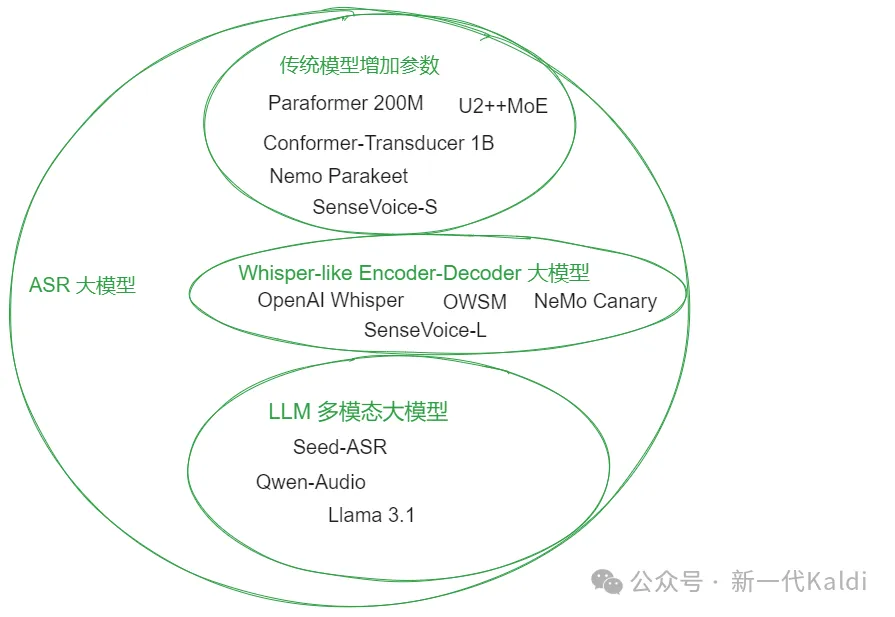

# 1. 简介

用14,000 小时的中文数据集训练后，模型的效果取得了 SOTA 或者接近 SOTA 的水平。750M 参数量的 Zipformer-XL 模型可以实现 WenetSpeech test_meeting 测试集 5.85% 的错误率, 达到了目前开源模型的最佳水平；微调后的 Whisper 模型在 SpeechIO 公开测试集上平均错误率为 4.31% ，接近一些商用 API 的效果；结合 Whisper 和 Qwen2-7B 的多模态大模型，在 Aishell 1 和 2 测试集上分别可以实现 0.51% 和 2.76% 的错误率，也达到了 SOTA 的结果。

本文介绍新一代 Kaldi Icefall 项目中的三种 ASR 大模型训练方案。

# 2. ASR 大模型介绍



ASR大模型分类图示

ASR 大模型大致可以分为三类：

1. 传统模型扩展

   - 将传统的模型，诸如 Conformer 等，参数增大，训练数据增多。

   - 这类模型一般只针对 ASR 任务，常配合 CTC 或者 Transducer 训练和解码。

   - 因为解码的速度很快，部署推理的成本也相对较小。

2. Transformer Encoder-Decoder 结构

   - 采用 Transformer Encoder-Decoder 结构的大模型，比如 OpenAI 发布的 Whisper 系列。

   - 这类模型常会针对多语种，多任务进行训练，支持多达上百种语言的语音识别，语音翻译，语种识别等任务。

   - 这类模型一般不容易实现流式的语音识别，因为 Transformer 的自回归解码特性，推理速度也较慢。

3. 多模态 LLM 模型

   - 结合了 LLM 的多模态模型，将 LLM 通过一个简单的 Speech Adaptor 和 Speech Encoder 连接起来。

   - 这类模型分别使用预训练好的 Speech Encoder 和 LLM 进行参数初始化，训练可以只针对 Speech Adaptor 进行。

   - 因为集成了 LLM, 除了语音识别，语音翻译等，训练任务可以进一步扩展到任意的 Speech Instrutions。

   - 模型的参数量和推理速度主要取决于 LLM， Speech Encoder 的参数量一般不会超过 1B，Speech Adaptor 则更加轻量。

# 3. Icefall 大模型训练方案

针对上文的三种 ASR 大模型， 下面分别介绍 Icefall 中对应的训练方案。

## 3.1 Zipformer Large 和 XL

参考 Dan 的建议，我们尝试了将 Zipformer 的参数量增大，得到了 Zipformer-Large (160M) 和 Zipformer-XL (750M) 两个模型。

两个模型的训练都使用了 joint 的 CTC 和 Transducer Loss, 方便后续利用 CTC guidance[1] 来加速 Transducer 的解码。训练过程采用了 Dynamic Chunk, 可以实现流式或者非流式的解码。

方案地址：https://github.com/k2-fsa/icefall/blob/master/egs/multi_zh-hans/ASR/RESULTS.md

## 3.2 Whisper 模型微调
我们对 Whisper-large-v2 进行了微调。同时，采用和 distill-whisper[2] 相同的模型结构 (但未进行 distillation)，微调了一个 decoder 只包含两层网络的轻量化模型。

经过测试，这个轻量化模型的精度稍逊于 Whisper-large-v2 微调版本 （参见后文实验部分），推理速度则可以提高一倍以上。

方案地址：https://github.com/k2-fsa/icefall/tree/master/egs/multi_zh-hans/ASR/whisper

## 3.3 Whisper + Qwen2 LLM 微调

我们使用微调以后的 Whisper 模型的 Encoder，一层 MLP 作为 Adaptor, 分别结合 Qwen 1.5B 和 Qwen 7B LLM, 得到了 whisper-qwen-1.5B, whisper-qwen-7B 两个模型。

实验分为两阶段训练，第一阶段只训练 Adaptor 参数，第二阶段对 LLM 添加 LoRA 参数，联合微调 Adaptor 和 LLM LoRA。为了加快训练和推理速度，Adaptor 对语音序列进行了 8 倍降采样，最终每 160 ms 语音信号对应一帧特征序列。

方案地址：https://github.com/k2-fsa/icefall/blob/master/egs/speech_llm/ASR_LLM/RESULTS.md

# 4. 实验
## 4.1 训练数据

所有实验都是针对中文 ASR 任务。训练数据集如下表，约一万四千小时音频，其中 WenetSpeech 数据集训练集使用标注更新版本[3]。

```markdown
| Dataset       | Number of hours | URL                                               |
|---------------|-----------------|---------------------------------------------------|
| TOTAL         | 13,906          | ---                                               |
| THCHS-30      | 35              | [Link](https://www.openslr.org/18/)               |
| AiShell-1     | 170             | [Link](https://www.openslr.org/33/)               |
| AiShell-2     | 1,000           | [Link](http://www.aishelltech.com/aishell_2)      |
| AiShell-4     | 120             | [Link](https://www.openslr.org/111/)              |
| ST-CMDS       | 110             | [Link](https://www.openslr.org/38/)               |
| Primewords    | 99              | [Link](https://www.openslr.org/47/)               |
| MagicData     | 755             | [Link](https://www.openslr.org/68/)               |
| AliMeeting    | 100             | [Link](https://openslr.org/119/)                  |
| WeNetSpeech   | 10,000          | [Link](https://github.com/wenet-e2e/WenetSpeech)  |
| KeSpeech      | 1,542           | [Link](https://github.com/KeSpeech/KeSpeech)      |
```

## 4.2 CER 结果
针对 Aishell1 test, Aishell2 iOS test, WenetSpeech test_meeting, WenetSpeech test_net 四个测试集，我们计算了模型的字错误率 (CER) 指标，解码都采用了 Greedy Search。

如下表结果，Zipformer-XL 在 WenetSpeech test_meeting 集合上可以实现 5.85% 的错误率，whisper-qwen2-7B 在 aishell1 test set 上可以实现 0.51% 错误率。

```markdown
| Model                     | aishell1 test | aishell2 test | wenetspeech test_meeting | wenetspeech test_net | Avg 4 |
|---------------------------|---------------|---------------|--------------------------|----------------------|-------|
| Paraformer[4]             | 1.68          | 2.85          | 6.97                     | 6.74                 | 4.56  |
| SenseVoice-L[5]           | 2.09          | 3.04          | 6.73                     | 6.01                 | 4.47  |
| Seed-ASR[6]               | 0.68          | 2.27          | 5.69                     | 4.66                 | 3.33  |
| zipformer-L （Ours）      | 1.38          | 3.23          | 6.26                     | 7.07                 | 4.49  |
| zipformer-XL （Ours）     | 1.31          | 3.27          | 5.85                     | 6.89                 | 4.33  |
| whisper-FT （Ours）       | 0.66          | 2.80          | 8.13                     | 6.94                 | 4.63  |
| distill-whisper-FT （Ours）| 0.94          | 2.98          | 8.34                     | 7.17                 | 4.86  |
| whisper-qwen2-1.5B （Ours）| 0.68          | 2.94          | 6.41                     | 6.63                 | 4.17  |
| whisper-qwen2-7B （Ours）  | 0.51          | 2.76          | 6.06                     | 6.30                 | 3.91  |
```

我们也在 SpeechIO 已经开源的 001 - 026 共 26 个测试集上进行了解码，经过微调以后的 Whisper 模型，可以实现 4.31% 的错误率。(下表结果均使用了 SpeechIO 所提供的正则化方法，不计入"嗯"，"儿"等字)

```markdown
| Model                     | speechio (Avg 001-026) |
|---------------------------|------------------------|
| aliyun_ftasr_api_zh       | 2.06                   |
| iflytek_lfasr_api_zh      | 3.01                   |
| U2++MoE[7]                | 3.80                   |
| zipformer-L （Ours）      | 5.45                   |
| zipformer-XL （Ours）     | 5.32                   |
| whisper-FT （Ours）       | 4.31                   |
| distill-whisper-FT （Ours）| 4.77                   |
| whisper-qwen2-1.5B （Ours）| 4.8                    |
| whisper-qwen2-7B （Ours）  | 4.5                    |
```

## 4.3 训练耗时

我们对模型训练所花费的时间进行了统计，所有的训练都使用了 8 张 Tensor Core 80G GPU。每个 epoch 使用了 1.1 和 0.9 倍数的速度扰动， 也即每个 Epoch 训练约 4.2万小时数据。

其中, whisper 的微调实验和 whisper-qwen2 的训练使用了 DeepSpeed Zero Stage 1 来节省显存，使得训练能够进行; Qwen2 的 LoRA 实验开启了 Flash-attention 2 来进一步加速。

```markdown
| Model                  | Time / Epoch | Total Epochs | Total Days |
|------------------------|--------------|--------------|------------|
| zipformer-L            | 11 hours     | 20           | 9.2        |
| zipformer-XL           | 16 hours     | 20           | 13         |
| whisper-FT             | 28 hours     | 3            | 3.5        |
| distill-whisper-FT     | 23 hours     | 6            | 5.75       |
| whisper-qwen2-1.5B     | 18 hours     | 4            | 3          |
| whisper-qwen2-7B       | 32 hours     | 6            | 8          |
```

# 5. 更多细节
我们将训练好的模型，训练日志和解码结果都上传到了 HuggingFace，具体地址见下表。

```markdown
| 模型                       | HF 仓库                                                    |
|----------------------------|------------------------------------------------------------|
| whisper finetune           | yuekai/icefall_asr_multi-hans-zh_whisper                   |
| distill-whisper finetune   | yuekai/icefall_asr_multi-hans-zh_whisper                   |
| zipformer Large (150M)     | yuekai/icefall-asr-multi-zh-hans-zipformer-large           |
| zipformer XL (700M)        | yuekai/icefall-asr-multi-zh-hans-zipformer-xl              |
| whisper-qwen2 1.5B         | yuekai/icefall_asr_aishell_whisper_qwen2_1.5B              |
| whisper-qwen2 7B           | yuekai/icefall_asr_multi-hans_whisper_qwen2_7B             |
```

# 6. 结果讨论
因为模型参数初始化方式的不同，结果之间的比较并非完全公平。通过这些结果，希望展示 Icefall 中 ASR 大模型训练方案的效果。后续我们会对训练方案持续优化，比如使用 fp8 来提升训练的效率。

本文只针对 Icefall 中的 ASR 大模型训练方案进行了介绍。借助 NVIDIA Triton[8] 和 NVIDIA TensorRT-LLM[9] 等工具，我们还可以对 ASR 大模型进行高效部署。后面我们也会对这些部署加速方案[10]进行介绍，欢迎关注和交流。

# 参考

[1] ASR 大模型训练方案来啦！,https://mp.weixin.qq.com/s/M3Pcl45e8dbzcIGKhJWurw

# 引用链接

[1] CTC guidance: https://arxiv.org/abs/2210.16481
[2] distill-whisper: https://arxiv.org/abs/2311.00430
[3] 标注更新版本: https://github.com/wenet-e2e/WenetSpeech/discussions/54
[4] Paraformer: https://arxiv.org/abs/2206.08317
[5] SenseVoice-L: https://arxiv.org/html/2407.04051v2
[6] Seed-ASR: https://arxiv.org/abs/2407.04675
[7] U2++MoE: https://arxiv.org/abs/2404.16407
[8] NVIDIA Triton: https://github.com/triton-inference-server/server
[9] NVIDIA TensorRT-LLM: https://github.com/NVIDIA/TensorRT-LLM
[10] 部署加速方案: https://github.com/k2-fsa/sherpa/tree/master/triton/whisper

