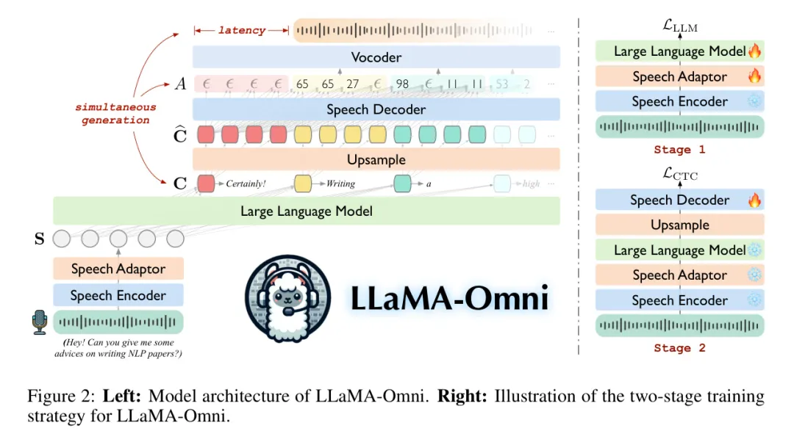
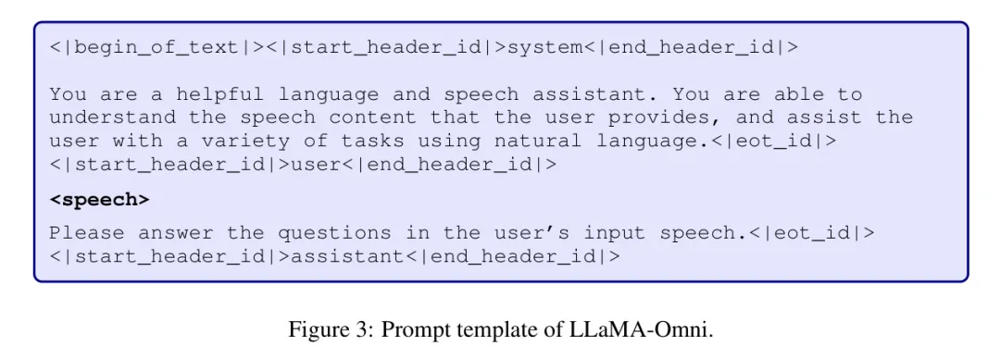
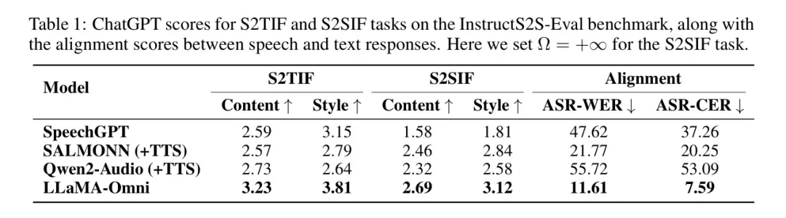
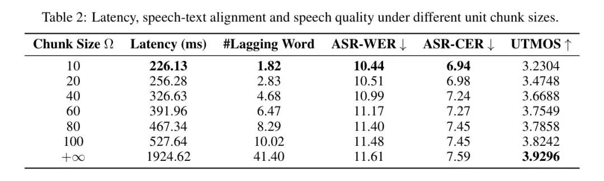
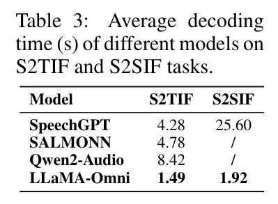

# 1. 简介

LLaMA-Omni 集成了一个预训练的语音编码器、一个语音 Adapter 、一个LLM和一个实时语音解码器。它消除了语音转录的需求，并可以直接从语音指令中以极低的延迟生成文本和语音响应。作者基于最新的LLaMA-3.1-8B-Instruct模型构建了LLaMA-Omni 。为了使模型与语音交互场景相匹配，作者构建了一个名为InstructS2S-200K的数据集，包括200万个语音指令和相应的语音响应。

实验结果显示，与先前的语音语言模型相比，LLaMA-Omni 在内容和风格上提供了更好的响应，响应延迟低至226ms。此外，仅使用4个GPU训练LLaMA-Omni 所需时间少于3天，为未来高效开发语音语言模型奠定了基础。

# 2. 模型

## 2.1 Speech Encoder
作者使用Whisper-large-v32的编码器作为语音编码器。Whisper是一个在大量音频数据上进行训练的通用语音识别模型，其编码器能够从语音中提取有意义的表示。具体来说，用户的语音指令的编码语音表示为，其中是长度为的语音表示序列。在整个训练过程中，作者保持编码器的参数不变。

## 2.2 Speech Adaptor
为了使LLM能够理解输入的语音，作者引入了一个可训练的语音 Adapter ，将语音表示映射到LLM的嵌入空间。遵循马等人（2024c）的研究，作者的语音 Adapter 首先将语音表示下采样以减少序列长度。

具体而言，每隔k个连续帧沿特征维度进行拼接：

接下来， 通过一个具有ReLU激活函数的2层感知机进行处理，得到最终的语音表示。上述过程可以形式化为以下：

## 2.3 Large Language Model
作者使用Llama-3.1-8B-Instruct3作为LLM ，目前这是最先进的开源LLM。它具有强大的推理能力，并且与人类偏好很好地对齐。

Prompt 模板  如图3所示。语音表示序列  填充到 对应的位置，然后将整个序列  输入到LLM。最后，LLM 根据语音指令和交叉熵损失自动回归生成文本响应 。

## 2.4 Speech Decoder
对于语音响应，首先将语音划分为离散单元。具体而言，使用预训练的HuBERT模型提取语音的连续表示，然后使用K均值模型将这些表示转换为离散的聚类索引。

随后，连续相同的索引被合并为一个单元，从而得到最终的离散单元序列，其中是聚类数量，是离散单元序列的长度。离散单元可以通过附加的基于单元的解码器转换为波形。

为了同时生成语音回复和文本回复，作者在LLM之后添加了一个 Stream 语音解码器，它包含几个标准的Transformer层，其架构与LLA相同，每个层都包含一个因果自注意力模块和一个 FFN 。语音解码器以非自回归方式运行，它将LLM的输出隐状态作为输入，并生成与语音回复对应的离散单元序列。

具体而言，对应文本回复的输出隐状态用表示，其中。作者首先将每个隐状态上采样一个因子，得到上采样隐状态序列，其中。接下来，被输入到语音解码器，输出隐状态序列用表示，其中。作者使用连接式时间分类（CTC）将与离散单元序列对齐。具体而言，CTC通过特殊的空白 Token 扩展了输出空间：

其中  和  是线性层的权重和偏置，序列  被称作 对齐. 为了模拟输入和输出之间的可变长度映射，CTC 引入了收缩函数 ，该函数首先合并  中的所有连续重复 Token ，然后删除所有空白 Token  。

例如：。在训练过程中，CTC 对所有可能的对齐进行边缘化，如下所示：

其中，表示所有长度为的可能对齐方式，这些对齐方式可以折叠为 。对齐是以非自回归的方式建模的。在推理过程中，我们选择最佳对齐，并应用折叠函数以获得离散单元序列，然后将其输入到声码器中以合成波形。

## 2.5 Training
如图2所示，作者采用两阶段训练策略为LLaMA-Omni。在第一阶段，作者训练模型直接从语音指令生成文本响应。具体而言，语音编码器被冻结，而语音 Adapter 和LLM使用公式（3）中的目标进行训练。在这一阶段，语音解码器不参与训练。在第二阶段，作者训练模型生成语音响应。在此阶段，语音编码器、语音 Adapter 和LLM都被冻结，只有语音解码器使用公式（5）中的目标进行训练。

## 2.6 Inference
在推理过程中，LLM 自动回归地生成文本响应。同时，由于作者的语音解码器使用因果注意力，一旦 LLM 生成一个文本响应前缀 ，对应的 upsampled 隐藏状态  可以被输入到语音解码器中，生成一个部分对齐 ，从而得到与生成的文本前缀对应的离散单元。

为了进一步实现语音波形的 Stream 合成，当生成的单元数量达到预定义的块大小  时，作者将这个单元段输入到 vocoder 中，合成一个语音段，然后立即播放给用户。因此，用户可以在等待完整文本响应生成完成之前开始听语音响应，确保低响应延迟，该延迟不受文本响应长度的影响。

此外，由于语音解码器使用非自回归建模，每个文本令元  对应的对齐  都在块内并行生成。因此，同时生成文本和语音的解码速度与仅生成文本的速度之间没有显著差异。

# 3. 语音指令数据的构建：InstructS2S-200K
为了训练LLaMA-Omni，作者需要三元数据，包括<语音指令，文本回复，语音回复>。然而，大多数公开的指令数据是以文本形式存在的。因此，作者通过以下过程基于现有的文本指令数据构建语音指令数据：

Step 1: 指令重写

由于语音输入与文本输入具有不同的特点，作者将根据以下规则重写文本指令： （1）在指令中添加适当的中间词（如“嘿”、“所以”、“呃”、“啊”等），以模拟自然的语言模式。 （2）将指令中的非文本符号（如数字）转换为相应的口语形式，以确保TTS正确合成。 （3）将指令修改为相对简短，避免过多冗词。作者使用Llama-3-70B-Instruct4模型根据这些规则重写指令。 Prompt 可以在附录A中找到。

Step 2: 响应生成

在语音交互中，现有的文本指令响应不适合直接作为语音指令响应使用。这是因为在基于文本的交互中，模型倾向于生成冗长的响应，使用复杂的句子，甚至可能包括有序列表或括号等非语言元素。然而，在语音交互中，通常更倾向于使用简洁而信息量大的响应。因此，作者使用Llama-3-70B-Instruct模型根据以下规则为语音指令生成响应：

（1）响应不应包含TTS模型无法合成的内容，如括号、有序列表等。

（2）响应应非常简洁明了，避免冗长的解释。 Prompt 信息请参见附录A。

Step 3：语音合成

在获得适用于语音交互的指令和响应后，需要进一步将其转换为语音使用TTS模型。对于指令，为了使合成的语音听起来更自然，作者使用CosyVoice-300M-SFT模型，随机选择每个指令一个男性或女性声音。对于响应，使用在LJSpeech数据集上训练的VITS模型来将响应合成标准语音。

作者从Alpaca数据集中收集了约50K条指令，涵盖了各种主题。此外，还从UltraChat数据集中收集了约150K条指令，主要涉及关于世界的各种问题。请注意，UltraChat是一个大规模的多轮对话数据集，但只选择了前150K条记录，并只使用第一轮指令。使用上述数据集和数据处理 Pipeline ，作者最终获得了200K条语音指令数据，称为InstructS2S-200K。

# 4. 实验
## 4.1 Experimental Setups
训练数据集：

作者使用第3节中提到的InstructS2S-200K数据集（包含20万条语音指令数据）。为了提取对应目标语音的离散单元，作者使用了一个预训练的K-means分箱器9，它从HuBERT特征中学习了1000个簇。预训练的高保真GAN解码器用于将离散单元合成为波形。

对于评估数据，作者从Alpaca-Eval10中选择了两个子集：_helpful_base_和_vicuna_，因为它们的问题更适合语音交互场景。作者删除了与数学和代码相关的问题，总共得到199条指令。为了获得语音版本，作者使用CosyVoice-300M-SFT模型将指令合成为语音。作者将在以下章节中将其称为InstructS2S-Eval测试集。

模型配置：

作者使用Whisper-large-v3的编码器作为语音编码器，使用LLama-3.1-8B-Instruct作为LLM。语音 Adapter 对语音表示进行5倍下采样。语音解码器由2个与LLaMA相同的Transformer层组成，具有4096个隐藏维度、32个注意力头和11008个 FFN 维度，其中包含425M参数。上采样因子λ设置为25。对于输入语音编码器的最小单位块大小Ω，作者在主要实验中设置Ω=+∞，这意味着作者等待整个单位序列生成后再将其输入到语音合成器进行语音合成。在后续实验中，作者将分析如何调整Ω的值来控制响应延迟，以及延迟和语音质量之间的权衡。

训练全功能的LLaMA-Omni遵循两阶段的训练过程。在第一阶段，作者使用32个批量的语音 Adapter （speech adapter）和语言模型（LLM），训练3个周期，每次迭代32步。作者使用余弦学习率调度器，前3%的步骤用于 Warm up ，峰值学习率设置为2e-5。在第二阶段，作者使用相同的批量大小、步骤数和调度器训练语音解码器，但峰值学习率设置为2e-4。整个训练过程大约需要65小时，在4个NVIDIA L40 GPU上运行。

## 4.2 Evaluation
由于LLaMA-Omni可以根据语音指令同时生成文本和语音响应，作者评估模型在两个任务上的性能：语音到文本指令遵循（S2TIF）和语音到语音指令遵循（S2SIF）。作者使用贪心搜索以确保可重复的实验结果。从以下方面对模型进行评估：

为了评估模型遵循语音指令的能力，作者使用 GPT-4o对模型的响应进行评分。对于S2TIF任务，评分基于语音指令的转录文本和模型的文本回复。对于S2SIF任务，作者首先使用 Whisper-large-v3 模型将模型的语音回复转录为文本，然后像S2TIF任务一样以相同的方式进行评分。 GPT-4o 在两个方面给出评分：内容和风格。 内容评分评估模型回复是否充分解决了用户指令，而风格评分评估模型回复的风格是否适合语音交互场景。详细说明可以在附录A中找到。

语音文本对齐为了评估文本响应和语音响应之间的对齐情况，作者使用Whisper-large-v3模型将语音响应转录为文本，然后计算转录文本和文本响应之间的Word Error Rate（WER）和Character Error Rate（CER）。作者将这些指标分别称为ASR-WER和ASR-CER。

为了评估生成的语音的质量，作者使用了名为UTMOS11的Mean Opinion Score（MOS）预测模型，该模型能够预测语音的MOS分数以评估其自然度。作者将这个指标称为UTMOS分数。

响应延迟latency是语音交互模型的一个关键指标，它指的是从输入语音指令到语音响应开始之间的时间间隔，这对用户体验有显著影响。此外，当语音响应开始时，作者还计算出已经生成的文字数量，称为**#滞后词**。

## 4.3 Baseline Systems
作者将以下语音语言模型作为基准系统：

SpeechGPT 是一种支持语音输入和输出的语言模型。作者使用原论文中采用的连续模态 Prompt 进行解码，根据语音指令依次输出文本指令、文本响应和语音响应。

SALMONN (+TTS) 是一种能够接受语音和音频输入并作出文本响应的LLM，使其能够执行S2TIF任务。对于S2SIF任务，作者在SALMONN之后添加了一个VITS TTS模型，以分阶段方式生成语音响应。

Qwen2-Audio (+TTS) 是一种强大的通用音频理解模型，能够执行各种与音频相关的任务，包括S2TIF任务。作者还构建了一个Qwen2-Audio和VITS ConCat 的系统，以完成S2SIF任务。

## 4.4 Main Results

表1展示了在InstructS2S-Eval基准测试上的主要结果。首先，对于S2TIF任务，从内容角度来看，LLaMA-Omni相较于之前的模型有显著提高。这主要是由于LLaMA-Omni是基于最新的LLaMA-3.1-8B-Instruct模型开发的，利用其强大的文本指令遵循能力。从风格角度来看，SALMONN和Qwen2-Audio的得分较低，因为他们是语音转文本模型。他们的输出风格与语音交互场景不匹配，经常产生格式化内容并包含大量冗余解释。

相比之下，SpeechGPT作为语音转语音模型，实现了更高的风格分数。同样，作者的LLaMA-Omni也获得了最高的风格分数，表明在经过作者InstructS2S-200K数据集的训练后，输出风格已经与语音交互场景很好地对齐。对于S2SIF任务，LLaMA-Omni在内容和风格得分上都优于之前的模型。这进一步证实了LLaMA-Omni能够在简洁高效的方式下，有效地处理用户的指令。

此外，在语音与文本响应的对齐方面，LLaMA-Omni实现了最低的ASR-WER和ASR-CER分数。相比之下，SpeechGPT在将语音与文本响应对齐方面表现不佳，这可能是由于其顺序生成文本和语音的缘故。

级联系统的语音-文本对齐，如SALMONN+TTS和Qwen2-Audio+TTS，也是次优的，主要原因是生成的文本响应可能包含无法合成为语音的字符。这个问题在Qwen2-Audio中尤为明显，它偶尔会输出中文字符，导致语音响应中出现错误。相比之下，LLaMA-Omni实现了最低的ASR-WER和ASR-CER分数，表明生成的语音与文本响应之间的对齐程度更高，进一步验证了同时生成文本和语音响应的优势。

## 4.5 语音质量和响应延迟之间的权衡
LLaMA-Omni 可以同时生成文本响应和与语音响应对应的离散单元。如第2.6节所述，为了进一步实现流形波生成，当生成的离散单元数量达到一定块大小Ω时，该块单元被输入到语音合成器中进行合成和播放。通过调整Ω的值，作者可以控制系统的延迟，其中较小的Ω对应较低的系统延迟。当Ω=+∞时，意味着在合成语音之前等待所有单元生成。同时，Ω的值也影响生成的语音质量。较小的Ω意味着将语音分割成更多段进行合成，这可能导致段与段之间的断续，可能降低语音的整体连贯性。

为了更好地理解Ω的影响，作者研究了系统的延迟、语音与文本响应的对齐以及不同Ω设置下生成的语音质量。如表2所示，当Ω设置为10时，系统的响应延迟低至226毫秒，甚至低于GPT-4o的平均音频延迟320毫秒。此时，语音响应在开始时平均滞后1.82个词。当Ω设置为无穷大时，延迟增加到约2秒。对于ASR-WER和ASR-CER指标，作者惊讶地发现，随着块大小的增加，错误率也增加。作者认为可能有两个原因。

- 一方面， vocoder可能比长序列更可靠地处理短单元序列，因为它通常训练在较短序列上。
- 另一方面，作者使用的ASR模型Whisper-large-v3具有很强的鲁棒性。即使语音与较小Ω的较小连续性，对ASR识别精度影响很小。

因此，作者进一步使用UTMOS指标评估生成的语音自然度。它显示，随着Ω的增加，语音的自然度提高，因为语音的不连续性减少。总之，作者可以根据不同的场景调整Ω的值，以实现响应延迟和语音质量之间的权衡。

## 4.6 Decoding Time

表3列出了不同模型在S2TIF和S2SIF任务上的平均解码时间。对于S2TIF任务，SpeechGPT需要先输出文本指令，然后输出文本回复，而SALMONN和Qwen2-Audio倾向于产生冗长的回复。

相比之下，LLaMA-Omni能直接提供简洁的答案，导致解码时间显著降低，每条指令的平均解码时间仅为1.49秒。对于S2SIF任务，SpeechGPT逐条输出文本和语音回复，导致解码时间比仅生成文本回复时大约延长6倍。相比之下，LLaMA-Omni同时输出文本和语音回复，并采用非自动回归架构生成离散单元。因此，总生成时间仅增加1.28倍，证明了LLaMA-Omni在解码速度上的优势。

# 参考

[1] LLaMA-Omni 发布 | 基于LLaMA-3.1-8B让羊驼家族再添大将，实现低延迟/高质量的语音互动，https://mp.weixin.qq.com/s/xu-rpbYsjfq1mO_T9GofGg