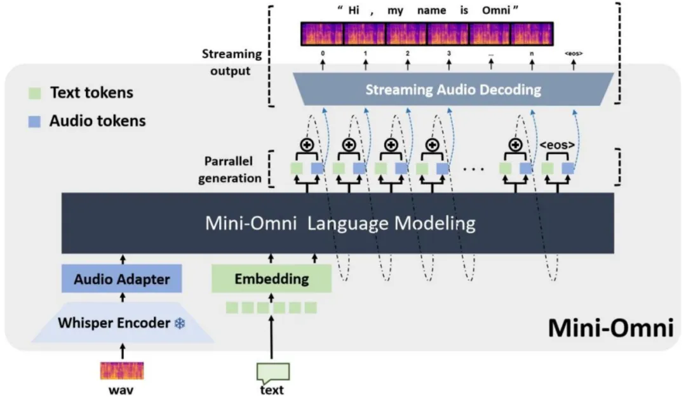
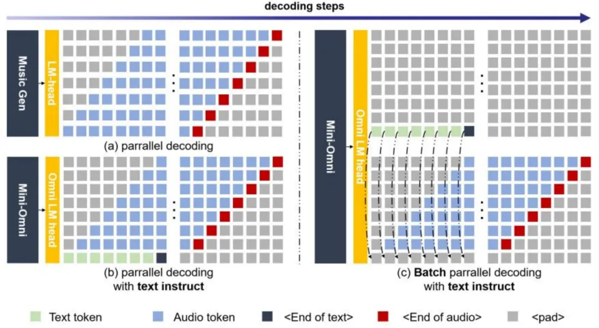
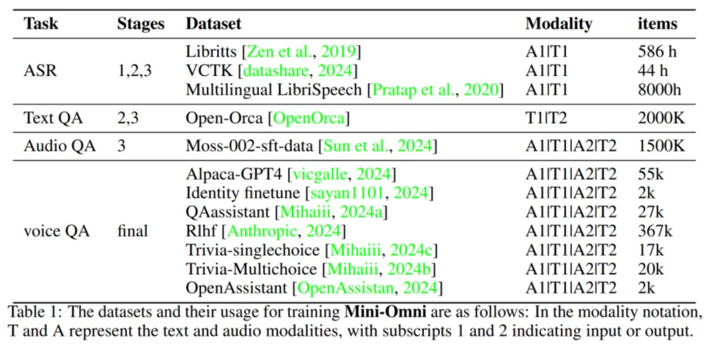

# 1. 简介

- 论文题目：Mini-Omni: Language Models Can Hear, Talk While Thinking in Streaming
- 论文地址：https://arxiv.org/abs/2408.16725
- 代码仓库：https://github.com/gpt-omni/mini-omni

Mini-Omni是一个开源多模态大型语言模型，具备实时对话能力和端到端的语音输入输出功能。通过独特的文本指导并行生成方法，实现了与文本能力一致的语音推理输出，仅需极少的额外数据和模块。

针对多层级的音频编码方案，本文采用不同层级延迟并行输出的方案减小音频推理长度，有效解决实时性问题。同时还提出了多任务同时推理的生成方法进一步加强模型的语音推理能力。另一方面，本文所采用训练方案可有效迁移至任意语言大模型，通过增加少量参数及分阶段训练，在尽可能保留模型原始推理能力的同时，为模型加上 「听、说」的语音交互能力。

为了验证方案的有效性，Mini-Omni 在使用仅 0.5B 的小模型和少量开源及合成数据的情况下，在实时语音问答及语音识别等方面表现出令人惊喜的效果。

总结来说，本文主要贡献为：

- 提出了首个开源的端到端、实时语音交互的多模态模型解决方案，支持语音流式输出，不需要额外的 ASR 或 TTS 系统。
- 推理过程中，可同时生成语音和文本信息，通过文本指导语音生成，有效降低语音推理的学习难度。
- 提出多阶段的训练方案，可通过少量开源或合成数据使任意语言模型具备语音交互能力。

# 2. Mini-Omni 模型架构

Mini-Omni 整体模型框架如下图所示，模型输入端可以是语音或文本，输出端同时包含文本和语音。为复用语言模型「预测下一个 token」的学习范式，输出侧语音采用离散编码，本文采用了 SNAC 编解码方案。

针对语音交互场景，输入语音经过预训练 whisper 的语音编码模块进行连续特征提取，然后通过 2 层 MLP 对齐语音信息与文本信息。输出侧，每一步会通过音频解码头和文本解码头同时进行文本 token 与语音 token 解码，然后将输出的音频表征和文本表征进行特征融合，再作为下一步的输入。同时，在推理过程中，可将输出的语音 token 流式输入至 SNAC 解码器中生成语音，实现低延迟的语音交互。

通过采用文本信息指导语音信息输出的形式，有效降低了直接进行语音输出推理的学习难度，实现少量数据即可使语言模型具备语音问答能力。这种一边生成文本，一边生成对应语音的形式功能上类似于「在线 TTS 系统 (online TTS)」，具有较好的灵活性。

文本指导下的音频生成

为降低直接推理语音信息的学习难度，以及减少推理过程中语音 token 长度，我们采用了文本和语音延迟并行生成的方案，其示意图如下。

本文所采用的 SNAC 方案，每一帧具有 7 个有效语音 token，对应音频时长为 80ms。一种语音建模方案是将语音的所有 token 平铺展开进行顺序推理，类似方案在音乐生成领域已被验证生成效果较好。但也存在语音 token 序列长、学习难度高等问题。为实现实时语音推理，我们采用延迟并行推理的方案。

具体来讲，模型每一步同时生成 8 个 token，包括 7 个语音 token 和 1 个文本 token。由于音频依赖文本内容，而音频的 7 个 token 之间从前到后是由粗到细的建模关系，所以在推理开始时如上图 (b) 所示。首先生成文本的第一个 token，然后生成文本的第二个 token 和第一层音频的第一个 token，以此类推。先输出文本 token 主要为了语音 token 在生成过程中有文本内容进行参考。

同时，由于文本指导语音生成方案的灵活性，我们在实验中发现，推理时在一个批次中同时进行 audio-to-audio 和 audio-to-text 两个任务，并用后者的文本 token 替换前者的文本 token 以指导前者的语音生成（如上图 c 中所示），可有效提升语音对话的能力。

让每个模型都能「听说」

提出了一种主要基于适配器的模型能力扩展方法，具体学习过程可以分为三个阶段：

首先模态对齐：此阶段的目标是增强文本模型理解和生成语音的能力。过程中，Mini-Omni 的 LLM 模块完全冻结，只在语音理解和生成两个适配器中进行梯度更新。在这个阶段，我们使用开源语音识别 (ASR) 和语音合成 (TTS) 数据集来进行训练。

其次适应训练：完成新的模态与文本模态的输入对齐后，将语音适配器冻结。在这个阶段中，我们将可用的文本问答对中的问题部分采用开源多音色的语音合成系统进行语音数据合成，生成语音问答数据集。我们关注于训练模型在给定音频输入时的文本推理能力。模型使用语音识别 (ASR)、语音问答 (AudioTextQA) 和文本问答 (TextTextQA) 任务的数据集进行训练。

最后多模态微调：在最后阶段，我们使用全面的数据对整个模型进行微调，新增如全语音问答 (AudioAudioQA)、文本语音问答 (TextAudioQA) 等形式数据集。此时，除了音频所有模型权重都会参与训练。由于适配器训练期间已经处理了主要的模态对齐任务，原始模型的能力得以最大限度地保留。

通过上述多阶段的训练流程，结合开源语音数据，本文只需合成少量的语音问答数据即可使任意语言模型具备「听说」的能力，实现纯语音的端到端自然交互。

# 3. 实验效果

主要采用开源语音或文本问答数据进行训练，具体可参考下表。其中 A1 和 T1 表示音频及对应的文本内容，A2、T2 同理。针对问答场景，1 表示问题，2 表示对应问答的答案。

下图中，展示了 Audio-to-Text、Audio-to-Audio、Batch-Audio-to-Audio 三种任务中 Mini-Omni 的具体表现。

# 参考

[1] Mini-Omni：首个开源实时语音交互模型，边听边说边思考，延迟比GPT-4o还要低，https://mp.weixin.qq.com/s/3E_sfrnl0kPNUOIiMCBksw
