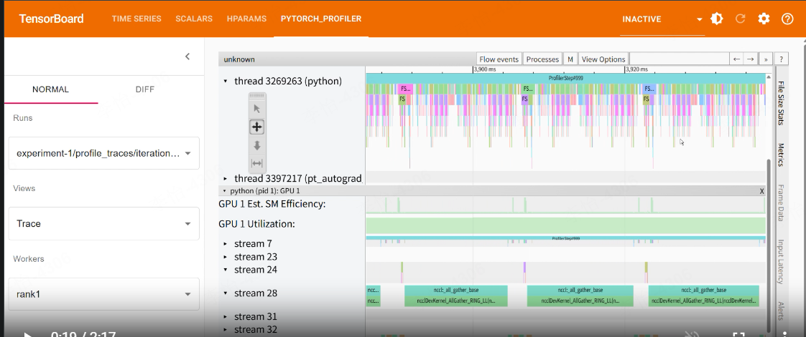

https://github.com/xingchensong/TouchNet

有没有想尝鲜 KimiAudio 的朋友？可以尝试使用 TouchNet。

TouchNet 是一个简洁、轻量的代码库，用于大规模多模态大语言模型（LLM）训练，并原生支持PyTorch并行计算（如tensor parallel/data parallel/context parallel...）。

TouchNet v0.1.0 目前提供了一个完整的sft pipeline，用于在 WenetSpeech 数据集上对 kimi-audio（以及qwen2audio）进行监督微调（SFT），同时还提供了对比结果。所有实验均可复现。

这应该是首个能够完全支持 kimi-audio 大规模微调且结果可复现的开源实践。

相关对比实验结果也比较有意思，请看：

https://github.com/xingchensong/TouchNet/tree/main/examples/audio/sft/asr

集成了GPU监控工具：
- [Nsys-like Profiler] to get optimization recommendations
- [Memory Monitor] to debug OOM errors and improve memory usage