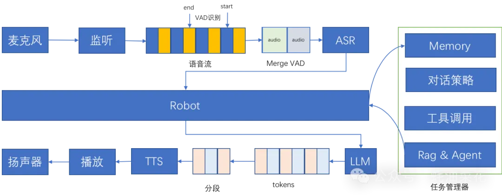

# 1. 资源

https://github.com/wwbin2017/bailing.git

# 2. 简介
- 技术核心：百聆结合语音识别（ASR）、语音活动检测（VAD）、大语言模型（LLM）和语音合成（TTS）技术，实现高效语音对话。
- 功能亮点：支持语音输入、智能对话生成、语音输出、打断功能、记忆功能、工具调用和任务管理。
- 应用场景：适用于智能家居控制、个人助理服务、汽车智能交互、教育辅助工具和办公辅助应用。

百聆（Bailing）是一款开源的语音对话助手，基于语音识别（ASR）、语音活动检测（VAD）、大语言模型（LLM）和语音合成（TTS）技术，能够与用户进行自然的语音对话。百聆的端到端时延低至800ms，无需GPU即可运行，适用于各种边缘设备和低资源环境。

百聆通过模块化设计，支持记忆功能、工具调用和任务管理，提供高质量的语音对话体验。其核心目标是在低资源环境下实现类GPT-4o的对话效果，适用于智能家居、个人助理、车载系统等多种场景。

**百聆的主要功能**
- 语音输入与识别：准确地将用户的语音输入转换为文本，为后续的对话处理提供基础。
- 语音活动检测：过滤掉无效的音频片段，只处理有效的语音部分，提高识别效率和准确性。
- 智能对话生成：基于大语言模型（LLM），生成自然、流畅且富有逻辑的文本回复。
- 语音输出与合成：将生成的文本回复转换为自然、逼真的语音，播放给用户。
- 支持打断：识别用户的关键字和语音打断行为，及时响应用户的即时反馈和控制指令。
- 记忆功能：记忆用户的偏好和历史对话，提供个性化的互动体验。
- 工具调用：支持集成外部工具，用户可通过语音指令直接请求信息或执行操作。
- 任务管理：高效管理用户任务，包括跟踪任务进度、设置提醒及提供动态更新。

**百聆的技术原理**
- 语音识别（ASR）：基于FunASR技术，将语音信号转换为文本数据，涉及语音信号的采集、预处理、特征提取及模式匹配。
- 语音活动检测（VAD）：基于silero-vad技术，实时监测和分析语音信号，判断是否包含有效的语音活动。
- 大语言模型（LLM）：使用deepseek作为核心模型，处理ASR输出的文本，生成自然、流畅的回复。
- 语音合成（TTS）：通过edge-tts等技术，将LLM生成的文本回复转换为语音信号，模拟人类的语音发音特点。

# 参考

[1] 百聆：集成Deepseek API及语音技术的开源AI语音对话助手，实时交互延迟低至800ms, https://mp.weixin.qq.com/s/7pd1ti6RnhnQUAnhwLc4Xw
