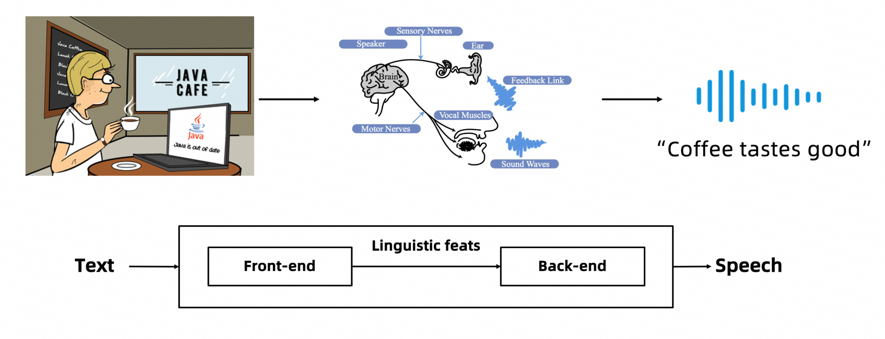
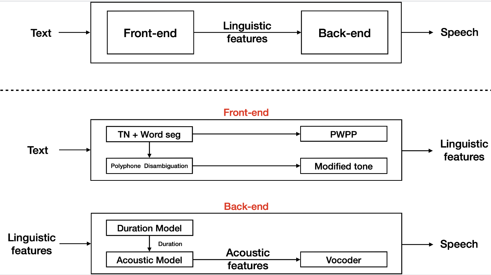
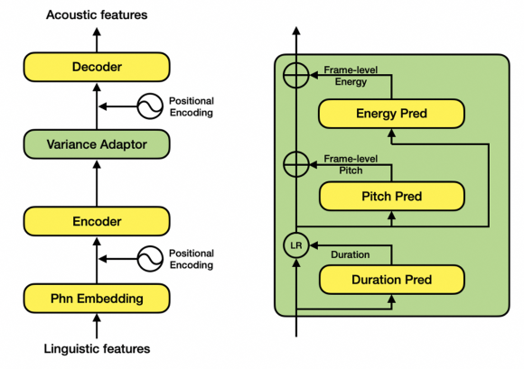
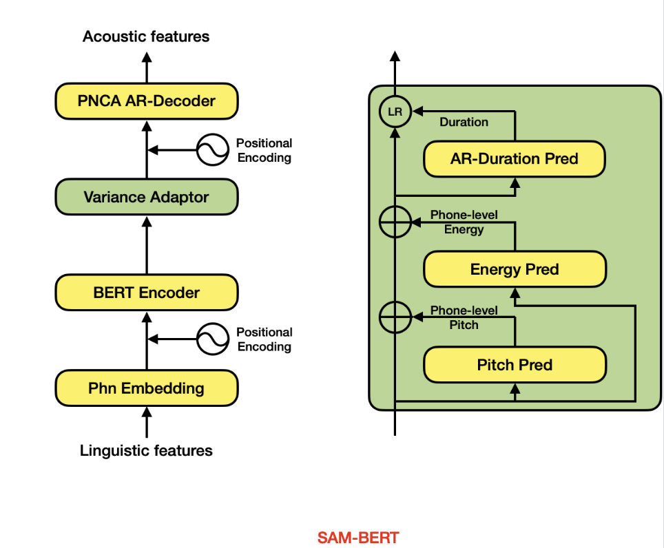
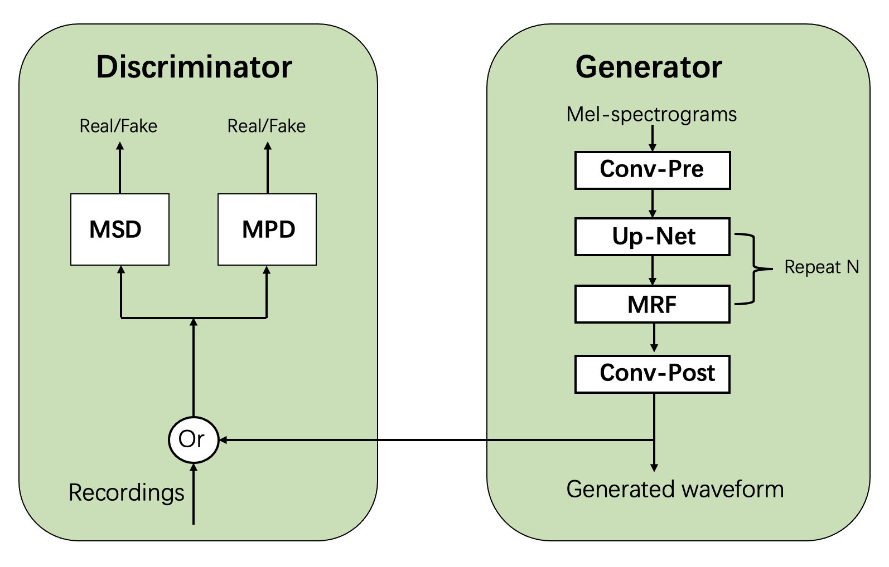
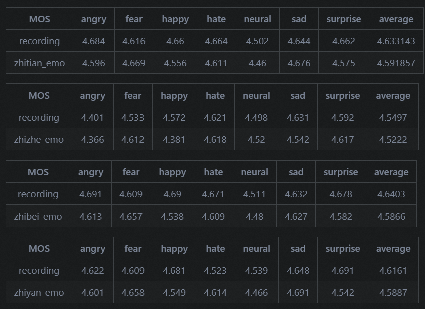

# 1. 简介

模型局限性以及可能的偏差:
- Sambert声音克隆是针对较短音频开发的，所以长音频的效果不一定更好；训练步数一般来说在500步以下
- 该发音人支持中文及中英文混合，TN规则为中文
- 目前支持发音人zhitian_emo，zhiyan_emo，zhizhe_emo，zhibei_emo

模型最后更新时间：2023-04
- 在线demo: https://modelscope.cn/models/iic/speech_sambert-hifigan_tts_zh-cn_16k/summary
- 训练介绍：https://modelscope.cn/docs/sambert
- 训练代码：https://github.com/alibaba-damo-academy/KAN-TTS.git

论文：
- （2020）Robutrans: A robust transformer-based text-to-speech model
- （2018）Bert: Pre-training of deep bidirectional transformers for language understanding
- （2020）Hifi-gan: Generative adversarial networks for efficient and high fidelity speech synthesis

# 2. 原理

## 2.0 什么是语音合成

语音合成(Text-to-Speech, TTS) 是指将输入文字合成为对应语音信号的功能，即赋予计算机“说”的能力，是人机交互中重要的一环。现代语音合成最早可以追溯到1939年贝尔实验室制造的第一个电子语音合成器，后来历经共振峰合成、PSOLA合成、Unit Selection波形拼接、统计参数合成几代的发展，在2016年随着WaveNet的出现步入了深度学习合成时代，此时语音合成的效果已经表现出了比拟真人的水准。

一个语音合成系统通常由两部分组成，分别是语言分析部分和声学系统部分，也被称为前端部分和后端部分，语言分析部分主要是根据输入的文字信息进行分析，生成对应的语言学特征，想好该怎么读；声学系统部分主要是根据语音分析部分提供的语音学特征，生成对应的音频，实现发声的功能，其中声学系统部分直接影响了合成语音的自然度和真实感。如人类通过大脑传递神经信号驱动肺部和声带发出声音一样，计算机对输入的文本，先后经过语言分析和声学系统，最终合成语音信号。



## 2.1 框架描述

拼接法和参数法是两种Text-To-Speech(TTS)技术路线。近年来参数TTS系统获得了广泛的应用，故此处仅涉及参数法。

参数TTS系统可分为两大模块：前端和后端。 前端包含文本正则、分词、多音字预测、文本转音素和韵律预测等模块，它的功能是把输入文本进行解析，获得音素、音调、停顿和位置等语言学特征。 后端包含时长模型、声学模型和声码器，它的功能是将语言学特征转换为语音。其中，时长模型的功能是给定语言学特征，获得每一个建模单元（例如:音素）的时长信息；声学模型则基于语言学特征和时长信息预测声学特征；声码器则将声学特征转换为对应的语音波形。

其系统结构如[图1]所示：



前端模块我们采用模型结合规则的方式灵活处理各种场景下的文本，后端模块则采用SAM-BERT + HIFIGAN提供高表现力的流式合成效果。

在语音合成领域，类似FastSpeech的Parallel模型是目前的主流，它针对基频（pitch）、能量（energy）和时长（duration）三种韵律表征分别建模。但是，该类模型普遍存在一些效果和性能上的问题，例如，独立建模时长、基频、能量，忽视了其内在联系；完全非自回归的网络结构，无法满足工业级实时合成需求；帧级别基频和能量预测不稳定。 因此达摩院语音实验室设计了SAMBERT，一种基于Parallel结构的改良版TTS模型，它具有以下优点：

- 建立时长与基频、能量的依赖关系，并使用自回归结构的时长预测模块，提升预测韵律的自然度和多样性
- Decoder使用PNCA自回归结构，降低带宽要求，支持CPU实时合成
- 音素级别建模基频、能量，提高容错率
- 以预训练BERT语言模型为编码器，在小规模数据上效果更好



FastSpeech模型结构

## 2.2 声学模型SAM-BERT

后端模块中声学模型采用自研的SAM-BERT,将时长模型和声学模型联合进行建模。结构如[图2]所示

```text
1. Backbone采用Self-Attention-Mechanism(SAM)，提升模型建模能力。
2. Encoder部分采用BERT进行初始化，引入更多文本信息，提升合成韵律。
3. Variance Adaptor对音素级别的韵律(基频、能量、时长)轮廓进行粗粒度的预测，再通过decoder进行帧级别细粒度的建模;并在时长预测时考虑到其与基频、能量的关联信息，结合自回归结构，进一步提升韵律自然度.
4. Decoder部分采用PNCA AR-Decoder[@li2020robutrans]，自然支持流式合成。
```



## 2.3 声码器模型

后端模块中声码器采用HIFI-GAN, 基于GAN的方式利用判别器(Discriminator)来指导声码器(即生成器Generator)的训练，相较于经典的自回归式逐样本点CE训练, 训练方式更加自然，在生成效率和效果上具有明显的优势。其系统结构如[图3]所示：



在HIFI-GAN开源工作[1]的基础上，我们针对16k, 48k采样率下的模型结构进行了调优设计，并提供了基于因果卷积的低时延流式生成和chunk流式生成机制，可与声学模型配合支持CPU、GPU等硬件条件下的实时流式合成。

# 3. 训练介绍

1. 训练数据介绍

    使用约10小时数据训练。

2. 模型训练流程

   模型所需训练数据格式为：音频(.wav), 文本标注(.txt), 音素时长标注(.interval), 随机初始化训练要求训练数据规模在2小时以上，对于2小时以下的数据集，需使用多人预训练模型进行参数初始化。其中，AM模型训练时间需要1～2天，Vocoder模型训练时间需要5～7天。

3. 预处理

    模型训练需对音频文件提取声学特征(梅尔频谱)；音素时长根据配置项中的帧长将时间单位转换成帧数；文本标注，根据配置项中的音素集、音调分类、边界分类转换成对应的one-hot编号

# 4. 评测结果

我们使用MOS（Mean Opinion Score)来评估合成声音的自然度，评分从1（不好）到5（非常好），每提高0.5分表示更高的自然度。我们会随机选择20个samples，然后每个sample交给至少10个人进行打分。作为对比，我们会使用真人录音的sample通过上述统计方式进行打分。



# 参考

[1] https://modelscope.cn/models/iic/speech_sambert-hifigan_tts_zh-cn_16k/summary