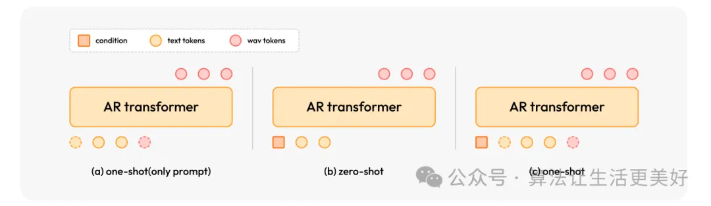
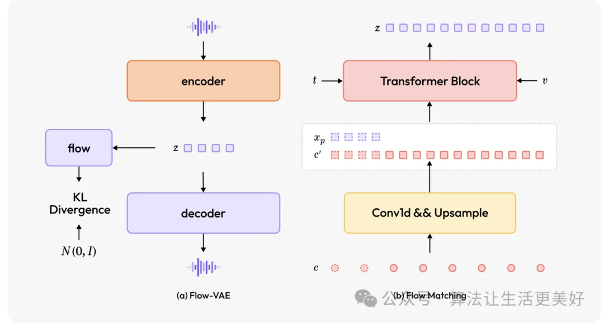
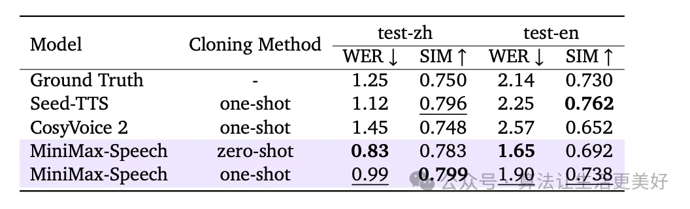
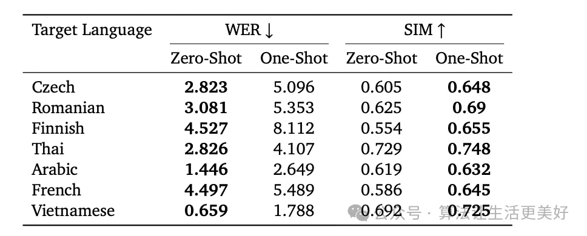

# 1. 资源

官方技术报告和demo：https://minimax-ai.github.io/tts_tech_report/

论文：https://arxiv.org/pdf/2505.07916

# 2. 原理

整体框架如下，可以看到整体采用的依然是Transformer，其最主要的创新在于两大块即图中的speaker encoder以及流模型（Flow Matching和Flow-VAE Decoder）。下面我们来分别看看。

## 2.1 Autoregressive Transformer

首先其采用的是autoregressive Transformer，这个其实没啥，最关键的是其引入了一个speaker encoder（这也没啥），然后学习的时候让其和autoregressive Transformer一起联动学习，换句话说speaker encoder是可被学习的，这和以往的大部分TTS模型做法大不相同（之前的做法都是选定好一个pre-trained的encoder）。

这一个改动就会带来诸多好处，比如最直接的就是效果的提升（这是显而易见的，毕竟学习了），还有就是能支持更多的语种（只要是训练过的都可以，而pre-trained的encoder只能支持好之前预训练过的语种），当然最大的好处也是本篇paper重点强调的zero-shot能力，下面我们展开来说说。

之前的一些工作诸如VALL-E、CosyVoice 2等大都需要同时提供被模仿者的语音+对应文本才能进行TTS（如图c），而本篇则去掉了“对应文本”即只需要被模仿者的语音即可(如图b)，其将该语音通过上述说的可学习的encode表征成图中的condition，其只关注被模仿者的音色和韵律风格等而忽略说话的内容，做到了真真的端到端。这种方式被其称为zero-shot(不需要对应文本)。当然，文章也提到其也支持语音+对应文本这种方式即图c，这种方式被称为one-shot(需要一个对应的文本)。

虽然one-shot在精细控制等方面可能存在一定好处，但是本篇文章重点其实想说的还是其zero-shot的独特设计，因为其有很多优势比如：

(a) Text-Free Reference：不再需要对模仿者音频进行文本转录，真真做到上述说的只关注被模仿者的音色和韵律风格等而不受说话的内容的限制，把两者解藕开了（实际上在TTS场景，我们确实需要的仅仅是被模仿者的音色，而具体内容是由我们提供的）

(b) Rich Prosodic Variation and Flexible Decoding：由于其不用文本，所以就不用受特定文本音频韵律的限制，从而就可以有更广阔的解码空间，使得输出能够高度保真地还原被模仿者独特的声音特征。

(c) Robust Cross-Lingual Synthesis：由于encode能学习到与文本语言无关的声音特征，所以进而增强了跨语言合成。特别是在目标语言和参考语言不一样或语义不匹配的时候。

(d) Foundation for Extensibility：这个编码器可以提供的稳健且解耦的说话人表征，也为各种下游应用提供了灵活的基础比如情感控制等等（作者也在论文中举了很多例子，感兴趣的可以看看）

可以看到虽然前前后后说了很多好处，但其实具体做法改动就一个：仅仅使用语音作为encode的输入，而且其要连同整个模型一起被学习

## 2.2 Latent Flow Matching

之前工作都是先要得到梅尔谱图，然后再由根据其解码得到声波。而这么做就不可避免的在到梅尔谱图这一终结步骤带来信息损失。

所以作者把这一步进行了隐式表征，具体来说如下

首先看图(a)，其把之前的梅尔谱图中间过程替换成了隐式表征z即连续语音特征。而解码器decoder需要根据z恢复为波形而不是带有一定信息损失的梅尔谱图（当然这里可能说的有点不准确，因为隐式表征也会有信息损失，但是一般来说隐式表征的信息更丰富鲁棒）。

同时我们注意到图(a)里面还有一个flow model即所谓的流模型，其主要是将连续语音特征z的分布转换为标准正态分布，具体来说就是到时候会和标准整体分布做一个KL loss，让其更容易预测，也更紧凑，增强编码器的信息表达能力。

现在我们可以清晰的看到Flow-VAE相比于之前VAE最大的特点就是直接端到端的利用隐式连续语音特征z进行解码，避免中间态带来的信息损失。

那怎么得到隐式连续语音特征z，为此又搞了一个图b的流匹配模型Flow Matching来支持（图a命名为Flow-VAE，那为了配合这里就命名为Flow Matching来支持）。

注意哈Flow Matching是在Flow-VAE之前的适配模块，位于AR transformer和Flow-VAE之间。其最终目标输出就是式连续语音特征z。其应用的输入肯定就是有AR transformer的输出c，说话者的表征v，时间t。其中图中虚框的部分就是前一节讲的one-shot，在训练的时候按比例的添加（一部分加&一部分不加），进而实现同时支持zero-shot和one-shot。

# 3. 效果

# 参考

[1] 最新最强的TTS语音合成技术来了！https://mp.weixin.qq.com/s/mQKznQivwA_qQUr3aG9lAg