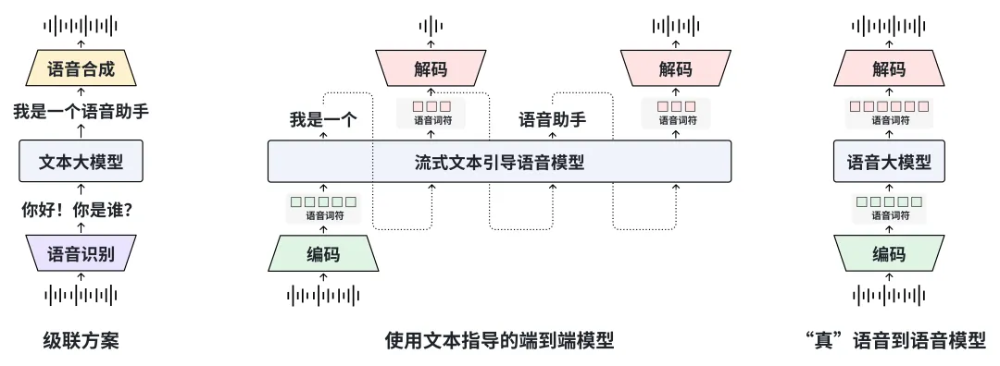
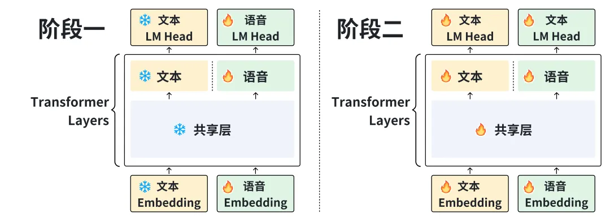
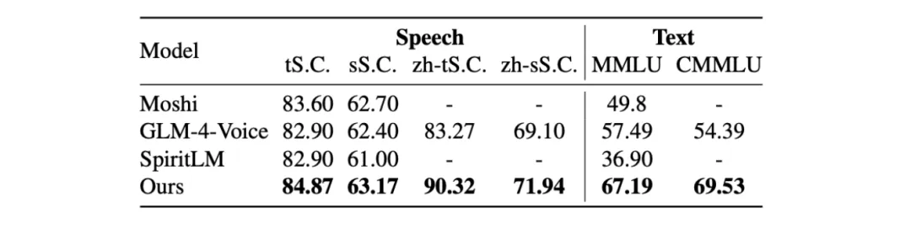
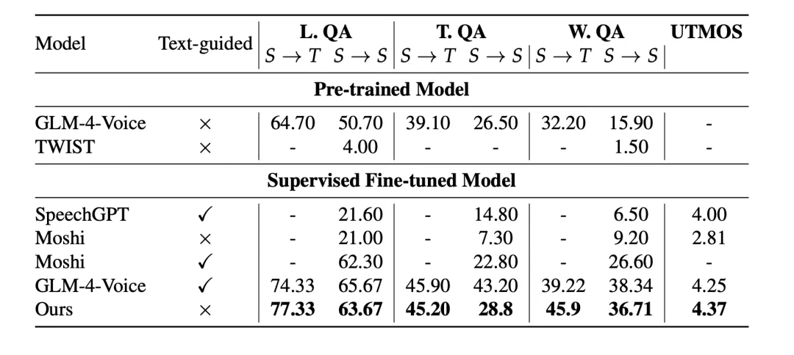

# 1. 资源

视频 Demo：https://moss-speech.open-moss.com/ 

在线 Demo：https://huggingface.co/spaces/fnlp/MOSS-Speech

GitHub 主页：https://github.com/OpenMOSS/MOSS-Speech 

技术报告：https://github.com/OpenMOSS/MOSS-Speech/blob/main/papers/MOSS-Speech%20Technical%20Report.pdf 

# 2. 原理

真正的语音到语音（Speech-to-Speech）大模型

MOSS-Speech摆脱了传统级联方案（下图左）和需要生成文本指导后续语音生成的端到端方案（下图中）对于文本的依赖，实现了无需文本引导，直接理解并生成语音词符（下图右）。模型能够捕捉并生成语调、情绪、笑声等非文字要素，实现更自然、更高效的交流。

为高效模态对齐设计的新架构

MOSS-Speech 基于预训练文本 LLM，通过模态分层+两阶段预训练，让模型在继承文本 LLM 的推理能力与知识的同时，加入了原生的语音理解与生成能力，有效避免了模态冲突，实现了高效模态对齐。

双模态原生支持

不仅能“听懂”和“说出”语音，还处理文本输入输出，实现跨模态交互。支持语音提问 → 语音回答，文字提问 → 语音回答，语音提问 → 文字回答，文字提问 → 文字回答。

# 3. 评测

MOSS-Speech 在语音到语音评测指标上取得了 SOTA 成绩。

预训练模型评测结果

指令微调模型评测结果

# 参考

[1] 真-语音到语音交互：MOSS-Speech 正式发布, https://mp.weixin.qq.com/s/pA9vDXA3tUnlWCcuyCBCOw