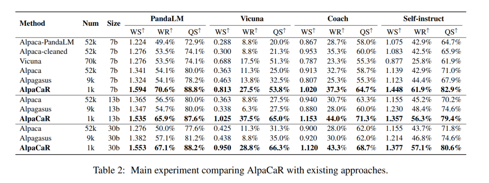

# 1. 简介

Clustering and Ranking: Diversity-preserved Instruction Selection through Expert-aligned Quality Estimation
- Paper: https://arxiv.org/abs/2402.18191
- Github: https://github.com/IronBeliever/CaR

CaR方法的核心是利用少量专家对齐数据训练一个数据质量排序模型，进行数据质量排序，再利用聚类方法保证高质量数据的多样性，最终利用较小的代价完成模型高质量微调，如下图所示，CaR方法仅利用1.96%的数据就达到较为优异的效果。

# 2. 方法介绍

## 2.1 总览

CaR方法总览

## 2.2 排序

排序阶段主要是为了进行指令数据的质量评估，利用Sentence BERT模型进行专家偏好模型训练，其中3751条专家审核数据来自CoachLM，为了保证数据质量，有精心挑选了修订前后有显著差异的2541条指令数据（根据编辑距离）。可以发现原始数据中会存在一些语义不流畅、歧义、冗余的现象，而专家修改过的数据更准确、简练，如下图所示。

PS：这里利用Sentence BERT模型做初始化，最终还是将instruction+input+output一起输入到模型中，进行回归打分。

对于排序模型，在测试集的准确率上达到了84.5%，而利用GPT-3.5 Turbo和gpt-4-1106-preview的准确率分别只有57.48%和63.19%，如下表所示。

其中GPT3.5或GPT4评分所需Prompt如下图所示。

## 2.3 聚类

聚类阶段主要是为了进行指令数据的多样性保留，让指令微调数据涉及更多的任务，激发出原始语言模型更多的能力。利用sentence-transformers模型将指令数据映射到一个384维的向量空间上，再利用PCA降维保留95%的维度，最后利用K-Means算法进行向量聚类操作，簇的个数为178。

最后数据由打分排序后前Top-N1的指令数据和K个聚类簇中每个簇的Top-N2的指令数据总和再去重组成，即set(n1+k*n2)。

# 3. 实验结果

测试数据包含Self-instruct中252条测试集、Vicuna中80条测试集、PandaLM中70条数据集、CoachLM中150条测试集。

在7B、13B、30B模型上对比Alpaca、Alpaca-PandaLM、Alpaca-cleaned、Alpagasus、Vicuna方法，结果如下表所示AlpaCaR方法在四个数据集上均由明显优势。

利用不同方式选取排序前9k的数据集进行模型训练，可以发现不同排序模型对测试集的评分与生成结果打分成正比。

数据质量分析，采用1k、2k-42k数据训练LLaMa-7B模型，发现随着数据数量的提高、整体数据质量下降，模型效果随着下降。

数据多样性分析，当从每个簇中选择1个指令数据时，模型效果最优。选择太多可能会影响数据的整体质量。

对比随机抽取结果，AlpaCaR方法更有竞争力。

成本分析，比较AlpaCaR相对于Alpaca和Alpagasus 在30B模型上进行指令评估和模型全参数微调 的成本，对于API方法进行质量评估参考GPT4的官方定价，模型训练推理服务参考leadergpu上租赁成本。

# 参考

[1] 指令微调数据的高效筛选方法-CaR（排序&聚类），https://mp.weixin.qq.com/s/QODddICM22U2gt52MBc8pQ
