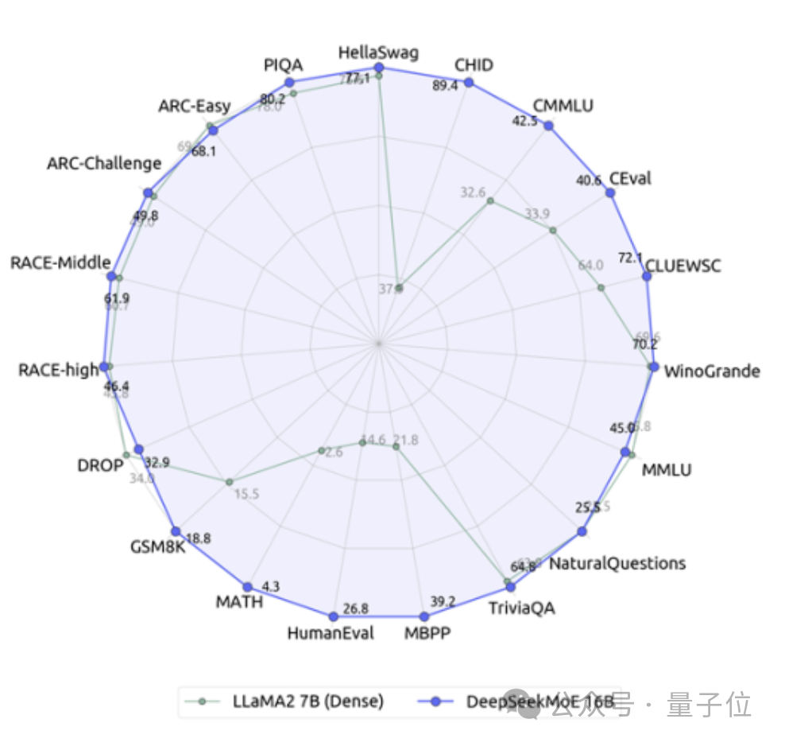
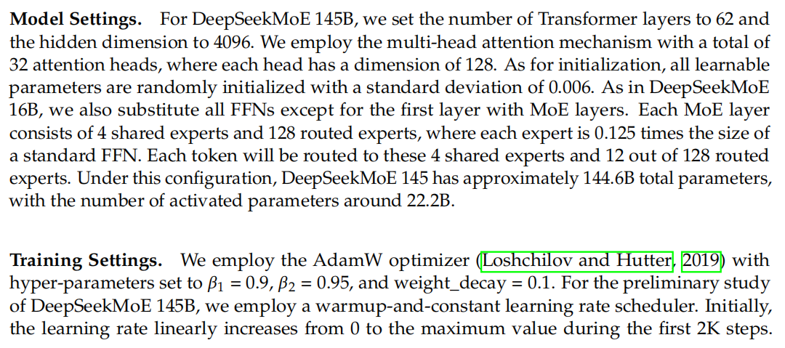

# 1. 简介

- 论文地址：https://arxiv.org/abs/2401.06066
- Github: https://github.com/deepseek-ai/DeepSeek-MoE
- base模型：https://modelscope.cn/models/deepseek-ai/deepseek-moe-16b-base/summary
- chat模型：https://modelscope.cn/models/deepseek-ai/deepseek-moe-16b-chat/summary

 - 16B MOE（2.8 B*8, 64个expert, 4个共享，63个选择top 6）
 - 表现完全不输给密集的Llama 2-7B模型，计算量却仅有40%
 - 与自家的7B密集模型相比，二者在19个数据集上的表现各有胜负，但整体比较接近
 - 但两种密集模型的计算量都超过了180TFLOPs每4k token，DeepSeek MoE却只有74.4TFLOPs，只有两者的40%

# 2. 原理

## 2.1 MOE架构

相比于传统的MoE架构，DeepSeek拥有更细粒度专家划分。

在总参数量一定的情况下，传统模型分出N个专家，而DeepSeek可能分出2N个。

同时，每次执行任务时选择的专家数量也是传统模型的2倍，所以总体使用的参数量也不变，但选择的自由度增加了。

这种分割策略允许更灵活和适应性的激活专家组合，从而提高了模型在不同任务上的准确性和知识获取的针对性。

除了专家划分上的差异，DeepSeek还创新性地引入了“共享专家”的设置。

这些共享专家对所有输入的token激活，不受路由模块影响，目的是捕获和整合在不同上下文中都需要的共同知识。

通过将这些共享知识压缩到共享专家中，可以减少其他专家之间的参数冗余，从而提高模型的参数效率。

共享专家的设置有助于其他专家更加专注于其独特的知识领域，从而提高整体的专家专业化水平。

通用MOE计算如下

DeepSeek MOE计算如下

## 2.2 Loss计算

# 3. 实验

## 3.1 框架

- 基于HAI-LLM
- 开发GPU kernels基于CUDA和Triton

## 3.2 训练

- 参数按照标准差0.006随机初始化
- 专家参数量是原有FFN的16倍

In order to prevent routing collapse, we set an expert-level balance factor of 0.01.

2T tokens

## 3.3 实验结果

# 参考

[1] 首个国产开源MoE大模型来了！性能媲美Llama 2-7B，计算量降低60%，https://mp.weixin.qq.com/s/_xRX54ep16RmRwQUGSBiWQ