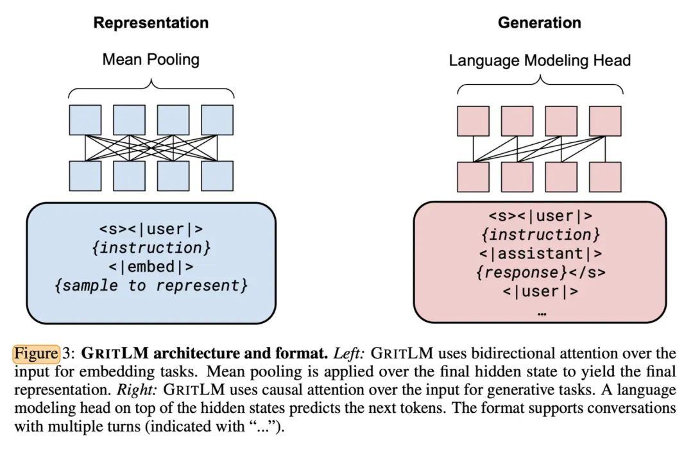

# 1. 介绍

- Github (224 Stars)：https://github.com/ContextualAI/gritlm
- 论文：Generative Representational Instruction Tuning
  - https://arxiv.org/pdf/2402.09906.pdf
  - Contextual AI, 港大，微软
  - 2024.2.15

通过不同的instruction区别这两类任务，让语言模型同时在这两种任务中训练，
从而得到一个同时具备生成embedding跟response能力的模型。并且通过实验发现，其在生成任务上的效果超过了Mistral 7B，
在embedding任务上的效果跟e5-mistral-7b-instruct处于同个水平。

# 2. 原理

GRIT借助于instruction tuning的方式，在训练过程中同时联合embedding任务跟generation任务这两种不同的范式，
由于两种训练范式的instruction跟loss都是不相同的，所以语言模型可以学习如何区分它们。其一是generation任务的
instruction tuning，给定instruction，让语言模型去生成对应的回复response，这也是大模型SFT的训练方式。
其二是，embedding任务的instruction tuning，给定instruction，让语言模型生成文本的表征，
这也是目前比较流行的统一句向量模型训练方式，可以参考之前的instructor。具体训练的损失计算方式见下文。

Representation

在生成文本表征的embedding任务下，语言模型采用的是传统的对比学习训练方法，拉近相关文本之间的距离，
同时疏远不相关文本之间的距离。而文本表征的获取则是，在给定instruction跟文本的条件下，
利用双向注意力机制获得对应的隐藏状态，将对应文本（不考虑instruction跟prompt的位置上的文字）最后一层隐状态求和再平均后的结果作为该文本的表征向量。

Generation

在文本生成任务下，语言模型训练任务是预测下一个token的语言建模任务。模型结构采用的单向注意力机制，
也就是每一个token只能看到之前的token，只计算response这些生成的token上的损失，跟目前的大模型SFT流程基本一致。

最终GRIT的训练损失就由以上这两个不同任务的损失加权求和得到。

# 3. 实验

研究人员基于Mistral 7B跟Mixtral 8*7B做进一步微调，微调过程的每一个batch都包含跟embedding任务
相关的数据以及跟生成任务相关的数据。对于Mistral 7B而言，每个训练batch 里，embedding任务数据的batch 
size为2048，而生成任务数据的batch size为256。

a) 从评测结果上可以看到，GritLM是目前唯一在embedding任务跟generation任务上都有非常不错表现的语言模型，
在embedding任务上效果媲美微软的e5 mistral 7B，在生成任务上的效果超过mistral 7B跟llama 2。
缺乏任何一种任务数据都会影响在对应任务上的评测结果，说明这种联合训练对于获得在embedding任务跟生成任务的能力非常关键。

 b) 研究人员还补充了大量的消融实验，有兴趣的朋友可以自行查阅。这里只提其中两点。其一是对于embedding任务而言，
 双向注意力机制优于单向注意力机制。其二是经过finetune过后，模型的embedding能力可以实现弯道超车，换言之，
 假设原本模型A的embedding能力比B差，但是经过finetune后，模型A的embedding能力可能会更强。

    c)对于RAG的影响，GritLM同时具备embedding跟generation的能力，所以可以使得Retrieval-Augmented 
Generation进行简化。简单来说，传统的RAG的embedding跟生成模型都要分别处理文本，但是GritLM可以同时生成文本的embedding
以及response的中间状态进行共享，从而可以节省大量内存跟时间开销。在我看来，分别利用GritLM独立生成embedding跟response，
跟利用GritLM同时生成embedding跟response最终的结果是有所差异的，因为生成任务跟embedding的instruction信息，
使用的attention机制等是有差异的，所以GritLM对于RAG的简化，更多的是在效果跟成本之间寻求一个平衡。

# 4. 讨论

GRITLM这是目前看到第一个同时具备embedding跟generation能力的语言模型，并且其embedding能力跟generation都达到一线水平。
GritLM这种特性天然适配RAG，GritLM+Doc Caching在保证检索准确率不受太大影响的前提能节省大量时间跟存储开销，
这给RAG的实际应用提供了一种新型落地方案。

GRITLM给我最大的感受，就是说明了其实语言模型的embedding跟generation能力是可以同时训练得到的，
不会相互损害彼此性能。但是目前GRITLM将这两种任务结合在一起训练的方式挺粗糙的，是否还存在更加优雅的方式？
目前GRITLM在处理不同任务时所使用的instruction，模型结构等信息有所差异，这就会导致只调用一次GRITLM跟分别调用用的结果会存在差异。
是否有更加统一的训练范式能将这两类任务结合到一起呢？除此之外，是否还有必要加入text embedding模型的预训练过程？
需要的话又要如何跟GRITLM这种finetune方式结合到一起？

# 参考

[1] GritLM: 能同时支持embedding跟generation的语言模型，RAG玩家有福了！, https://mp.weixin.qq.com/s/rpuxhyjfjM2RsZWg3cPx1g