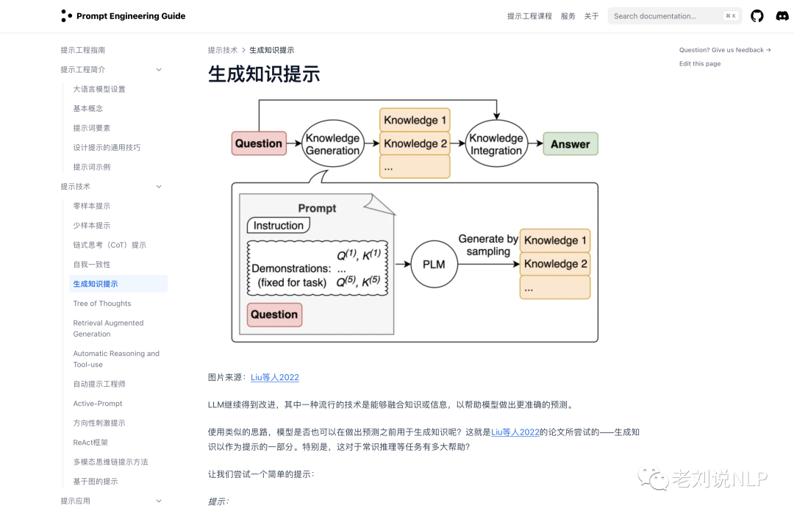

# 1. 免费课程
## 1.1 Prompt课程
### 1.1.1 Prompt-吴恩达

1. chatgpt-prompt-eng （吴恩达）

    目前课程均免费，可以在线听（最好使用代理，不然有时会比较卡顿）

    https://learn.deeplearning.ai/chatgpt-prompt-eng/lesson/1/lesson_1

2. prompt-engineering-for-developers
   - 描述：为1.1.1中大部分课程的中文翻译版，但没有配套中文视频
   - Github: https://github.com/datawhalechina/prompt-engineering-for-developers.git
   - 星：5.8k
   - 推荐度：5星

3. B站地址
   - https://www.bilibili.com/video/BV1Bo4y1A7FU/?share_source=copy_web&vd_source=d670de3e996c9a3b795a0e40e028adeb

### 1.1.2 Prompt Engineering提示工程指南

地址：https://www.promptingguide.ai/zh

提示工程（Prompt Engineering）是一门较新的学科，关注提示词开发和优化，
帮助用户将大语言模型（Large Language Model, LLM）用于各场景和研究领域。 
掌握了提示工程相关技能将有助于用户更好地了解大型语言模型的能力和局限性。

该项目基于对大语言模型的浓厚兴趣，编写了提示工程指南，介绍了大语言模型相关的论文研究、
学习指南、模型、讲座、参考资料、大语言模型能力以及与其他与提示工程相关的工具。

## 1.2 原理

1. LLM基础课程

    吴恩达发了一个最新的LLM教程，里面包含LLM背后模型的原理，
    以及如何做指令微调和高效微调，目前可以免费学习视频，作业部分收费。。
    对于要学习LLM原理和训练的人可以学习一下，课程总时长5个小时左右，但是分成小课，
    一节课也就十分钟左右，质量很高：
    
    《Lenerative AI with Large Language Models》课程地址：
    https://www.deeplearning.ai/courses/generative-ai-with-llms/

2. 黄大年茶思屋

    - 黄大年茶思屋原本是内部员工交流探讨的平台，也是与外部科学家思想碰撞的管道。后来对外开放。
      里面有很多专家和技术大牛的精品课程分享。
    - https://www.chaspark.com/#/home   

3. LLMForEverybody
    - 在线阅读：https://luhengshiwo.github.io/LLMForEverybody/
    - Github (1.1k stars): https://github.com/luhengshiwo/LLMForEverybody
    - 每个人都能看懂的大模型知识分享，LLMs春/秋招大模型面试前必看，让你和面试官侃侃而谈

4. Hugging Face 手把手教你构建 DeepSeek-R1 推理模型
    - 课程链接：https://hf.co/learn/nlp-course/en/chapter12/1?fw=pt
    - 大纲
      - 强化学习简介及其在大模型 (LLM) 中的作用
      - 理解 DeepSeek R1 论文
      - 在 TRL 中实现 GRPO
      - 对齐模型的实际用例

## 1.3 工具使用 

1. LangChain课程

   吴恩达和LangChain联合创始人推出。
   
   (1) LangChain数据处理：
       
       https://www.deeplearning.ai/short-courses/langchain-chat-with-your-data/

## 1.4 应用构建课程

1. HuggingLLM

    - 该项目聚焦于如何使用ChatGPT相关API创造新的功能和应用，
      对相关任务有详细的背景和系统设计介绍，并提供示例代码和实现流程。
    - 地址：https://github.com/datawhalechina/hugging-llm
    
    

2. 构筑大语言模型应用：应用开发与架构设计
  
   - 地址：https://github.com/phodal/aigc
   - 《构筑大语言模型应用：应用开发与架构设计》一本关于LLM在真实世界应用的开源电子书，
    介绍了大语言模型的基础知识和应用，以及如何构建自己的模型。其中包括Prompt的编写、
    开发和管理，探索最好的大语言模型能带来什么，以及LLM应用开发的模式和架构设计。
    
    - 学习该项目可以学习到一些有趣的实操案例。

    

# 参考
[1] 吴恩达LLM课程介绍，https://www.datalearner.com/blog/1051688052742878
[2] 大模型应用实践基础入门指引：五个开源的大模型实践教程以及大模型落地话题相关研报, 
    https://mp.weixin.qq.com/s?__biz=MzAxMjc3MjkyMg==&mid=2648404428&idx=3&sn=47ad5f31e4d2612b9356bbd7473951b9&chksm=83836299b4f4eb8f825263316234ec5c06b2a2f808ecea45707ab828e90e9f0d74ed6794fe4e&scene=178&cur_album_id=2120957806534033409#rd
[3] GitHub 1万5千星！免费的大语言模型课程！开源了，https://mp.weixin.qq.com/s/Gf-jdQLdzog2zNnZVIf2Qw