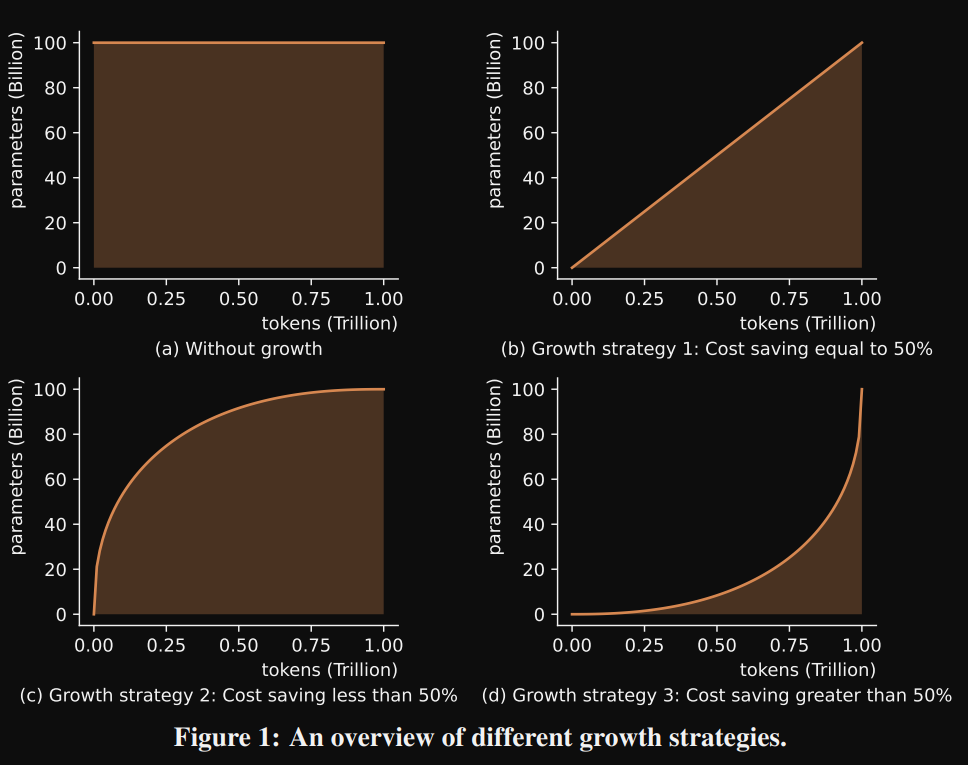

# 1. 成本优化
## 1. FLM-101B: An Open LLM and How to Train It with $100K Budget

论文地址：https://arxiv.org/abs/2309.03852
Hugging Face项目页：https://huggingface.co/CofeAI/FLM-101B
发布时间：2023-09-07

个人评价：性能一般，仅供学习参考。

预算10万美元（约73万人民币），GPT-3的训练成本可是高达460万美元，近一些的Llama2据估算也大概是这个数。

1. “成长策略”降低训练成本
   
   也就是先训练16B参数的小规模模型，然后扩大到51B，最终再扩展到101B版本。
   由于训练低参数量模型的运算效率更高，这种循序渐进的训练方式成本要低于一步登天。

   应用了loss prediction技术，即根据低参数模型的训练损失预测出高参数量模型的损失。
   

   
 
2. 改善并行策略来提高吞吐量

   FLM使用的是混合并行策略，将多种并行方式进行最优化配置，达到高吞吐量，单GPU利用率超过了50%。
   团队还利用序列并行和分布式优化器技术，将输入序列和优化器状态分配到不同GPU，减轻了单个GPU的计算和内存压力。

   

   

3. 性能评测
   
   
   
   FLM团队提出的大模型“智商测试”重点考察模型的推理泛化能力，而非知识储备。

   这项测试从如下四个维度进行了展开：
   
   - 符号映射：使用随机符号替换分类标签，评估模型推理和泛化能力，避免过度拟合。
   - 规则理解：检验模型能否按照给定规则进行操作，如“计数”、“字符串替换”等。
   - 模式挖掘：给出示例，让模型归纳推导出规律并应用，如“头尾添加”等。
   - 抗干扰能力：在噪声环境中提取关键信息，包括多关键信息提取、单论据追踪和双论据追踪三项内容。

4. 原理

   （1） 数据
   - 英中比例：53.5%：46.5%
   - 使用多任务指令数据：OIG (Open Instruction Generalist) and COIG (Chinese Open Instruction Generalist), 
      in the pre-training stage 
     - https://huggingface.co/datasets/laion/OIG
     - https://huggingface.co/datasets/BAAI/COIG

   (2) 模型
   - FreeLM作为基座，decoder only，2个训练目标：语言和2分类，用mask统一2种目标，将2类用特殊token，用于因果语言模型训练。
     2个目标函数可以稳定模型训练。
   - xPos（Extrapolatable Position Embedding）处理长序列：在旋转矩阵中加入指数衰减
   -  train the 16B model with 245.37B tokens, the 51B model with 39.64B
      tokens, and the 101B model with 26.54B tokens.

   (3) 训练
   - 沿着序列长度维，切割layernom和dropout层
   - megatron-lm并行优化器，降低GPU显存占用
   - cosine学习率，B1=0.9, B2=0.95, LR=6E-6, weight decay=0.1, gradient clipping=1.0
   - 稳定性:通过小模型预测参数和loss
     - 16B: （1）分析数据分布 （2） 网格搜索学习率/方差/softmax温度值(使用100M的小模型)，
       最佳值4e-4, 1.6e-2, 2.0
   - BF16训练

# 参考

[1] 智源：70万预算从头开发千亿参数大模型，挑战成功, https://mp.weixin.qq.com/s/rq6cWbvYJQMWRzh1w5w7pw