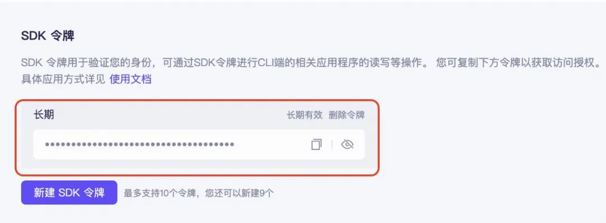

# 1. SiliconCloud
**优势**:
- 无需高性能硬件
- 部署和维护简单
- 使用 SiliconCloud 可免费调用 internlm/internlm2_5-7b-chat 模型
- 高并发量，推理速度快

**使用说明**:
- 选择"云端模型"选项
- 选择 "internlm_silicon" 作为模型格式
- 输入 SiliconCloud API Key（需在 https://cloud.siliconflow.cn/ 注册获取）

**重要说明**:
- internlm/internlm2_5-7b-chat 模型在 SiliconCloud 上可以免费调用，但 API Key 仍需妥善保管好。
- MindSearch 项目与 SiliconCloud 并无利益关系，只是使用它能更好地体验 MindSearch 的效果，感谢 SiliconCloud 为开源社区所做的贡献。

# 2. Modelscope

每天2000个请求的使用容量

后续会提供更多模型，目前支持的模型如下：

```text
Qwen/Qwen2.5-Coder-32B-Instruct

Qwen/Qwen2.5-Coder-14B-Instruct

Qwen/Qwen2.5-Coder-7B-Instruct

Qwen/Qwen2.5-72B-Instruct

Qwen/Qwen2.5-32B-Instruct

Qwen/Qwen2.5-14B-Instruct

Qwen/Qwen2.5-7B-Instruct
```

使用方法

```python
from openai import OpenAI

client = OpenAI(
    api_key="MODELSCOPE_SDK_TOKEN", # ModelScope Token
    base_url="https://api-inference.modelscope.cn/v1"
)

response = client.chat.completions.create(
    model="Qwen/Qwen2.5-Coder-32B-Instruct", # ModleScope Model-Id
    messages=[
        {
            'role': 'system',
            'content': 'You are a helpful assistant.'
        },
        {
            'role': 'user',
            'content': '用python写一下快排'
        }
    ],
    stream=True
)

for chunk in response:
    print(chunk.choices[0].delta.content, end='', flush=True)
```

在这个范例里，针对魔搭平台提供的API，适配的有几个地方：

```text
base url 指向魔搭的服务：https://api-inference.modelscope.cn/v1/

api_key 使用魔搭的SDK token

模型名字(model)使用魔搭上开源模型的Model Id，例如Qwen/Qwen2.5-Coder-32B-Instruct
```

这其中，魔搭的SDK Token，可以从您的魔搭账号中获取：

https://modelscope.cn/my/myaccesstoken



即开即用Notebook分享链接：

https://modelscope.cn/notebook/share/ipynb/86e5ec04/Qwen-Coder-inference-api.ipynb.ipynb


# 参考

[1] 开发者福利，魔搭推出免费模型推理API，注册就送每日2000次调用！https://mp.weixin.qq.com/s/sjuMbEfOT0dF4pKpCVALeg
