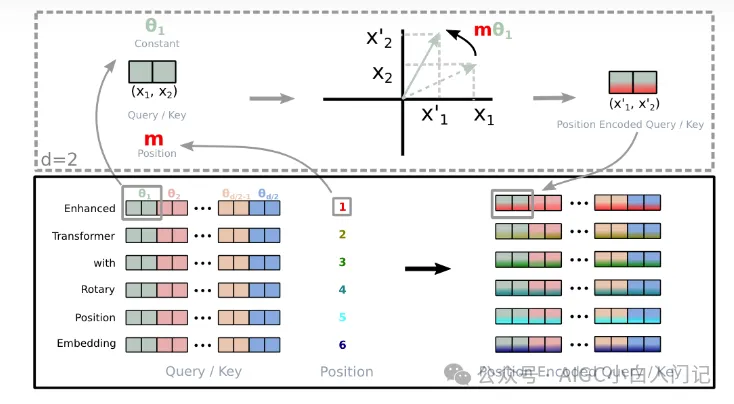
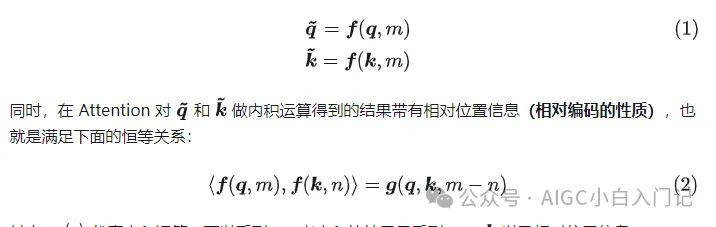
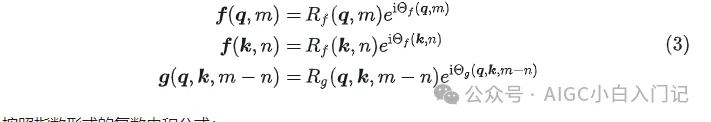
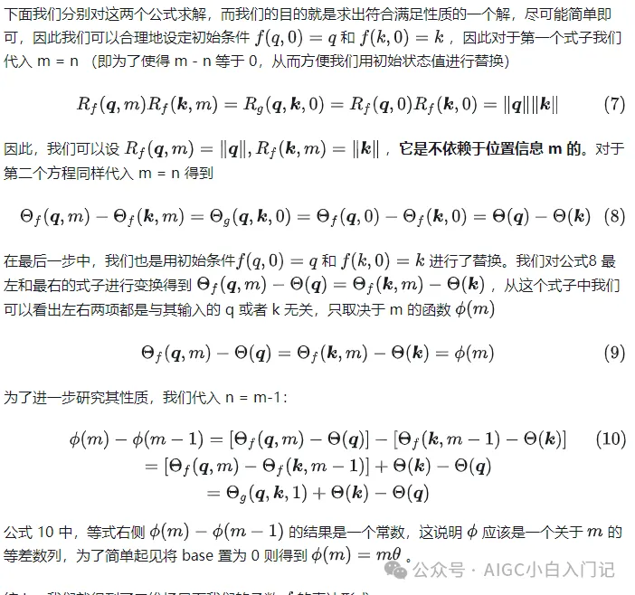
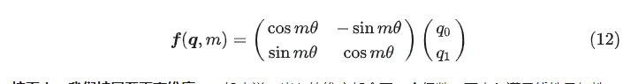
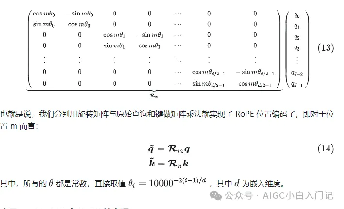
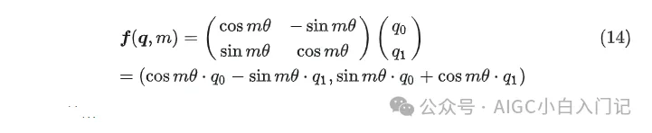
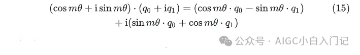
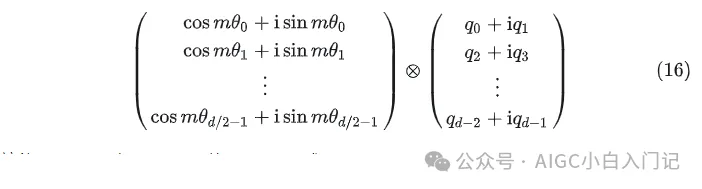

# 1. 简介

## 1.1 RoPE的目的

首先，为什么要在 Transformer 架构下的网络中加入位置编码呢？

原因很简单——因为单纯的 Attention 机制并不像 CNN 和 RNN 一样能够捕获输入的顺序。因此，要么将位置信息融入到输入中（绝对位置编码），要么微调 Attention 结构，使其能够识别不同位置的 token（相对位置编码）。

而 RoPE 则是脱胎于这两种范式属于复合型编码，即通过绝对位置编码实现的相对位置编码。

用数学的语言表达，RoPE 就是这么一个函数f，对于 attention 中的查询 q 和键 k 进行位置编码，使得我们的 q 和 k 的编码信息中能够加入位置信息（绝对位置编码的实现方式）：

其中，<,>代表内积运算，可以看到，二者内积的结果只受到q、k对位置信息 m-n 的影响。

## 1.2 推导——找到符合性质的函数 f 

在确定了我们想要的编码方式所具有的性质（公式 2）后，我们下一步就是为公式 2 找到一个解，也就是找到函数 f 使其满足这个性质。

为了简化问题，我们先考虑二维场景，而复数就是二维的，我们可以用复数来进行求解。因此 f 则可以为写为如下指数形式的复数表示：

按照指数形式的复数内积公式：

依据公式2，我们分别将其左右两项用公式 5 和 公式 3 进行替换则得到了下面两个方程

## 1.3 结论——RoPE 的形式

在上一章节，我们已经推导出来了 RoPE 的二维形式，那么在实际场景中该怎么把这个结论用起来呢？

上文已经提到过，RoPE 在具体实现中是为输入中加入位置信息，也即公式 2。公式 2 中的函数 f 我们也已经在公式 11 中得到了其中一个解。根据复数乘法的几何意义，该变换实际上对应的向量的旋转，也称之为“旋转位置编码”，他的矩阵形式为：

接下来，我们扩展至更高维度。一般来说，嵌入的维度都会取一个偶数，而内积满足线性叠加性，因此我们将其构建为二维情形的拼接，即

## 1.4 应用——LLaMA 中 RoPE 的实现

在上一章节，我们介绍了 RoPE 的计算形式，但是在 LLaMA 的具体代码实现中又略有不同，我们依然从二维场景出发，对公式 12 进行变形：

上式可以转化为两个复数的乘法运算：

接下来，与上一章节一样，我们将其扩展到高维：

这就是 LLaMA 中 RoPE 位置编码的实现方式。

大家可以参考我下面的 colab notebook自己手撕一下代码，看一下每一步的输入输出加深理解。

# 参考

[1] 白话旋转位置编码（Rotary Position Embedding, RoPE），https://mp.weixin.qq.com/s/GmspKbHORY8TW447tCCY4g