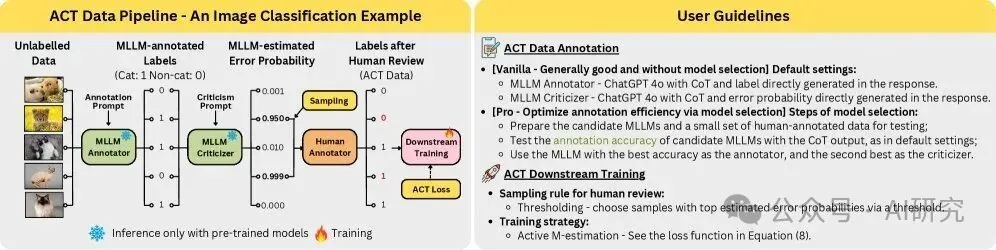
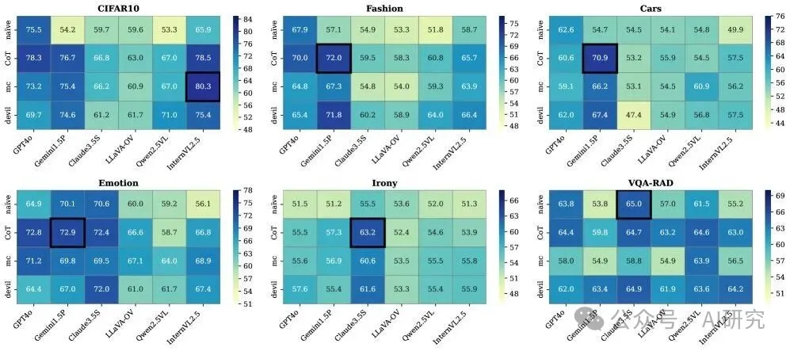
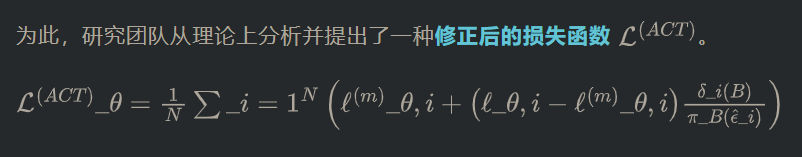

论文标题：ACT as Human: Multimodal Large Language Model Data Annotation with Critical Thinking

ArXiv URL：http://arxiv.org/abs/2511.09833v1

---

众所周知，高质量的标注数据是监督学习的燃料，但人工标注既烧钱又费时。虽然让大语言模型（LLM）代劳看似是个捷径，但其产出的标签质量却常常不尽人意。

那么，有没有一种方法，既能享受LLM的效率，又能保证接近人工标注的质量？答案来了！

字节跳动、理研AIP等机构联合提出了一套名为 ACT（Annotation with Critical Thinking）的数据流水线，让AI自己标注、自己批判，再由人类专家精准介入。实验证明，这套方法能在将模型性能差距缩小到2%以内的同时，节省高达90%的人力成本！

ACT流水线：AI标注员与AI批判家的协作
传统AI标注是“单人作业”，而ACT引入了一种“双人审核”机制。整个流程非常巧妙：

1. 标注员（Annotator）：首先，一个多模态大模型（MLLM）扮演“标注员”的角色，快速对海量数据（包括文本、图像等）进行初步标注。
2. 批判家（Criticizer）：接着，另一个（或同一个）MLLM扮演“批判家”，它不直接标注，而是审视“标注员”给出的结果，并识别出那些“可疑”的、可能错误的样本。
3. 人类专家：最后，人类专家不再需要埋头于所有数据，只需集中精力审查被“批判家”标记出来的少量可疑样本。

这个流程的核心思想是，将有限且宝贵的人类智慧，用在最需要的地方。

该研究的价值远不止于此。ACT框架具有极强的通用性：

• 跨模态：借助MLLM，它能轻松处理自然语言、计算机视觉和多模态理解等多种任务。
• 模型无关：无论是能访问内部概率的白盒模型，还是无法访问的黑盒模型（如通过API调用），ACT都能适用。
• 免训练：整个标注与批判流程无需额外训练，开箱即用。
如何打造高效的标注-批判组合？
那么，如何配置“标注员”和“批判家”才能让ACT框架发挥最大效能呢？研究团队进行了一系列有趣的实验探索。

一个关键发现是，思维链（Chain-of-Thought, CoT）提示策略在不同角色中发挥的作用截然不同。

研究人员发现，对于“标注员”来说，CoT并不总是能带来提升。但在“批判家”的角色中，CoT却大放异彩。引导模型进行一步步的推理和判断，能显著提升其发现错误的能力。

上图展示了多种黑盒批判策略的效果。可以看到，采用CoT策略的批判家（橙色条）在多个数据集上都取得了最佳表现，相比简单策略，其效率提升最高可达22.46%。

研究人员总结出几条非常实用的指导方针：

1. 最佳标注员：GPT-4o结合CoT策略是一个非常强大的通用标注员。
2. 最佳批判策略：对于黑盒模型，CoT策略是识别错误的最有效手段。
3. 强强联合：最佳组合通常是“交叉批判”，即用一个强大的模型去批判另一个模型的标注结果，而不是“自我批判”。
不仅标得好，更要训得好：优化的损失函数
通过ACT流程，我们得到了一份混合数据集：一小部分是高质量的人工校对数据，大部分是可能有噪声的机器标注数据。直接用这些数据训练下游模型，效果会好吗？

这是ACT面临的最后一个挑战。如果只用人工数据，样本太少；如果混合使用，机器标签的噪声可能会干扰模型学习。

这个公式的核心思想是，在训练过程中，为经过人类审核的数据赋予更高的权重，从而修正机器标签可能带来的偏差。这就像给模型带上了一副“纠错眼镜”，让它能够区分哪些知识是可靠的，哪些是需要谨慎对待的。

实验结果令人振奋：

在CIFAR10、Fashion-MNIST等多个基准数据集上，使用ACT数据和优化后的损失函数训练出的模型，其性能与完全使用人工标注数据训练的模型差距不足2%！

这意味着，我们几乎可以用十分之一的成本，达到与“全人工”标注相媲美的效果。对于预算有限的团队和需要快速迭代的项目而言，这无疑是巨大的福音。

结论
ACT框架为AI领域的数据标注难题提供了一个优雅且极其高效的解决方案。它通过引入“批判性思维”这一环，让AI不仅是埋头干活的“工人”，也成了懂得反思的“质检员”。

这种“AI标注 + AI批判 + 人类仲裁”的模式，不仅极大地降低了数据标注的门槛，也为数据驱动的AI发展开辟了新的可能性。未来，或许我们能看到更多具备自我审视和修正能力的AI系统，让整个AI生态变得更加鲁棒和高效。

 
# 参考

[1] AI标注成本直降90%！字节ACT框架：让大模型学会批判性思维, https://mp.weixin.qq.com/s/zNz8DwxV4LBUPSc_TNFJ4A