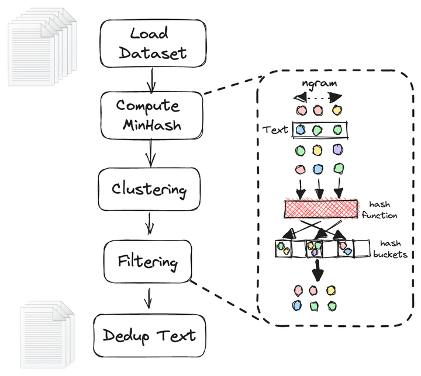
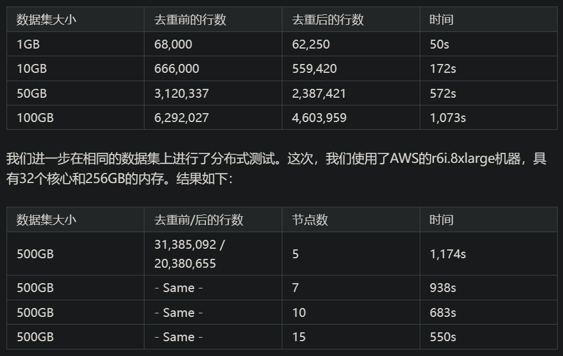
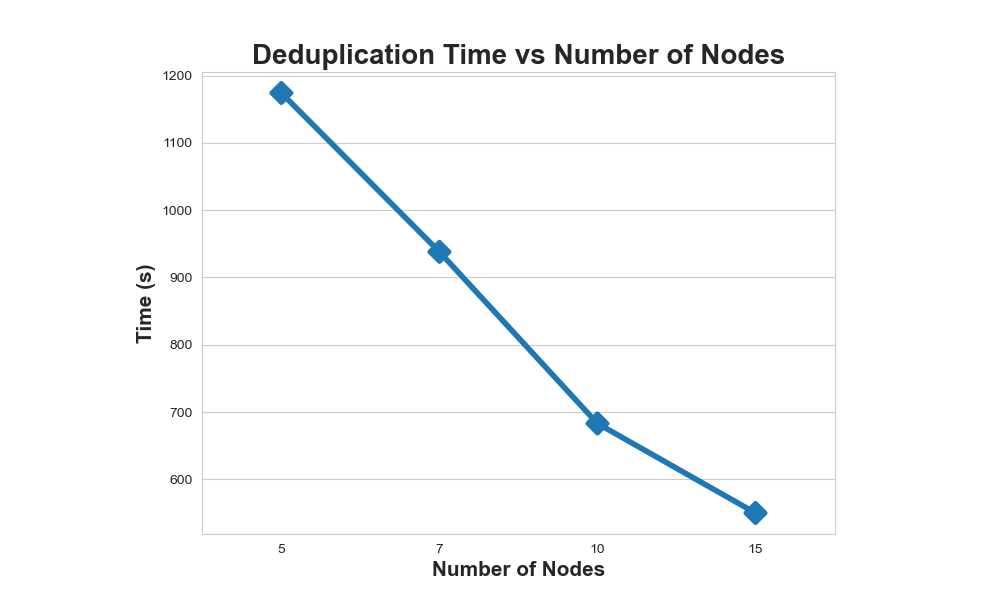

# 1. 资源

Github (997 stars): https://github.com/xorbitsai/xorbits/tree/main
文档：https://doc.xorbits.io/en/latest/reference/experimental/generated/xorbits.experimental.dedup.html

个人实测体会：
- xorbits内部好像封装了老的pandas版本，之间将pandas传入，会出错
- 文本太长会太多，容易报错

NOTICE: Problem with this code
- It integrate pandas, thus, it can't load file properly that pandas can, e.g. large csv file
- It can't handle very long str, it gives out error

# 2. 简介

在大型语言模型（LLMs）的训练中，文本数据集的去重起着至关重要的作用。它不仅可以提升训练的效率，同时也有效减轻隐私问题12。LLMs的发展依托于大规模且多样化的数据集，然而这些数据集往往包含大量从互联网爬取的重复序列，这无疑加剧了数据冗余和隐私风险34。文本去重不仅能加快LLMs的训练速度，同时也能降低数据记忆和隐私攻击的风险125。我们的创新在于采用Xorbits框架进行分布式的文本数据集去重。类似于Dask、Ray和Modin等框架一样，Xorbits能够在多台机器上实现大规模并行处理，从而提供更高的处理速度和更大的处理量。借助Xorbits进行文本数据集去重，我们能处理超出单机处理能力的大规模文本数据集，并且获得较高的效率，这无疑代表了LLMs数据处理的一项重大突破。

# 3. 原理



```python
# 要安装xorbits，运行 `pip install xorbits`

import xorbits.pandas as pd
from xorbits.experimental import dedup

df = pd.DataFrame(...) # 假设df是你的文本数据集，且"text"列是需要去重的文本列

res = dedup(df, col="text")
```

```python
from xorbits.experimental import dedup
words = list("abcdefghijklmnopqrstuvwxyz")
df = pd.DataFrame(
    {
        "text": [
            " ".join(["".join(np.random.choice(words, 5)) for i in range(50)])
            for _ in np.arange(10)
        ]
        * 2,
    }
)
res = dedup(df, col="text", method="exact") # for 'exact' method
res = dedup(df, col="text", method="minhash", threshold=0.8, num_perm=128, min_length=5, ngrams=5, seed=42) # for 'minhash' method
```

以下是我们算法的详细步骤6：

1. 我们给待去重的数据框（dataframe）添加一个唯一标识符列__dedup_id。
2. 我们采用如下的embed_func函数来生成哈希值。该函数首先将文本内容分解为N-gram，然后应用哈希函数生成一系列签名__signatures，并将这些签名与相应的唯一标识符建立映射关系。每个签名都包含一个元组，元组中包含基于num_perm参数的文本行哈希值的位置信息。

    ```python
    def embed_func(
        row: pd.Series,
        *,
        text: str,
        num_perm: int,
        ngram_size: int,
        min_length: int,
        hashranges: List[Tuple[int, int]],
        permutations: np.ndarray,
    ) -> pd.Series:
        content, idx = row[text], row["__dedup_id"]
    
        a, b = permutations
    
        masks: np.ndarray = np.full(shape=num_perm, dtype=np.uint64, fill_value=MAX_HASH)
        tokens: Set[str] = {
            " ".join(t) for t in ngrams(NON_ALPHA.split(content), ngram_size, min_length)
        }
    
        hashvalues: np.ndarray = np.array(
            [sha1_hash(token.lower().encode("utf-8")) for token in tokens], dtype=np.uint64
        )
    
        permuted_hashvalues = np.bitwise_and(
            ((hashvalues * np.tile(a, (len(hashvalues), 1)).T).T + b) % MERSENNE_PRIME,
            MAX_HASH,
        )
        hashvalues = np.vstack([permuted_hashvalues, masks]).min(axis=0)
    
        Hs = [
            (i, bytes(hashvalues[start:end].byteswap().data))
            for i, (start, end) in enumerate(hashranges)
        ]
        return pd.Series({"__signatures": Hs, "__id": idx})
    ```

3. 利用这个嵌入函数，我们采用apply操作对数据框进行嵌入计算。

    ```python
    embedded = in_df_with_id.apply(
             embed_func,
             axis=1,
             output_type="dataframe",
             dtypes=pd.Series(["object", "bytes"], index=["__signatures","__id"]),
         )
    ```

4. 我们利用局部敏感哈希（LSH）方法，通过将高维数据映射到降维空间来实现近似最近邻搜索。此处，我们需要将 __signatures 列 “展开（explode）”以获取每个文本切片的位置信息。然后，我们对其进行分组并设定集群哈希值。

    ```python
    clusters = (
             embedded.explode("__signatures")
             .groupby("__signatures", sort=False)["__id"]
             .apply(set)
         )
    ```
   
5. 然后我们构建并查集（Union Find）。所有先前的数据框操作都可以在各节点并行执行，每个节点都可以计算其并集。然而，去重需要全局并查集，这就需要我们在计算后合并所有集合。由于这是去重算法中唯一不能并行化的步骤，我们采用了基于Cython的并查集来加速计算。

    ```python
     for cluster in clusters:
         if len(cluster) <= 1:
             continue
    
         idx = min(cluster)
         for x in cluster:
             op.union_find.union_(x, idx)
    ```

6. 在全局并查集构建完成后，我们使用 dataframe.map对原始文本进行去重，同时在去重完成后舍弃签名列__dedup_id。

    ```python
    res = input_data[
             input_data["__dedup_id"].map(lambda x: op.union_find.find(x) == x)
         ].drop(columns="__dedup_id")
    ```
   
# 4. 基准测试

我们在"Oscar2201"的中文数据集上进行了精细的算法测试。测试运行在AWS的r5a.16xlarge 机器上，该机器具有64个核心和512GB的内存。测试结果如下：





节点个数与运行时间统计


结果显示了Xorbits去重速度的强大，以及它能够随着节点数量的增加而适应的能力。尽管如此，我们在节点数从10增加到15时，观察到性能提升的速度有所减缓。这种轻微的减速可能归因于合并每个数据块的并查集所带来的内在算法挑战。这项基于MinHash的操作在全局范围内是必要的，但在分布式设置中执行并不可行，因此在大节点数时给时间减少设置了上限。

# 参考

[1] 用 Xorbits 革新大型语言模型中的文本去重技术，https://zhuanlan.zhihu.com/p/646488919