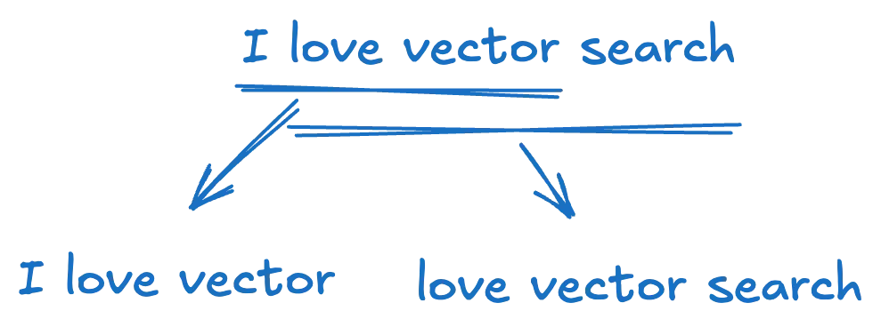
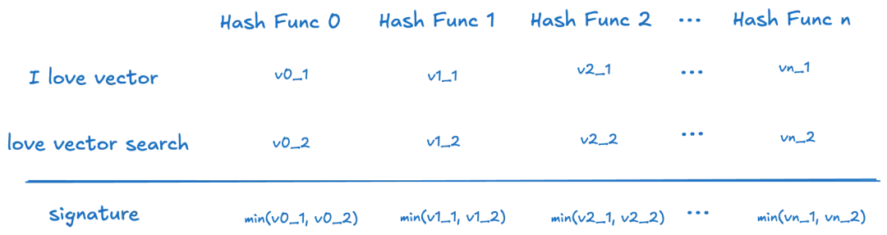
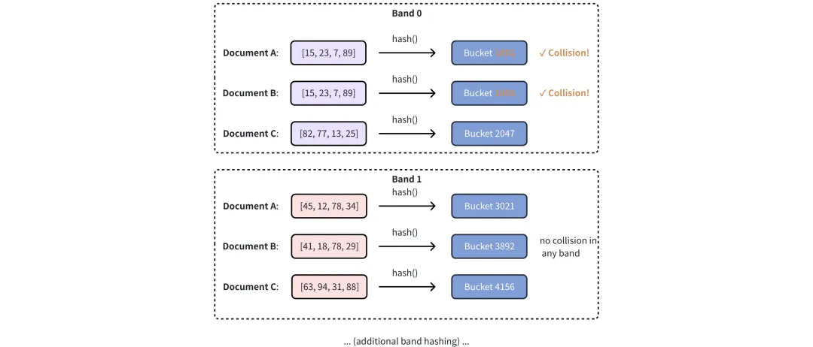
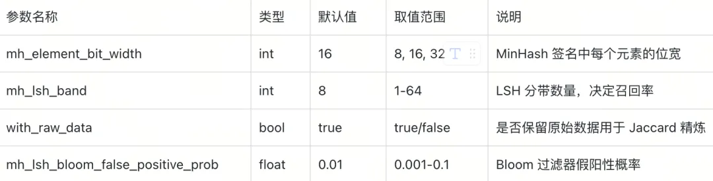
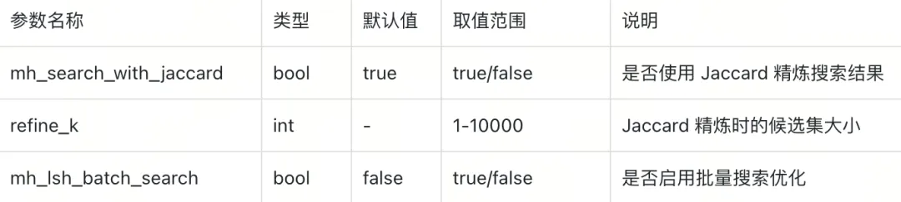

有多少“天临元年”之后毕业的研发er？

大家是否考虑过一个问题，论文查重这些年变得格外严格背后，技术上，到底是怎么实现的？

是关键词检索，逐个词语暴力搜索，还是抽取embedding数据，做语义层面的深层比对？

如果用前者，那么知网在内学术平台数据库要崩溃；用后者，不仅平台要崩溃，在论文中缝缝补补，修改表达做原创的各位毕业生更要崩溃。

那有什么低成本、高效，又不会过于变态的查重方式？

不久前，Milvus发布了2.6版本，其中一个亮眼的新功能就是MinHash LSH for deduplication（MinHash局部敏感哈希用于去重）。

简单来说，这个功能帮你自动检测和去除重复的数据条目，避免数据库里塞满一模一样或高度相似的数据。

这在实际场景中超级实用，比如在大模型训练的时，去除重复数据；再比如在知网等学术平台，可以用来作为粗筛阶段的查重工具（Minhash 语序和语义不敏感，因此只能做大段抄袭的粗筛检测，精细查重还需要引入SimHash、TF-IDF + 余弦相似度、BERT 语义向量等方式）。

那么MinHash LSH for deduplication到底是什么？原理如何，该怎么在实际场景中落地，本文将一一讲解。

01 
什么是MinHash LSH？
一般来说，数据去重主要有三条技术路线

精确匹配：借助哈希查找完全相同的文本；

近似匹配：使用 MinHash LSH、Jaccard 相似度等算法发现近似重复；

语义匹配：利用向量嵌入找出语义相似内容。

面对 TB 乃至 PB 级数据量，逐对比对的精确匹配计算量过于庞大；而语义去重又要先生成向量，开销更甚。因而，我们需要像 MinHash LSH 这样的创新性近似方法，在召回率、精度和成本之间取得平衡，使大规模去重切实可行。而要理解MinHash LSH，我们需要分别理解两个点：什么是MinHash，以及什么是LSH。

我们先来回答第一个问题，为什么使用 MinHash 表示文档？

简单来说，这是一种哈希技术，用于估算两个集合的相似度。想象一下，你有两个文本文档，想知道它们有多像。MinHash会把文档拆分成小块（比如单词或n-gram），然后用哈希函数生成一个“签名”（signature）。两个文档的签名越相似，文档就越像。它的优势是计算快，适合大数据。

分片 (Shingling)：将每个文档分解成重叠的词序列或字符序列 (k-shingles)。例如，句子 “I love vector search” 以 k=3 (按词) 分片得到：{“I love vector”, “love vector search”}



MinHashing：对每个分片集应用多个哈希函数，并记录每个函数的最小哈希值。这会为每个文档生成一个签名向量。



在计算相似度时，两个文档的 MinHash 签名中哈希值在相同位置对齐的概率提供了其原始分片集 Jaccard 相似度的近似估计。这允许我们无需直接比较较大的原始文本，而是分析其紧凑的 MinHash 签名来有效估计文档相似度。

MinHash 原理涉及使用具有最小哈希值的词来代表整个文档，通过加入额外的哈希函数来提高准确性。小的词变化很可能被忽略，因为它们通常不会影响最小哈希值。相反，更大的变化往往会改变哈希值并更容易被检测。这种方法可以视为对各种词的哈希值进行 min-pooling。除了 MinHash 外，还有像 SimHash 这样的替代方法用于生成文档签名，但这里不讨论。

明白了使用 MinHash 表示文档之后，我们需要了解如何通过LSH（Locality-Sensitive Hashing，局部敏感哈希）识别相似文档：

即使使用紧凑的 MinHash 签名，在数百万或数十亿文档中比较每一对仍然计算昂贵。这就是局部敏感哈希 (LSH) 的作用。LSH 的关键思想是使用有意造成碰撞的哈希函数 - 相似项更可能哈希到同一个桶中，而不相似的则不会。这与传统的哈希相反，后者旨在避免碰撞。

对于 MinHash，一种流行的 LSH 策略是分带技术：

分带 (Banding)：将每个 MinHash 签名（长度为 N 的向量）分成 b 个带，每个带有 r 个维度 (N = b × r)。

哈希带：使用标准哈希函数将每个带（r 个值的子向量）哈希到一个桶中。

候选对：如果两个文档在任何带中共享一个桶，它们将被标记为潜在匹配。

通过调整带的数目 (b) 和每个带的维度数 (r)，你可以控制召回率、精确率和搜索效率之间的权衡。

举例说明，对于三个具有 128 维 MinHash 签名的文档


首先，LSH 将 128 维信号分成 32 个 带（Band），每个带包含 4 个连续值


然后，使用哈希函数将每个频段哈希到不同的桶中。共享同一桶的文档对被选为相似度候选文档。在下面的示例中，文档 A 和文档 B 被选为相似度候选文档，因为它们的哈希结果在 带0 （Band 0） 中相交



关键思想是：高度相似的文档在其 MinHash 签名中会有许多匹配的哈希值。当这些签名被分成带时，即使只有一个带的所有值匹配，也足以将两个文档放到同一个桶中。文档越相似，这种情况在至少一个带中发生的概率越高，从而允许 LSH 在无需穷尽比较所有签名的情况下高效地找出候选对。

简而言之，MinHash + LSH 实现了可扩展的近似去重：MinHash 将文档压缩成紧凑签名，LSH 通过分组可能的匹配来高效缩小搜索空间。这就像在人群中发现双胞胎：首先，对每个人快速拍摄特征快照 (MinHash)，分组相似的 (LSH)，然后检查较小的组以找出实际重复项。它特别适合处理非结构化数据，比如文本、图像向量，因为这些数据的高维特性让传统去重方法（如精确匹配）变得低效或不可能。

在Milvus 2.6中，这个功能被集成到向量索引中，让去重成为数据库的一部分，而不是额外步骤。新用户不用担心底层数学，Milvus已经封装好了，你只需设置参数就好。

02 
为什么Milvus 2.6引入这个功能？
向量数据库的核心是存储和搜索高维向量，但现实数据往往有重复：比如模型训练任务中，爬取的文本有大量相似段落，这些重复会浪费存储空间、拖慢查询速度，还可能导致AI模型训练偏差。

传统去重方法有局限：

精确匹配：对向量来说太严格，因为浮点数精度问题或噪声会导致“相似但不完全相同”。

全扫描比较：数据量大时，计算量爆炸。

MinHash LSH解决了这些。它是近似去重，精度高（可调）且速度快，能在插入数据时实时检测重复，节省资源。Milvus 2.6引入它，正是为了让向量管理更智能，尤其在RAG（Retrieval-Augmented Generation）或多模态AI应用中大放异彩。

03
MinHash LSH在Milvus中的工作原理
MinHash 签名使用固定长度的二进制向量来接近集合间的 Jaccard 相似性。但是，由于这些签名不保留原始集合，因此无法直接应用JACCARD,L2 或COSINE 等标准度量来比较它们。

为了解决这个问题，Milvus 引入了一种专门的度量类型，称为MHJACCARD ，专为比较 MinHash 签名而设计。核心流程是：

预处理和签名生成：读取文档，进行分片和MinHashing生成签名（例如使用外部工具如datasketch）。

数据插入：将签名作为二进制向量加载到Milvus集合中，连同元数据如ID。

索引构建：在签名字段上构建MINHASH_LSH索引，使用JACCARD度量，配置LSH参数（如带数）。

候选搜索：使用签名查询集合，检索top-k相似项，距离近似Jaccard相似度。

此流程可扩展到数十亿文档，通过近似匹配实现，参数调优控制召回/精确。

在 Milvus 中使用 MinHash 时：

向量场的类型必须是BINARY_VECTOR

index_type 必须是MINHASH_LSH （或BIN_FLAT)

metric_type 必须设置为MHJACCARD

---

04
上手实践：使用 Milvus 去重数据
我们用Python SDK来实践。我们首先模拟一个文本去重场景：插入一些相似句子，看Milvus如何自动剔除重复。

1：前提条件
下载并启动Milvus

安装所需要：pip install pymilvus==2.6.2  datasketch numpy

生成 MinHash 签名， 根据具体工作量，我们可以选择：

使用 Python 的datasketch 来简化（建议用于原型开发）

使用分布式工具（如 Spark、Ray）处理大规模数据集

如果性能调整至关重要，则实施自定义逻辑（NumPy、C++ 等）

在本文中，我们使用datasketch ，以简化并兼容 Milvus 输入格式

生成 MinHash 签名

我们将生成 256 维 MinHash 签名，每个哈希值表示为 64 位整数。这与MINHASH_LSH 的预期向量格式一致。

```python

from datasketch import MinHash
import numpy as np
MINHASH_DIM = 256
HASH_BIT_WIDTH = 64
def generate_minhash_signature(text, num_perm=MINHASH_DIM) -> bytes:
    m = MinHash(num_perm=num_perm)
    for token in text.lower().split():
        m.update(token.encode("utf8"))
    return m.hashvalues.astype('>u8').tobytes()  # Returns 2048 bytes
def extract_token_set(text: str) -> str:
    tokens = set(text.lower().split())
    return " ".join(tokens)
```

2：创建集合并配置MinHash LSH
连接Milvus

````python
from pymilvus import MilvusClient
client = MilvusClient(uri="http://localhost:19530")  # Update if your URI is different
````

定义 Collections 模式

主键

用于 MinHash 签名的BINARY_VECTOR 字段

原始标记集的VARCHAR 字段（如果启用了精炼搜索）

原始文本的document 字段

定义一个 Schema，其中包括主键、用于 MinHash 签名的BINARY_VECTOR 字段、原始标记集的VARCHAR 字段（如果启用了精炼搜索）、原始文本的document 字段

```python
from pymilvus import DataType
VECTOR_DIM = MINHASH_DIM * HASH_BIT_WIDTH  # 256 × 64 = 8192 bits
schema = client.create_schema(auto_id=False, enable_dynamic_field=False)
schema.add_field("doc_id", DataType.INT64, is_primary=True)
schema.add_field("minhash_signature", DataType.BINARY_VECTOR, dim=VECTOR_DIM)
schema.add_field("token_set", DataType.VARCHAR, max_length=1000)  # required for refinement
schema.add_field("document", DataType.VARCHAR, max_length=1000)
```

建立索引参数并创建 Collections

```python
index_params = client.prepare_index_params()
index_params.add_index(
    field_name="minhash_signature",
    index_type="MINHASH_LSH",
    metric_type="MHJACCARD",
    params={
        "mh_element_bit_width": HASH_BIT_WIDTH,  # Must match signature bit width
        "mh_lsh_band": 16,                       # Band count (128/16 = 8 hashes per band)
        "with_raw_data": True                    # Required for Jaccard refinement
    }
)
client.create_collection("minhash_demo", schema=schema, index_params=index_params)
```

索引参数释义



3：插入数据

```python
# 准备数据：一些相似文本
texts = [
    "machine learning algorithms process data automatically",
    "deep learning uses neural networks to model patterns"
]
insert_data = []
for i, doc in enumerate(documents):
    sig = generate_minhash_signature(doc)
    token_str = extract_token_set(doc)
    insert_data.append({
        "doc_id": i,
        "minhash_signature": sig,
        "token_set": token_str,
        "document": doc
    })
client.insert("minhash_demo", insert_data)
client.flush("minhash_demo")
```

4：测试查询
准备插叙

```python
query_text = "neural networks model patterns in data"
query_sig = generate_minhash_signature(query_text)
```

近似搜索 - 默认情况下，Milvus 只使用 MinHash 签名和 LSH 索引来查找近似邻域。这种方法速度很快，但可能会返回误报或错过近似匹配

```python
search_params={
    "metric_type": "MHJACCARD", 
    "params": {}
}
approx_results = client.search(
    collection_name="minhash_demo",
    data=[query_sig],
    anns_field="minhash_signature",
    search_params=search_params,
    limit=3,
    output_fields=["doc_id", "document"],
    consistency_level="Bounded"
)
for i, hit in enumerate(approx_results[0]):
    sim = 1 - hit['distance']
    print(f"{i+1}. Similarity: {sim:.3f} | {hit['entity']['document']}")
```

搜索参数释义



上面代码没有输出结果，表示发生了误报或近似匹配失败。

精确搜索 - 如果我们想要精确的 Jaccard 相似性，Milvus 支持使用原始标记集的精炼搜索。启用方法如下

将标记集存储为单独的 VARCHAR 字段

在建立索引参数时设置"with_raw_data": True

并在执行相似性搜索时启用"mh_search_with_jaccard": True

```python
search_params = {
    "metric_type": "MHJACCARD",
    "params": {
        "mh_search_with_jaccard": True,  # Enable real Jaccard computation
        "refine_k": 5                    # Refine top 5 candidates
    }
}
refined_results = client.search(
    collection_name="minhash_demo",
    data=[query_sig],
    anns_field="minhash_signature",
    search_params=search_params,
    limit=3,
    output_fields=["doc_id", "document"],
    consistency_level="Bounded"
)
for i, hit in enumerate(refined_results[0]):
    sim = 1 - hit['distance']
    print(f"{i+1}. Similarity: {sim:.3f} | {hit['entity']['document']}")
```

输出

```python
1. Similarity: 0.291 | deep learning uses neural networks to model patterns
2. Similarity: 0.447 | machine learning algorithms process data automatically
```

通过精确搜索，我们可以准确找到匹配度最高的文本。

# 参考

[1] 去重算法这么多，但模型训练最优解是MinHash LSH ｜Milvus 2.6解读, https://mp.weixin.qq.com/s/s--VBZED53ZnGDW_tJpihQ