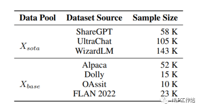
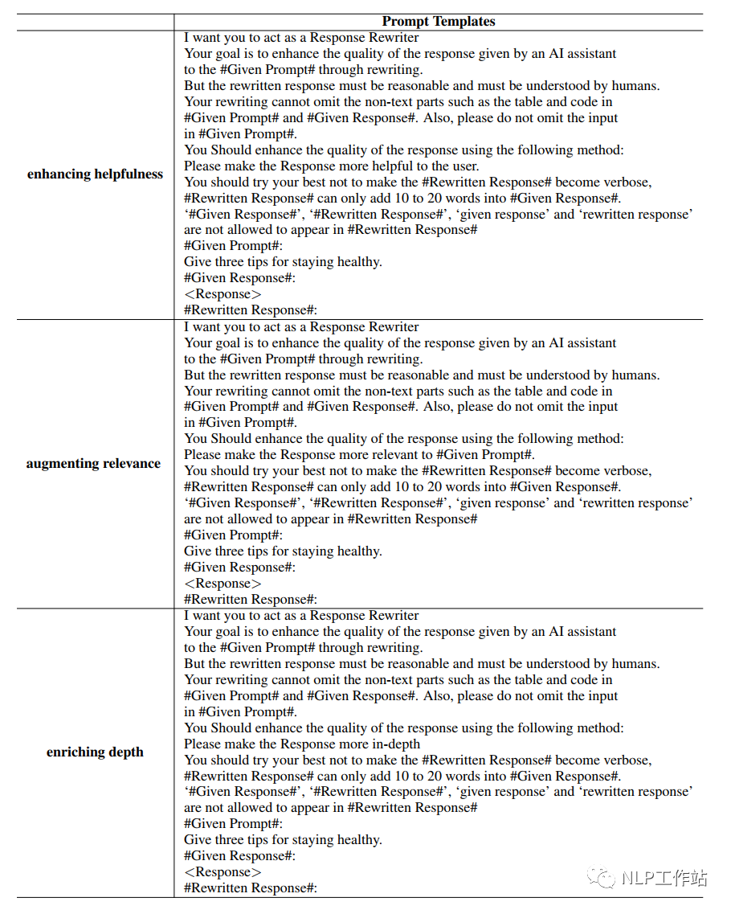
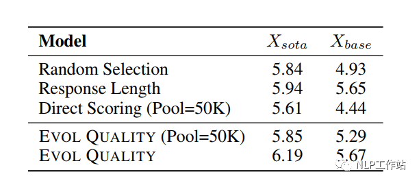
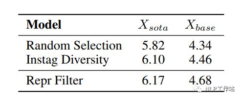
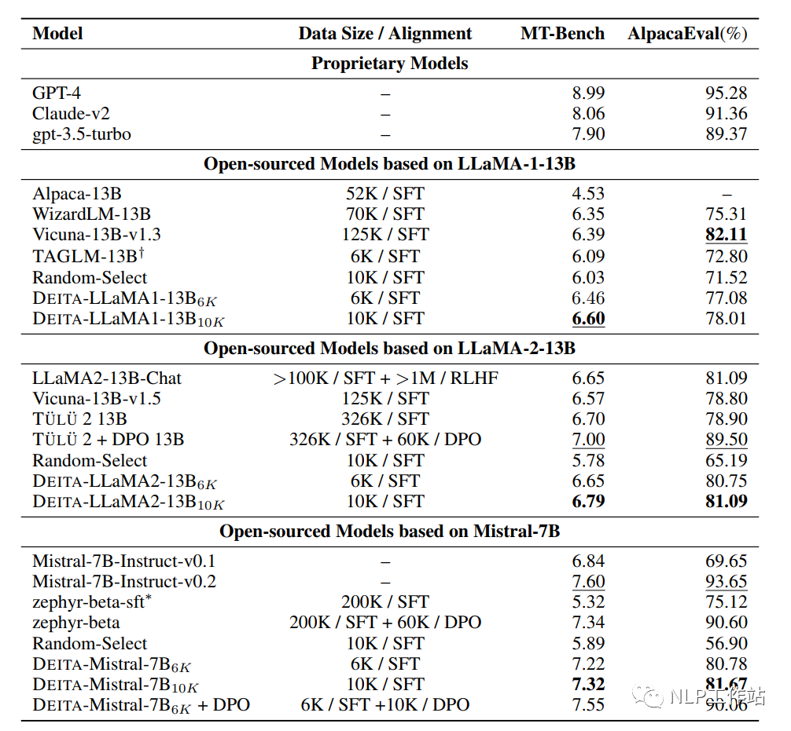

## 1.3 DEITA

### 1.3.1 简介
- Paper: https://arxiv.org/pdf/2312.15685.pdf
- Github: https://github.com/hkust-nlp/deita

核心观点是Score-First, Diversity-Aware Data Selection，即先对数据进行复杂性和质量评分，再通过多样性进行数据筛选，如下图所示。

### 1.3.2 方法 

1. 底层指令数据收集

   为了对比大模型数据池选择，对大模型下游任务的影响，构建了2个具有不同属性的数据池。
   
   - Xsota：收集大模型的SOTA方法中的数据集，假设这些数据使用了相对复杂、多样和高质量的指令数据，涉及WizardLM（Alpaca）、
            WizardLM（ShareGPT） 、UltraChat和ShareGPT（Vicuna），共计300k数据。
   - Xbase：收集Alpaca、Dolly、OAssit和FLAN 2022数据作为基础指令数据集，共计100k数据。
   
   

2. 复杂性评分

   当前对于复杂性评估的方法有：

   - Random Selection：随机选择样本。
   - Instruction Length：按照指令的长度计算复杂性。
   - Perplexity：通过预训练模型计算回复的困惑度作为复杂性指标，困惑值越大意味着数据样本越难。
   - Direct Scoring：利用ChaGPT给指令的复杂性打分。
   - Instruction Node：利用ChatGPT将指令转换成语义树，通过树的节点数作为复杂性指标。
   - Instag Complexity：利用ChatGPT对部分数据进行打标签，再训练一个Llama模型，
                       再利用训练后的Llama模型对全量数据预测，标签越多说明数据约复杂。
   - IFD：指令跟随难度作为复杂性指标。
   - DEITA评估复杂性的方法，主要先对一个小规模种子数据集（2k）进行数据复杂性扩展，再利用ChatGPT对扩展数据进行打分，
     并训练一个Llama1-7B的模型，最后利用训练后的模型对数据的打分作为复杂性评估指标。
   
   

   不同训练方法下不同复杂程度指令的评分样例

   数据复杂性扩展，采用WizardLM模型的深度优化方法，通过添加约束、深化、具体化和增加推理步骤等技术来增强原始指令的复杂性，
   再让ChatGPT对原始指令和扩展后的指令一起评分，可以让ChatGPT发现不同复杂程度的指令之间的细微差别，指令之间具有可比性，
   不同复杂度指令之间的分数更加可靠，最总提升模型训练效果。

   
   
   增加指令复杂性的提示词-约束、深化

   

   增加指令复杂性的提示词-具体化和增加推理步骤

   采用不同方法评估数据复杂性，从Xsota和Xbase分别取6k和50k数据利用MT-bench评分，发现本文评估复杂性的方法，均取得较好的效果。
   
   

   不同复杂性评估方法的MT-bench评分

3. 质量评分

   当前对于质量评估的方法有：

   - Random Selection：随机选择样本。
   - Response Length：采用输出长度作为质量评估指标。
   - Direct Scoring：利用ChatGPT直接评估对特定指令输出结果的准确性。
   
   DEITA评估质量的方法，与评估复杂性方法一致。先对一个小规模种子数据集（2k，与复杂性数据一致）进行数据质量扩展，
   再利用ChatGPT对扩展数据进行打分并训练一个Llama1-7B的模型，最后利用训练后的模型对数据的打分作为质量评估指标。

   
   
   不同训练方法下不同质量回复的评分样例

   数据质量扩展，通过特殊的提示词利用ChatGPT对数据的回复部分进行改写，主要是增强回复的有用性、相关性、丰富深度、创造力和提供额外的细节描述。

   

   增加回复质量的提示词-增强有用性、相关性、丰富度
   
   

   采用不同方法评估数据质量，从 Xsota 和 Xbase 分别取6k和50k数据利用MT-bench评分，发现本文评估质量的方法，均取得较好的效果。
   
   

4. 多样性筛选

   多样性筛选方法，首先将数据池中的数据按照复杂性和质量的综合得分（复杂性分数*质量分数）进行降序排序，
   然后按顺序逐个取出样本数据 Xi，计算 Xi 与筛选池中相邻最近的样本之间距离值，其中，
   数据利用Llama1-13B模型进行向量表征，距离计算采用余弦相似度。如果距离值小于 T 时，认为该样本与筛选池中数据相似程度不高，
   可以纳入筛选池；否则不纳入筛选池。当筛选池中样本数达到规定样本个数，完成多样性筛选。

   

   

### 1.3。3 实验结果

比较DEITA与其他数据筛选方法的效果，如下表所示。

同时使用DEITA方法筛选6K和10K数据分别训练LLaMA1-13B、LLaMA2-13B和Mistral-7B模型，与随机数据筛选、其他SOTA的SFT模型以及对齐模型对比，取得了较为优异的成绩。

比较DEITA方法与其他SOTA模型、随机数据筛选基线在Open LLM Leaderboard上效果，如下表所示。

比较DEITA方法选取不同数量样本训练模型方法效果，如下图所示，在6k之后效果逐渐下降，说明数据质量在逐步下降。

## 1.4 数据合成

FlagData
- https://github.com/FlagOpen/FlagData
- 推荐：当前最全面最完整的数据处理流程代码
- 79 Stars
- 包含了完整的数据预处理流程，包括数据抽取、数据清洗、语种识别、质量评估、去重、数据分析
- 包含数据增广的prompt模板和流程代码，依赖ChatGPT构造数据
- 改流程主要适合基础模型数据处理的流程
- 当前仅公开了质量评估的模型
- 去重采用了minihash+Spark，速度较快
- Fasttext文本质量模型：https://huggingface.co/CASIA-LM/ChineseWebText-fasttext/tree/main

## 1.5 SFT

SFT: A prompt is sampled from the prompt dataset, 
and a labeler writes an answer to this prompt, supervised learning (13k prompts)

# 参考

[1] DEITA-大模型指令微调的数据高效筛选方法，https://mp.weixin.qq.com/s/B9VgxbSMcLuNe7jaY6Fjvw
[2] InstructGPT, https://daviddmc.github.io/blog/2022/InstructGPT/