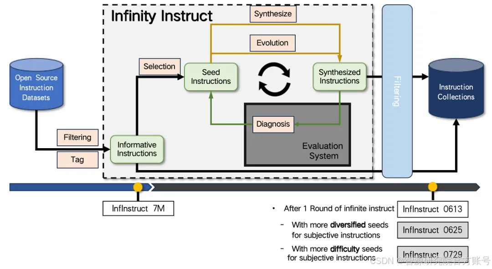
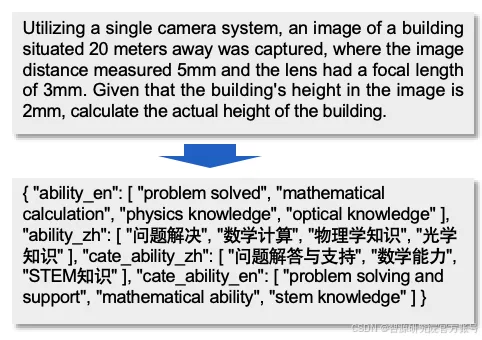
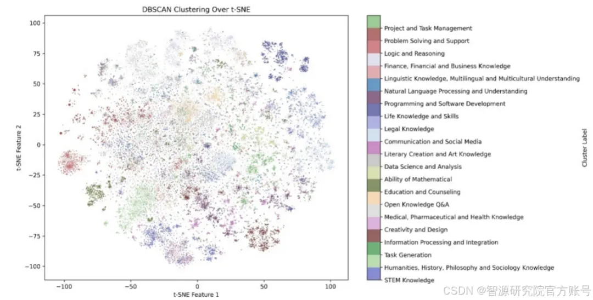
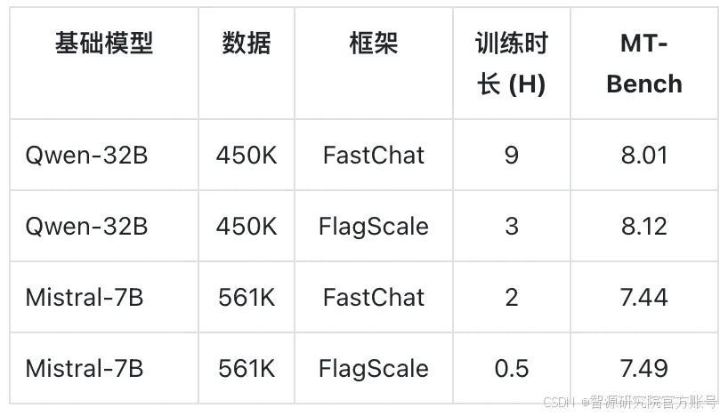

# 1. 下载

Infinity-Instruct 可在 Hugging Face、DataHub、Flopsera 等平台下载。

Hugging Face
https://huggingface.co/datasets/BAAI/Infinity-Instruct

DataHub
https://data.baai.ac.cn/details/InfinityInstruct

Flopsera
http://open.flopsera.com/flopsera-open/details/InfinityInstruct

论文：InfinityMATH: A Scalable Instruction Tuning Dataset in Programmatic Mathematical Reasoning

# 2. 方法
智源研究院搜集了 7500 万余条开源指令作为待选指令池，采用数据选择与指令合成两条途径快速迭代，构建高质量的基础、对话指令数据集，以填补开源对话模型与 GPT-4 之间的基础能力、对话能力差距。

## 2.1 基础指令数据筛选

对于基础指令数据集，筛选流程主要考虑训练数据集和目标数据集数据分布的对齐，基于DSIR的思路，在训练数据集上进行排序，选取训练集的子集，拟合目标数据集的分布。

## 2.2 对话数据集生成、进化、评价

对于对话指令数据集，Infinity-Instruct 首先采样了部分高质量的开源指令集，并为每条指令分配一组标签，描述完成指令所需的能力和知识。标签系统共有两个级别：

- 第一级标签: 宏观类别，如 "自然语言处理 "和 "数学推理"。共包括 26 个类别。
- 第二集标签: 刻画具体任务，包含超过1.5w个类别。

基于此系统，就能识别指令集的内容分布以及完成不同任务所需的能力，构建一个高质量的种子数据集。随后，Infinity-Instruct 参考 WizardLM 的方法对种子指令在广度、深度方向上进行扩展，并用 AI Agent 从指令合规性的角度剔除未能进化的数据。最后，进化后的指令作为初始输入，使用 AI Agent 扮演不同角色，为每条指令生成 2 至 4 轮对话。

## 2.3 数据去污、去重

为避免构造的数据存在自身重复、或与评测榜单重复的样本，Infinity-Instruct 对所有数据应用了 MinHash 进行去重。并基于 BGE 检索剔除了和 AlpacaEval、MT-Bench 等评测榜单重复的样本。

## 2.4 训练框架

考虑到微调成本，项目使用 FlagScale 去掉训练样本中不必要的 pad，压缩样本量，同时应用模型切分、切分支持大模型在数百万量级指令数据集上的训练。初步测试可比传统微调框架，如 FastChat+Accelerate 快三倍以上。

# 3. 未来规划
Infinity Instruct 未来将开源基础、对话指令数据处理的全流程代码，以及模型训练代码。同时，智源将探索扩展 Infinity Instruct 数据策略到对齐、预训练阶段，支持语言模型构建全生命周期的高质量数据需求。

Infinity RLAIF: 基于 Infinity Instruct 标签体系以及生成指令构建了 50K 对齐数据的第一个版本，实验结果显示，Infinity-Gemma-2-9B-SimPO 在 AlpacaEval 上达到 73.4，在 Arena Hard 上达到 59.1。未来会进行更多对齐数据、算法的探索。

Infinity Math: 基于多个开源数学数据集构建了可无限扩增的数学领域指令数据集，其中 POT 指令数据可提升在多个 7B 的基础语言模型和基础代码模型的 zero-shot 数学能力 180%-510%，相关论文被 CIKM 2024 接收，欢迎引用。

# 参考

[1] 社区供稿 | 智源千万级指令微调数据集 Infinity-Instruct 持续迭代，Llama3.1 仅微调可接近 GPT-4，https://mp.weixin.qq.com/s/CWW3Lr_iQrTr9Zr9nTh4ig