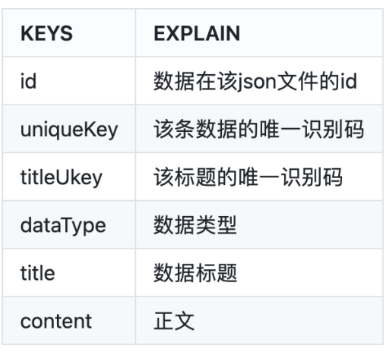
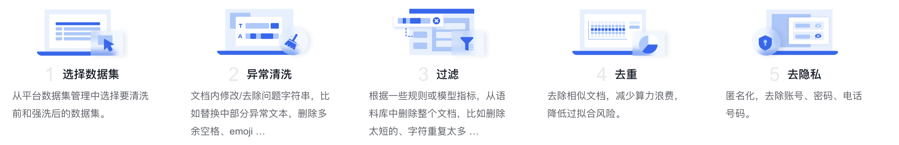

# 1. 百川

## 1.1 预训练数据

- 整合各类信息源，确保文化、科学、技术等方面广泛的知识覆盖；
- 建立了一套系统的数据质量体系，包括低质、优质、类别等
- 设计了一个多粒度的大规模聚类系统。通过使用先进的聚类算法和方法，识别和整合相似或相关的数据，为去重、采样提供支撑
- 一种细粒度的自动化匹配算法，自动配比各类任务，例如课程学习。从而实现个性化的模型学习，使预训练数据能够更精确地匹配用户需求

## 1.2 搜索增强

- 动态响应策略：依赖 Prompt，将指令任务细化为 16 个独立类别，覆盖各种用户指令的场景。
- 智能化搜索词生成：通过对问答样本进行精细化的人工标注，捕捉和理解用户多元化的志林需求。
- 高质量搜索结果筛选：百川构建了一个搜索结果相关性模型，对从搜索内容和知识库中获取的信息进行相关性频分，
                  从而筛选出高质量的搜索引用内容，减少在知识抽取阶段引入的无关、低质量的信息。
- 回答结果的搜索增强：RLHF，让 Baichuan 大模型参照搜索结果，针对用户请求生成高价值且具有实时性的回答。

# 2. Llama2-Chinese

- https://github.com/FlagAlpha/Llama2-Chinese
- 5.9k Stars

## 2.1 预训练数据

- 采用大规模的中文数据进行持续预训练，包含百科、书籍、博客、新闻、公告、小说、金融数据、法律数据、
  医疗数据、代码数据、专业论文数据、中文自然语言处理竞赛数据集等
- 数据来源：https://github.com/FlagAlpha/Llama2-Chinese#-%E6%95%B0%E6%8D%AE%E6%9D%A5%E6%BA%90
- 对庞大的数据进行了过滤、打分、去重，筛选出超过1T token的高质量中文数据，持续不断加入训练迭代中

# 3. 书生万卷1.0

1. 文本清洗流程如下：

    1）首先，从WARC原始文件中提取文本，然后使用不同的语言检测工具（pyclid2）对提取的文本进行分类，随后对中英文文本进行不同的处理。鉴于互联网上存在大量无效数据，采用以下规则进行过滤，以获得高质量数据：
    
    2）删除不规范的文档，包括平均单词长度和文档长度不合适的文档。如果出现频率最高的单词不是字母，或者出现频率过高，我们会将其视为不常见的文档格式并将其删除。
    
    3）删除内容过少的文档，如经过处理后句子少于三句的文档；段落少于三段的文档；长度超过200字的段落少于三段的文档；或停用词少于两个的文档。
    
    4）对段落进行清理，删除了一些特殊段落，如包含JavaScript等单词的段落、标点符号以外的段落以及超过1000字的段落。
    
    5）注意到获得的数据中包含重复数据，对文本数据进行标记化处理，并使用MinHashLSH和n-grams评估相似度，删除相似度大于0.8的内容。
    
    6）由于互联网数据中存在有害和低质量的内容，训练模型来评估质量并针对不同问题进行过滤，具体包括：
    
    7）使用FastText模型对色情、暴力、赌博、攻击和其他有毒主题的内容安全模型进行训练，分别针对中文和英文，以过滤潜在的有毒数据。
    
    8）针对网上的各种低质量数据，如自动生成的随机数据和广告内容，我们分别针对中文和英文训练数据质量模型，以降低低质量数据的比例。

2. 文本图片数据清理

   - To reduce the difficulty of cleaning and ensure data quality, we wrote specific parsing rules
     for each site. User-generated articles were sourced from a single open-source site.
   - We only extracted valid (ad-free, list-free, navigation bar-free, emoticon-free, comment-free)
     article content. We used a series of rules to filter. We also removed references, complex
     tables, lists, and other entry-related content for the text part of Wikipedia, retaining only
     the text paragraphs. For user-generated articles and authoritative media news, we used
     XPath, CSS selectors, and regular expressions to remove media sources, publishers, reposts,
     advertisements, and comments unrelated to the article theme, to obtain the article’s main
     body. Like with text data cleaning, we also performed deduplication based on similarity.
   - We believed the header images of Wikipedia articles are meaningful for image selection, so
     we only retained these. To ensure all images in user-generated articles had valid descriptions,
     we removed articles with more than 15 images and those where the number of text characters
     was less than twice the number of images. Based on this rule, we retained 55% of the valid
     articles.
   - We the valid text and images obtained from the above filtering. The format for Wikipedia
     was (the first paragraph, main image, and remaining paragraphs)
    
   The language distribution was 62.3% Chinese and 37.7% English.

# 4. wudao数据集

地址：https://www.sciencedirect.com/science/article/pii/S2666651021000152

数据清理的具体步骤：

1）在文本提取之前评估每个数据源的质量，并删除文本密度低于70%的网页。

2）使用simhash算法删除重复内容。

3）删除一个包含少于10个汉字的网页。

4）删除包含脏话、煽动性评论和其他非法内容等敏感信息的网页。

5）为了最大程度地保护每个人的隐私安全，使用正则表达式匹配并删除私人信息（如身份证号码、电话号码、QQ号码、电子邮件地址等）。

6）使用标点符号（如句号、感叹号、问号、省略号）来分隔提取出的文本，并删除最后一段。

7）过滤掉高频乱码词汇的网页，并使用解码测试进行二次检查，解决乱码问题。

8）将繁体汉字转换为简体汉字，以使的语料库中字符格式统一。

9）从网页中删除异常符号（如表情符号、标志等）。

10）删除包含超过十个连续非中文字符的网页。

11）删除网页标识符（如HTML、层叠样式表（CSS）和Javascript）。

12）删除每个句子中的所有空格，以规范化的语料库。

数据字段

# 5. Textbooks Are All You Need

- 论文地址： https://arxiv.org/abs/2306.11644
- 发表时间： 2023.06.20

1. 数据来源和组成

    如标题所言，模型的最主要部分就是教科书质量的训练数据。此前用来做代码生成的数据集如The Stack，
    作者们认为都不宜用来教会模型推理和算法规划。模型结构和训练方法都比较传统，不必赘述。
    
    标准代码数据集是一个大而全的语料库，然而，通过随机抽查，作者们观察到其中许多片段对于学习写代码并不是很有指导性，存在如下缺点：
    
    - 代码示例不自成一体，依赖于外部模块或文件，导致它们在没有上下文的情况下很难理解。
    - 不少典型代码示例比较无聊，不涉及算法，比如定义常量、设置参数或配置GUI。
    - 含有算法逻辑的代码示例常常深藏在复杂或文档不完善的函数中，很难以理解或学习。
    - 代码示例偏向于某些主题，导致数据集中编码概念和技能的分布不均衡。
    
    因为要处理噪音、歧义和不完整数据，即使是一个想学编程的真人，看到上面这些示例也会觉得失望和低效（无比O疼）。
    因此，对于LLM而言，这些数据一样质量堪忧。作者们认为，一个简捷、自包含、有指导性且分布均衡的优秀数据集，必定会让语言模型学习得更好。
    
    本文使用的训练数据少于 7B token：
    
    - 过滤的code-language数据集：The Stack和StackOverflow的子集，使用基于语言模型的分类器过滤 （约6B token）
    - 人造教科书数据集：由GPT-3.5生成的Python数据集（< 1B token）
    - 小型的人造习题数据集：Python练习和解答 （约 180M token）。
    
    将code-language数据集和人造科教科书数据集称为CodeTextbooks用于预训练，
    得到基模型phi-1-base; 再使用人造习题数据集 CodeExcercises 微调得到 phi-1 模型。
    训练效果如下图所示：
    
    
    
    其中横轴是模型规模，逐渐变大。由图可见，使用 CodeTextbooks 预训练的模型相较原始数据集性能有所提升。
    虽然 CodeExcercises 规模很小，但相较于仅用 CodeTextbooks 预训练的模型性能提升明显：
    仅 1.3B 的预训练模型 phi-1-base 已在HumanEval数据集达到 29% Pass@1

2.  数据过滤器

    使用原始的代码生成数据集The Stack和The StackOverflow中的Python语言子集，包括约35M样本，总大小超过 35B token。
    使用GPT-4标注了约 100K 样本，标注prompt为："determine its educational value for a student whose goal is 
    to learn basic coding concepts"，也就是确定对一个要学编程基本概念的学生来说，这段代码的价值如何。
    然后使用这个标注数据集训练一个简单的随机森林分类器，用于判断一段代码样本的优劣。
    feature使用预训练codegen模型的embedding。

3. 数据构造
   （1） 构造数据   

       构造高质量代码生成的数据集的主要挑战之一是确保示例的多样性和不重复。所谓多样性，是指示例应涵盖广泛的编程概念、
       技能和场景，并且在难度、复杂度和风格上有所变化。多样性让语言模型接触到解决问题的不同方式，
       减少了过拟合或记忆特定模式的风险，同时增加模型对未见过任务的泛化能力和鲁棒性。
    
       然而，实现多样性并不简单，特别是使用另一个语言模型生成合成数据。仅仅通过prompt让模型生成编程教材或练习，
       即使在指令或参数上有一些变化，也很可能会得到一个同质化和冗余的数据集，其中相同的概念和解决方案反复出现，
       只有微小区别。这是因为语言模型在给定其训练数据和先验知识的情况下，往往会遵循最有可能或最常见的路径，
       它们缺乏创造性和动力去探索生成代码的新方式。因此，我们需要找到合适的“秘籍”，
       使语言模型在输出中更具创造性和多样性，同时仍然保持示例的质量和连贯性。

       受之前生成短篇故事论文的启发，通过在prompt中加入从固定词表中随机选择的词汇，在prompt中加入随机性，从而产生多样性的数据集。  
    
   （2） 模型合成数据   

       此数据集是用GPT3.5生成的Python教科书，少于1B token，主要包括高质量自然语言问题描述和相关的代码段。
       多样性由主题和目标受众的不同引入随机性来保证。

   （3） CodeExcercises 数据集   

       这个用于微调，少于 180M 的小数据集由Python习题和解答构成。每个练习都是一个待补全函数的字符串。
       此数据集是为了让模型对齐基于自然语言指令完成函数补全任务。数据集也由GPT-3.5生成，引入多样性的方式是使用不同的函数名。
       为避免测试数据集污染，我们使用了额外手段保证HumanEval中的问题不会在微调阶段出现。

4. 数据去重
    - n-gram
    - embedding和句法相似度
      - embedding用l2距离：阈值设在0.95到0.8
      - 句法用编辑距离

# 6. 百度

- https://cloud.baidu.com/doc/WENXINWORKSHOP/s/Mliu6hgzo

数据清洗是面向post-pretrain场景下预训练泛文本数据的一站式数据处理方案，
通过对数据进行异常清洗、文本过滤、文本去重和去除隐私信息，大幅提升数据质量，优化模型训练效果。

1. 异常清洗

    

    可选异常清洗配置如下所示：

    1）移除不可见字符：移除ASCII中的一些不可见字符, 如0-32 和127-160这两个范围。
    2）规范化空格：将不同的unicode空格比如  u2008，转成正常的空格。
    3）去除乱码：去除乱码和无意义的unicode。
    4）繁体转简体：将文档中的繁体字转换成简体。
    5）去除网页标识符：移除文档中的html标签，如<html>,<dev>,
等。
    6）去除表情符：去除表情符如image.png

2. 过滤

    

    可选过滤配置如下所示，每项过滤配置都可在打开后进行范围内取值：

    1）检查文档的词数目：词数目不在指定范围会被过滤掉，如中文，取值范围[1,1000000]（正整数）。
    2）检查文档的字重复率：如果字重复率太高，意味着文档中重复的字太多，文档会被过滤掉，取值范围[0,1]。
    3）检查文档的词重复率：如果词重复率太高，意味着文档中重复的词太多，文档会被过滤掉，取值范围[0,1]。
    4）检查文档的特殊字符率：如果特殊字符率太高，意味着文档中特殊字符太多，文档会被过滤掉，取值范围[0,1]。
    5）检查文档的色情暴力词率：如果色情暴力词率太高，文档会被过滤掉，取值范围[0,1]。
    6）检查文档的语言概率：如果语言概率太低，文档会被过滤掉，取值范围[0,1]。
    7）检查文档的困惑度：如果困惑度太高，文档会被过滤掉，取值范围[0,5000]。

3. 去重

    

    可选去重配置为simhash-operator，根据海明距离计算文档相似度, 相似度<=海明距离，认为两个文档相似。

4. 去隐私

    

    可选去隐私配置如下所示：
    
    1）去除数字：去除数字和字母数字标识符，如电话号码、信用卡号、十六进制散列等，同时跳过年份和简单数字的实例。
    2）去除Email：去除Email地址。
    3）去除IP地址：去除IPv4 或者 IPv6 地址。

5. 

# 7. Tigerbot

来源 Github (2.2k Stars): https://github.com/TigerResearch/TigerBot

<b>数据清洗</b>

- 由于各类数据质量存在差异，通过 Alpaca Self-Instruct 生成的数据亦存在各种问题。因此，我们经过细致的人工校验和分类，总结出一套全面且系统化的数据清洗规则与方法。
- 整体规则可以划分为**过滤类规则**和**清洗类规则**两大类。其中，命中过滤规则的数据项将被弃用，而清洗规则旨在处理并保留所需的数据。
- 同时，在数据梳理与积累的过程中，我们也不断对清洗规则进行迭代和优化。
- 通用清洗规则描述如下所示：

a. 过滤类-敏感词规则：基于积累的敏感词库，清洗丢弃涉政、涉黄、涉暴、涉恐等数据项；

b. 过滤类-无效输入输出：此类规则主要针对 Self-Instruct 生成数据缺陷进行专项清理，根据输入输出分别制定规则，以丢弃一些无效的数据项；

> 无效输入如"<一段文本>"，无效输出如"[图画]"；

c. 清洗类-关键词规则：根据整理的关键词/正则列表进行数据的替换，包括：清理特殊标志位字符、清理非可见字符、清理标签、繁简转换等；

d. 清洗类-特殊逻辑规则：此类规则用于清洗一些特殊现象数据，如指令与输入重复等，如下所示：

> `{"instruction": "描述如何做一道红烧肉。请提供食材和详细的步骤。", "input": "请描述如何做一道红烧肉，提供食材和详细步骤。", ...}`

# 8. FinWeb

FineWeb 由 huggingface 领导的团体研发，提供超过15万亿个Token，这些Token来自2013年至2024年的 CommonCrawl转储

FineWeb在设计时一丝不苟，使用datatrove进行流水线处理。这个过程针对数据集进行清理和重复数据删除的操作，从而提高其质量和适用性以便利于大语言模型的训练和评估。

FineWeb的主要优势之一在于其性能。通过精心策划和创新的过滤技术，FineWeb在各种基准测试任务中优于C4、Dolma v1.6、The Pile和 SlimPajama 等已建立的数据集。在FineWeb上训练的模型表现出卓越的性能，它已经成为自然语言处理的宝贵资源。

透明度和可重建是FineWeb发展的核心原则。该数据集及其处理管道代码在ODC-By 1.0许可下发布，使研究人员能够轻松复制和构建其发现。

FineWeb利用了URL 过滤、语言检测和质量评估等过滤步骤提高数据集的完整性和丰富性。每个CommonCrawl转储都使用高级MinHash技术单独删除重复数据，进一步提高了数据集的质量和实用性。

# 9. ACL2024 | IEPILE:大规模基于Schema的信息抽取语料库

三条启发式规则以排除质量较低且无意义的数据：1）非字母字符占比超过80%；2）文本长度小于5个字符且不含任何标签；3）停用词如'the'、'to'、'of'等占比超过80%。我们认为以上所述的清洗措施将对模型的训练产生积极影响，并提高其性能

# 参考

[1] LLM（一）| 百川智能baichuan7B、13B、53B以及baichuan2总结, https://zhuanlan.zhihu.com/p/656857636

[2] 大模型研发必备：两大开源可用且清洗过的中文文本语料库及大模型FLOPS、参数量快速估计工具推荐，
    https://mp.weixin.qq.com/s/uqU0LKzchGLmXiDswRFkrQ

[3] LLM数据为王: Textbooks Are All You Need, https://zhuanlan.zhihu.com/p/642684154