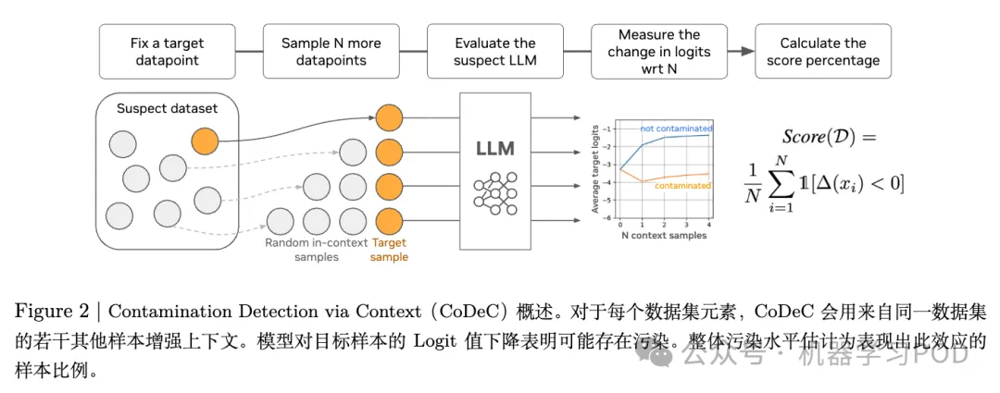

参考：https://mp.weixin.qq.com/s/N9w6QCV5rjnN9Bi2JySm4Q

NVIDIA 提出 CoDeC：通过 In-Context Learning 来区分模型“记忆”还是“泛化”
对于大模型的评估来说，benchmark 必须是模型在训练阶段从未见过的。如果模型在训练中已经接触过、甚至“背诵”了测试集的内容，那么其在评测中的高分就失去了意义。

这种现象被称为“数据污染”（Data Contamination），它不仅会错误地夸大模型的能力，导致不同模型之间不公平的比较，更会误导整个领域对技术进展的判断。数据污染的存在，使得我们难以确定模型的高性能究竟源于其强大的泛化推理能力，还是仅仅因为它记住了答案。

准确、可靠地检测数据污染，已经成为确保 LLM 评估完整性和可信度的关键环节。学术界和工业界当前已经提出了多种检测数据污染的方法，但它们普遍面临一些实际应用中的挑战：

基于损失函数的标准： 这类方法的核心假设是，模型在训练集样本上的损失（loss）或困惑度（perplexity）会显著低于在未见过样本上的损失。然而，这种方法的阈值设定非常困难，一个固定的阈值往往难以适用于不同的模型和数据集。此外，一些简单、格式化的未见过数据也可能产生很低的损失，从而导致误判。
需要外部参考模型或数据： 一些更先进的方法通过引入一个“参考模型”（通常是更小或更早期的模型）来校准目标模型的输出分数。这种方法虽然提升了准确性，但它依赖于一个“干净”的参考模型，而这个前提本身有时难以保证。另一些方法则需要访问与目标数据集同分布的、但确定未被污染的“留出集”（held-out data），这在很多现实场景中难以实现。
近期 NVIDIA 的论文 《Detecting Data Contamination in LLMs via In-Context Learning》提出了一个新的检测思路，利用了大模型上下文学习（In-Context Learning, ICL）的能力，来有效地区分模型“记忆”的数据和“泛化”的数据。

论文标题：Detecting Data Contamination in LLMs via In-Context Learning
论文链接：https://www.arxiv.org/pdf/2510.27055
1. CoDeC
CoDeC 的核心思想：对于一个给定的数据样本，模型对其预测的置信度（confidence）会因上下文中是否提供了来自同一数据分布的“提示”而发生不同的变化。这种变化的模式，恰好揭示了该样本是否是模型训练的一部分。

CoDeC 的优势
作为一个实用的检测工具，CoDeC 具备多项使其易于部署和推广的优良特性：

分数直观易懂： CoDeC 输出的是一个 0% 到 100% 的百分比分数，直接对应“受负面影响样本的比例”。这比那些输出无界、任意尺度分数的传统方法更容易解释和使用，研究人员可以据此设定相对明确的判断标准。
模型与数据集无关性： 该方法不依赖于任何特定的模型架构或数据集类型。只要模型能够输出词元的对数概率（即所谓的“灰盒访问”权限），并且数据集可以表示为一组文本序列，就可以应用 CoDeC。这使得它可以广泛适用于 Transformer、RNN、Mamba 等不同架构的模型，以及代码、问答、对话、书籍等各种形式的数据。
无需参数调优： CoDeC 是一个即插即用的方法，不需要像许多成员推断攻击（MIA）方法那样，针对不同的模型和数据集去调整分类阈值。
计算高效： 相对于需要额外训练（如影子模型）或多次迭代的方法，CoDeC 的计算开销很小。对于每个样本，它只需要两次前向传播（forward pass）。实验表明，即使在只有几百个样本的小型基准测试集上，CoDeC 也能给出稳定可靠的分数。
对文本裁剪的鲁棒性： CoDeC 的分数在使用训练样本的部分片段时仍然保持稳定。这一特性在评估长文本（如书籍、文章）时尤其有用，因为我们可以将长文本分割成多个片段来构成一个数据集。
对格式变化的敏感性： 有趣的是，CoDeC 对文本格式的变化（如添加"Question:"、"Answer:"等标签）很敏感。如果上下文中的格式与模型训练时见过的格式不符，会降低污染分数。这提醒使用者，在进行评测时，应专注于那些保证在训练中出现过的核心文本内容，而剥离那些不确定的格式化指令。

