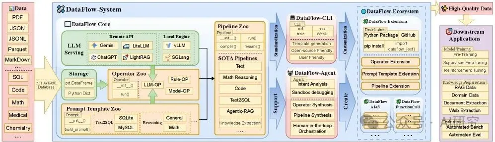

ArXiv URL：http://arxiv.org/abs/2512.16676v1

在大模型（LLM）开发的狂热浪潮中，我们往往沉迷于模型架构的微调或参数规模的扩展，却忽略了一个残酷的现实：数据工程依然处于“手工作坊”时代。

ArXiv URL：http://arxiv.org/abs/2512.16676v1

当模型训练代码已经通过 PyTorch 或 TensorFlow 实现了高度标准化和模块化时，数据准备工作却依然充斥着大量临时编写的 Ad-hoc 脚本、难以复现的清洗流程以及缺乏统一标准的“胶水代码”。这不仅效率低下，更让“以数据为中心（Data-Centric AI）”的愿景难以落地。

为了解决这一痛点，北京大学的研究团队推出了一款名为 DataFlow 的全新框架。它不只是一个工具箱，更是一套系统级的解决方案：它让构建数据流水线像写 PyTorch 模型一样优雅、模块化且可编程。

更令人震惊的是，基于 DataFlow 构建的 10K 样本数据集，在训练效果上竟然超越了包含 100 万样本的开源数据集 Infinity-Instruct。

该框架的设计包含四个核心支柱：

1. 全局存储抽象：统一管理异构数据源（JSON, Parquet, SQL 等），让算子只关注逻辑，不关注存储细节。
2. 层级化编程接口：从底层的 LLM 服务（Serving），到中间层的算子（Operators）和提示词模板（Prompt Templates），再到顶层的流水线（Pipelines），层次分明。
3. 丰富的算子库：内置了近 200 个可复用的算子，覆盖了生成、评估、过滤和精炼四大类。
4. 插件化扩展：用户可以像发布 Python 包一样发布自己的数据处理算子，形成社区生态。

# 参考

[1] 1万条顶100万条！北大DataFlow：像写PyTorch一样搞定大模型数据,https://mp.weixin.qq.com/s/_miJKVWtb5TZk64BLpsEYQ 