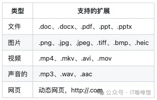

# 1. 资源

项目名称：  omniparse

GitHub 链接：https://github.com/adithya-s-k/omniparse

Star 数：3K

# 2. 简介

OmniParse 是一个平台，它可以提取和解析任何非结构化数据，将其转换为针对 GenAI (LLM) 应用程序优化的结构化、可操作数据。无论您处理的是文档、表格、图像、视频、音频文件还是网页，OmniParse 都可以将您的数据准备得干净、结构化，并可用于 RAG、微调等 AI 应用程序

OmniParse 旨在成为一个摄取/解析平台，您可以在其中摄取任何类型的数据，例如文档、图像、音频、视频和 Web 内容，并获得最结构化、最可操作且对 GenAI (LLM) 友好的输出。目前来看项目的思路的实用性很不错，当然目前项目在使用上也有一些不完善，比如它擅长解析英语，但对于中文等语言可能会有困难，另外对于PDF中公式转LaTeX会有困难，具体的可以参考项目给出的信息。



# 3. 使用

```text

#运行服务器：
python server.py --host 0.0.0.0 --port 8000 --documents --media --web

#--documents：加载所有帮助您解析和提取文档的模型（Surya OCR系列模型和Florence-2）。
#--media：加载Whisper模型来转录音频和视频文件。
#--web：设置selenium爬虫。
```

运行

以下是执行文档解析的例子，可以解析 PDF、PowerPoint 或 Word 文档。

```bash
#Curl 命令：
curl -X POST -F "file=@/path/to/document" <http://localhost:8000/parse_document>
```

解析图像文件（PNG、JPEG、JPG、TIFF、WEBP）。

```bash
#Curl 命令：

curl -X POST -F "file=@/path/to/image.jpg" <http://localhost:8000/parse_media/image>
```
# 参考

[1] 3K star！为RAG而生的数据清洗神器，https://mp.weixin.qq.com/s/CaMgmyHM-GJbFdnY74Ttsw