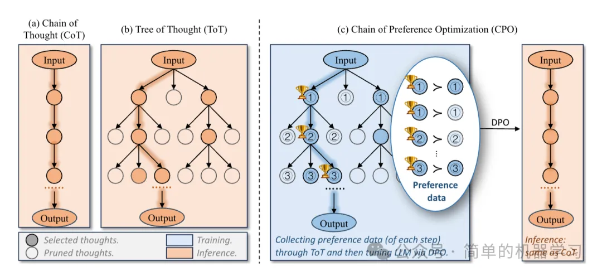
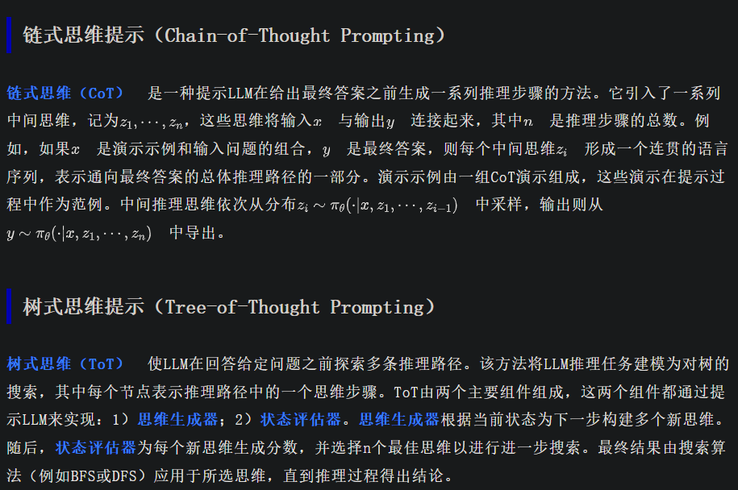
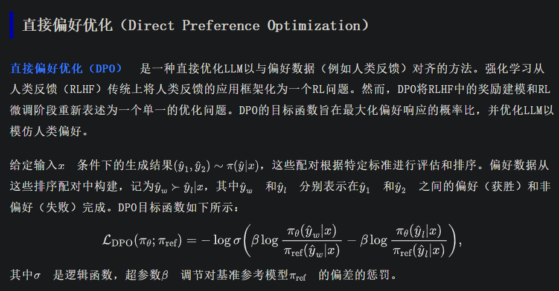
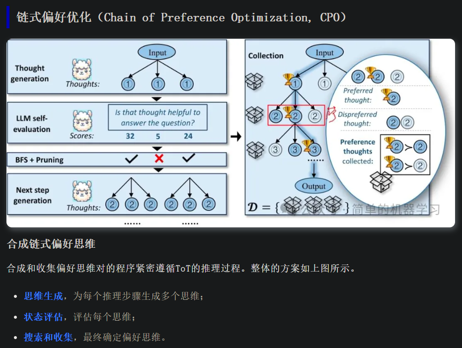
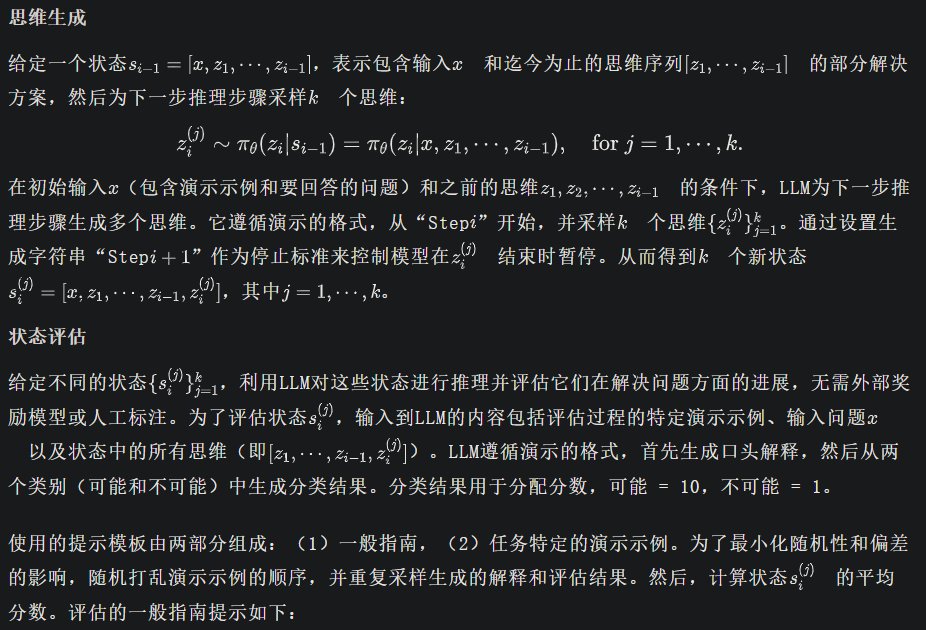

# 简介

思维链（CoT） 解码的近期发展使得大型语言模型（LLMs）能够为解决复杂问题生成明确的逻辑推理路径。但这些路径并非总是经过深思熟虑且最优的。思维树（ToT） 方法利用树搜索来广泛探索推理空间，并找到思维链解码可能忽略的更好的推理路径。但这种深思熟虑是以大幅增加推理复杂性为代价的。

基于上述内容的考量，《Chain of Preference Optimization: Improving Chain-of-Thought Reasoning in LLMs》利用思维树构建的搜索树对大型语言模型进行微调，能够让思维链实现相近或更优的性能，从而避免了沉重的推理负担。

# 参考

[1] [蒙特卡洛搜索树]CPO: 通过偏好链优化改进大型语言模型中的思维链推理，https://mp.weixin.qq.com/s/mjOA0knUaYbP3FOFksp3dw