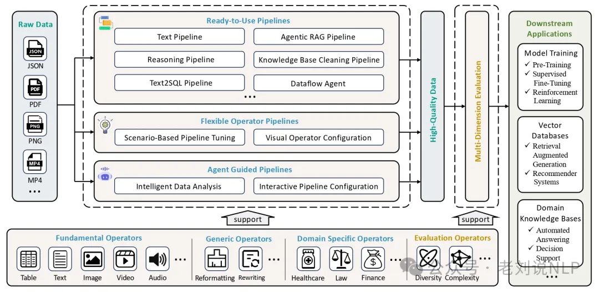
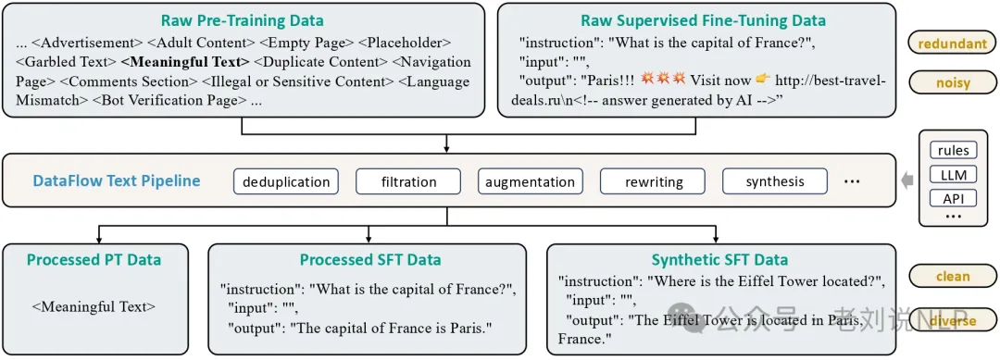
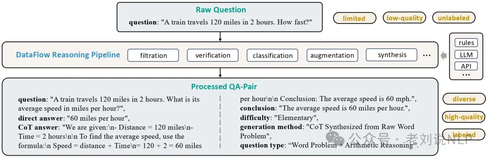
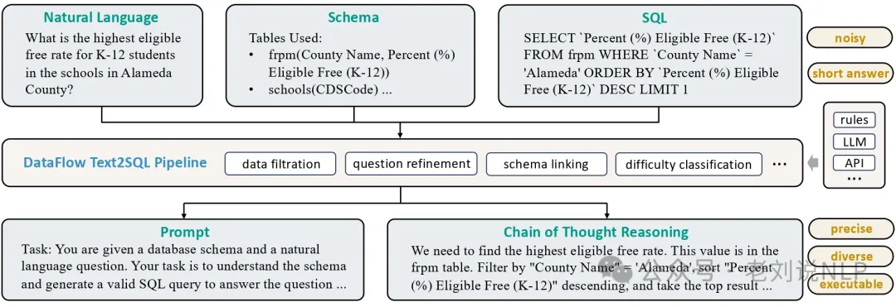

# 资源

DataFlow: A Data-centric AI system for data preparation and training，https://github.com/OpenDCAI/DataFlow，感兴趣的可以关注，这是数据合成方面的工具，说明文档在https://opendcai.github.io/DataFlow-Doc/zh/guide/

# 2. 功能

有哪些功能？

支持的任务包括纯文本训练合成、强推理数据合成、Text-to-SQL数据合成、Agentic RAG数据合成流程等。

其中：

1）纯文本数据处理不同格式的文本信息，包括预训练文本和指令微调格式文本。从大规模纯文本（多为网络爬取）中挖掘问答对，用于监督微调和强化学习训练。

2）强推理数据合成的核心目标是通过数学问答数据的合成与处理，扩展现有数据集的规模和多样性，增强已有问答对，添加 长链式推理（Chain-of-Thought）、 类别标注、难度估计。

具体的：问题处理：过滤非数学问题、合成新问题、验证问题正确性、进行难度评分和类别分类；答案生成与处理：根据问题的标准答案或模型生成的答案进行处理，包括格式过滤、长度过滤和正确性验证等；数据去重：对生成的问答数据进行去重，确保数据集的质量。

3）Text-to-SQL数据合成，通过清洗和扩充现有的Text-to-SQL数据，为每个样本生成包含训练提示词（prompt）和长链推理过程（chain-of-thought）的高质量问答数据，将自然语言问题转化为 SQL 查询，辅以解释、思维链推理和数据库结构上下文信息。

