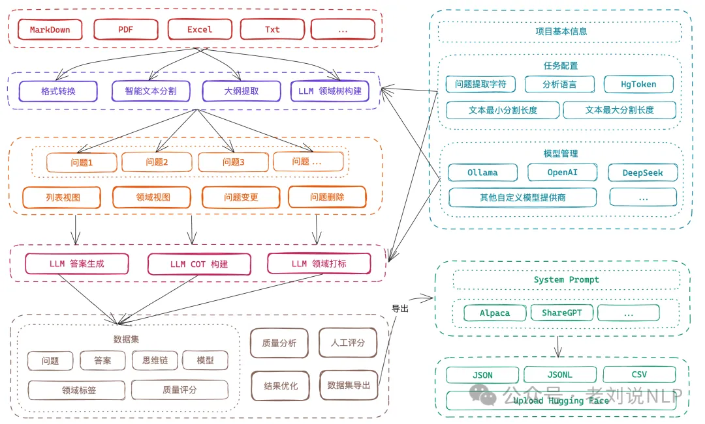

Easy Dataset(https://github.com/ConardLi/easy-dataset)，一个专为创建大模型（LLM）微调数据集而设计的项目，提供了直观的界面，用于上传特定领域的文件，智能分割内容，生成问题，并为模型微调生成高质量的训练数据。社区成员有测试过，还不错，具体说明说明文档在：https://rncg5jvpme.feishu.cn/docx/IRuad1eUIo8qLoxxwAGcZvqJnDb?302from=wiki

我们可以关注三个问题。

1、当前微调模型的数据痛点

里面提到的这几个问题说的很中肯，这个工具的远景是很好了，也着实点出了当前大模型微调的一些问题，可以看看，是现实痛点。

目前各行各业都在积极探索微调自己行业的大模型，其实微调的过程不是难事，目前市面上也有比较多成熟的工具，比较难的是前期的数据集准备的环节，数据集的质量直接决定了模型微调后的效果，高质量领域数据集的构建始终面临多重挑战，大家在构建数据集的过程中可能会普遍遇到以下问题：

1）完全不知道怎么做，目前就在纯人工去做，想提高效率；

2）直接将文档丢给AI，但是AI对于大文件生成的QA对效果比较差；

3）AI本身有上下文的限制，一次不能生成太多的问题，分批生成后面又会生成重复的问题；

4）已经有整理出来的数据集了，想有一个批量管理数据集的地方，可以进行标注和验证；

5）对于数据集有细分领域的需求，不知道如何去构建领域标签；

6）想要微调推理模型，但是不知道推理微调数据集中的COT怎么构造；

7）想从一个格式的数据集转换成另一个格式的数据集，不知道怎么转换；

2、如何具体实现？

那么，具体是什么做的？视频教程在：https://www.bilibili.com

在文档处理环节，上传Markdown文件并自动将其分割为有意义的片段，在"文本分割"部分上传Markdown文件；查看自动分割的文本片段，并根据需要调整分段。

在问题生成环节，从每个文本片段中提取相关问题，导航到"问题"部分；选择要从中生成问题的文本片段；查看并编辑生成的问题；使用标签树组织问题。

在答案生成缓解， 使用LLM API为每个问题生成答案。转到"数据集"部分，选择要包含在数据集中的问题，使用配置的LLM生成答案；查看并编辑生成的答案。

在数据导出环节，以各种格式（Alpaca、ShareGPT）和文件类型（JSON、JSONL）导出数据集，在数据集部分点击"导出"按钮；选择喜欢的格式（Alpaca 或 ShareGPT）；选择文件格式（JSON 或 JSONL），根据需要添加自定义系统提示，然后导出最终数据集。

3、实际效果以及大家的实际需求又是什么？

但是？是否真的达到的目的？

总的来说，还很初步，一个知识库只能导入一个文件，不然，需要删除该文件，再导入，弄QA对。整体大面的功能不错，后面支持多文件，并发，就比较适合使用。并且，这个项目是纯JS写的，不好二次开发，/video/BV1y8QpYGE57/**。

所以，也给出了一些未来的规划，这个其实也是真是场景中所需要关注的，其实可以看到大家的刚需，几个方面。

1）文献格式，单项目支持上传多个文件、支持多种类型（PDF、World、Excel）的文献解析；

2）多模态支持，支持图片、视频、音频等多模态数据集生成；

3）质量评估，引入BLEU、ROUGE等指标，自动标注数据置信度，降低人工校验成本；

4）数据标注，支持强化学习偏好数据集的质量标注，完善数据集评估能力；

5）蒸馏数据集，支持不基于领域文献，直接基于大模型生成用于模型蒸馏的数据集；

6）平台联动，支持HuggingFace数据集一键上传，支持从HuggingFace等平台一键拉取数据集，进行二次评估。

# 参考

[1] 大模型微调数据生成工具Easy Dataset及KBLaM知识注入框架评析, https://mp.weixin.qq.com/s/0PUMbuiyXPUIXunMuH-otw