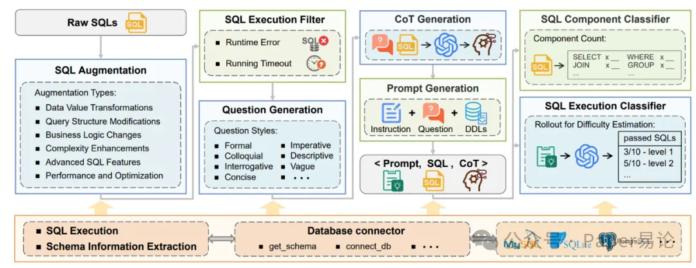
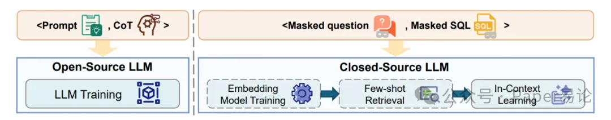
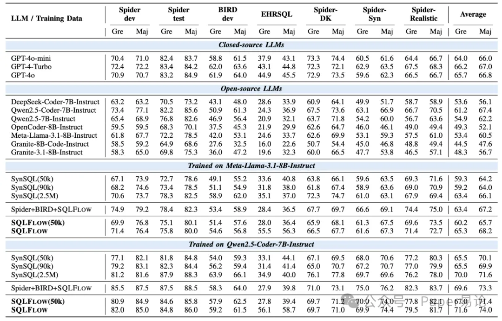

就拿 Spider 数据集来说，原始训练集里带窗口函数的 SQL 占比几乎为 0，经过 TEXT2SQL-FLOW 增强后，SQLFlow-Spider 里这个比例直接冲到 5.27%，子查询和聚合函数的占比也大幅提升，模型练完之后处理复杂查询的能力自然突飞猛进～ 而且这些增强数据还完美贴合数据库 schema，不会出现语法错误，执行起来稳稳的～

整个框架的工作流程也超级清晰，上半部分是数据增强 pipeline，从 SQL 生成、过滤到问题和推理链生成，一气呵成；下半部分是 Database Manager 模块，负责搞定不同数据库的兼容问题，示意图一看就懂👇

（图 2：TEXT2SQL-FLOW 整体框架图）

生成数据之后，不管是开源模型还是闭源模型，都能找到适配的使用方式～ 对于开源大模型，直接用 SQLFLOW 里的提示词和推理链对儿做监督微调，让模型不仅能生成正确 SQL，还能学会一步步推理的逻辑；对于闭源模型（比如 GPT 系列），就把 SQLFLOW 当成少样本知识库，再用他们提出的掩码对齐检索方法，精准匹配结构相似的例子，让提示词效果翻倍，这个用法示意图太直观了👇

光说不练假把式，实测数据才是硬道理！先看开源模型微调效果：用 Qwen2.5-Coder-7B-Instruct 在 SQLFLOW 上微调后，Spider-dev 的执行准确率从 73.4% 暴涨到 82.0%，涨了 8.6 个百分点；BIRD-dev 从 50.9% 冲到 59.2%，涨了 8.3 个百分点；就连超难的 EHRSQL 基准，都从 24.3% 飙升到 56.1%，直接翻倍还多！

和其他数据集比起来，SQLFLOW 的优势更明显～ 同样是 5 万条样本，SQLFLOW 训练的模型在 Spider-test 上准确率 84.6%，SynSQL 只有 81.8%；BIRD-dev 上 SQLFLOW 57.9% vs SynSQL 54.0%，差距一目了然。就算是 9 万条样本，SQLFLOW 也稳稳压制 SynSQL，甚至能和 250 万条样本的 SynSQL-2.5M 打个有来有回，这数据质量真的绝了～

再看闭源模型的检索效果，他们提出的掩码对齐检索法简直是降维打击！下面这张表对比了各种检索策略，能看到用 SQLFlow-part 训练的 Question-SQL 相似度检索，加了掩码之后，BIRD-dev 准确率冲到 61.0%，Spider-dev 81.2%，Spider-test 83.5%，不仅远超随机选择、问题相似度这些传统方法，还逼近了用真实 SQL 检索的上限（BIRD-dev 61.8%），关键还不用额外花 LLM API 的钱，性价比直接拉满👇

TABLE III: 检索策略性能对比（“上限” 指用真实 SQL 检索，“Mask” 表示是否使用查询 / 示例掩码，“API” 表示检索过程是否产生 LLM API 成本）

# 参考

[1] TEXT2SQL-FLOW 横空出世！8.9 万条高质量数据，让 Text-to-SQL 模型战力飙升～https://mp.weixin.qq.com/s/1_RDpVV32S1ztXblM0mIcg