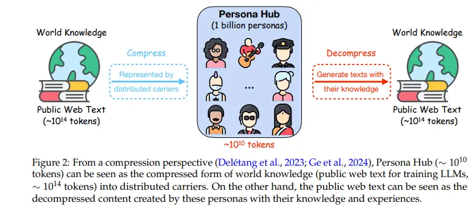
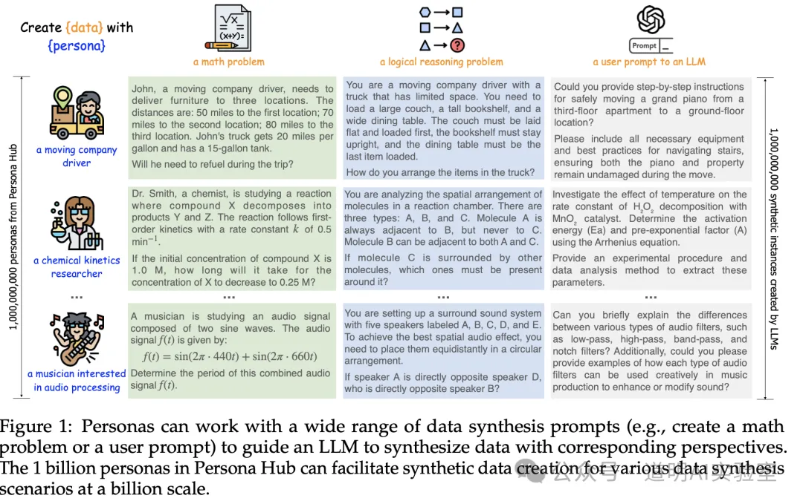
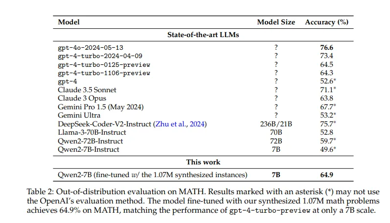

# 1. 资源

- 论文地址：https://arxiv.org/abs/2406.20094
- Github地址：https://github.com/tencent-ailab/persona-hub

腾讯 AI Lab 的研究人员推出了一个名为 Persona Hub 的包含十亿个人设的数据集，并提出了一种基于人设驱动的合成数据生成方法，以解决传统方法在多样性和规模上的局限性，从而提升大型语言模型的训练效果。

# 2. 背景

合成数据生成的主要挑战在于大规模创建多样化数据。传统方法通常难以同时保持多样性和可扩展性。实例驱动方法根据种子语料库生成新数据，但其多样性受限于原始数据集的多样性。关键点驱动方法试图通过利用精选的关键点列表来使合成数据多样化，但由于需要详尽的整理工作，因此难以在不同领域进行扩展。因此，这些方法通常无法生成可以涵盖广泛场景和用例的数据集。

当前的合成数据生成方法通常涉及实例驱动和关键点驱动方法。实例驱动方法使用种子语料库来创建新实例，但其多样性受到初始语料库的限制。关键点驱动方法依赖于全面的关键点列表，这很难进行详尽的整理，并且将范围限制在特定领域。这些方法虽然有用，但通常无法生成高级 LLM 训练和应用所需的足够多样化和可扩展的合成数据集。

# 3. 方法

来自腾讯 AI Lab 的研究人员推出了 Persona Hub，这是一种新颖的以人为本的数据合成方法。这种方法利用从网络数据中自动整理的 10 亿个不同角色的集合来生成合成数据。Persona Hub 允许 LLMs 从不同角度创建数据，从而增强多样性和可扩展性。通过将合成数据提示与特定角色相关联，该方法可以引导 LLMs 创建独特且多样化的数据集，从而克服先前方法的局限性。

Persona Hub 包含 10 亿个代表全球 13% 人口的人物角色，每个角色都具有独特的知识、经验、兴趣和职业。该集合可以通过使用特定角色提示 LLMs 来生成跨不同场景的合成数据。人物角色充当世界知识的分布式载体，引导 LLMs 生成多样化且上下文丰富的合成数据。研究人员开发了可扩展的方法，利用文本到角色和角色到角色方法从海量网络数据中导出这些角色。文本到角色方法从特定文本中推断角色，而角色到角色方法通过人际关系扩展角色多样性。

# 4. 实验

以人为本的方法产生了令人印象深刻的量化结果。研究人员创建了 50,000 道数学题、50,000 道逻辑推理题、50,000 条指令、10,000 篇知识丰富的文本、10,000 个游戏 NPC 和 5,000 个工具。在评估中，使用 107 万个合成数学问题进行微调的模型在 11,600 个实例的分布内测试集上达到了 79.4% 的准确率，优于所有测试的开源 LLMs。在 MATH 基准测试中，该模型达到了 64.9% 的准确率，与 gpt-4-turbo-preview 的性能相当，证明了通过以人为本的数据合成显着提高了 LLM 的能力。

研究人员强调了 LLM 性能的显着提高，以及以人为本的数据合成对 LLM 训练和开发的深远影响。通过利用 Persona Hub 中的 10 亿个角色，研究人员可以创建多样化的合成数据集，从而显着增强 LLM 的能力。该方法在各种数据合成场景中被证明是有效的，展示了其成为合成数据生成标准实践的潜力。

研究人员提出的以人为本的合成数据生成方法通过引入可扩展且多样化的方，解决了传统方法的局限性。Persona Hub 广泛的角色集合有助于创建丰富多样的合成数据，从而推动 LLM 训练和应用领域的发展。这种创新方法有望增强 LLMs 的能力并拓宽其在现实世界中的适用性。通过为合成数据生成的挑战提供强大的解决方案，这项研究有可能推动人工智能和机器学习领域的重大进步。

# 参考

[1] 腾讯的“10亿角色扮演”项目到底在说什么？，https://mp.weixin.qq.com/s/mlynNwvA-o3MjG74B3f2Vw
