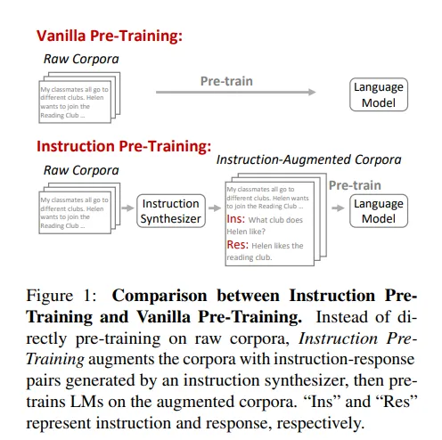
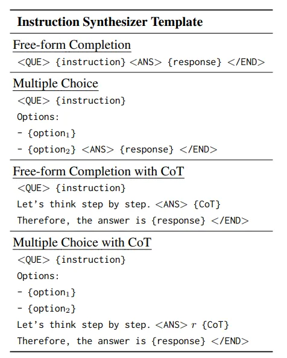
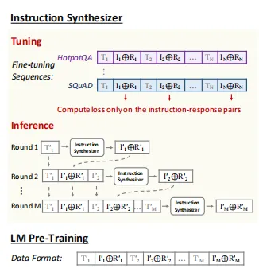
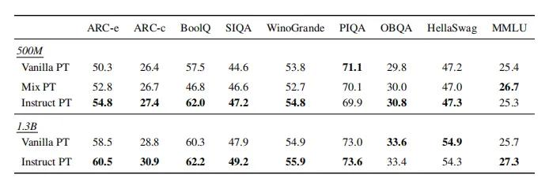
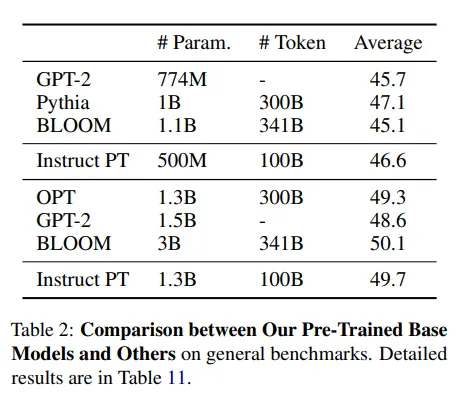
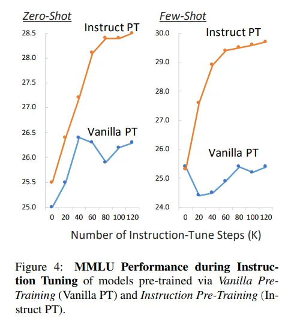
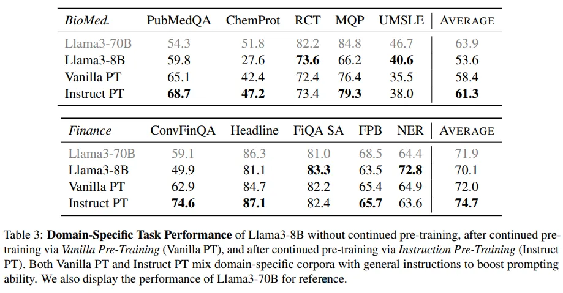
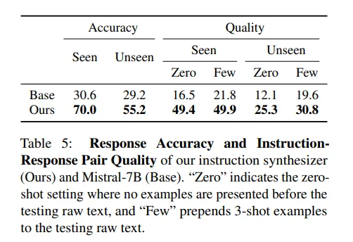
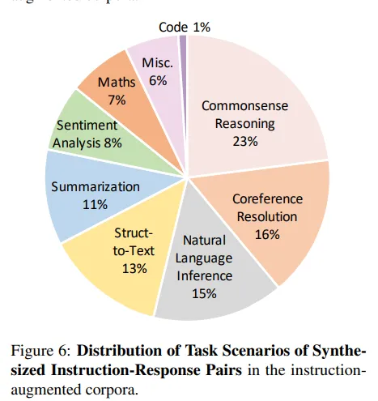

# 1. 资源

论文标题:
Instruction Pre-Training: Language Models are Supervised Multitask Learners

论文链接：
https://arxiv.org/pdf/2406.14491

github链接：
https://github.com/microsoft/LMOps

# 2. 简介

现在的大模型训练通常会包括两个阶段：

一是无监督的预训练，即通过因果语言建模预测下一个token生成的概率。该方法无需标注数据，这意味着可以利用大规模的数据学习到语言的通用特征和模式。

二是指令微调，即通过自然语言指令构建的多样任务对预训练模型进行微调，显著增强了任务泛化能力。

最近，微软与清华提出了指令预训练（Instruction Pre-Training）的新方法，该方法在第一阶段引入指令—响应对的数据，采用监督多任务学习来探索预训练语言模型的新途径。

指令预训练使Llama3-8B模型在部分领域上的表现甚至超越了Llama3-70B模型。

# 3. 方法

与传统的直接在原始语料库上进行预训练不同，指令预训练（ Instruction Pre-Training）通过使用指令合成器生成一组指令-响应对（instruction-response pairs）来增强每个原始文本，然后利用增强后的语料库对语言模型进行预训练。

这些增强的指令-响应对是基于大量原始语料库的内容合成的，确保了高知识覆盖率和正确性。因此指令预训练的核心就是如何构建一个指令合成器，下文将详细叙述这个过程。

## 3.1 指令合成器
简单来说，指令合成器的开发，需要先将广泛的现有数据集转换们需要的格式：每个示例包含原始文本以及一组指令-响应对。使用这些数据，然后微调语言模型，以基于相应原始文本生成指令-响应对。

与现有使用GPT-3等大型或专有模型合成数据不同，本文选用7B的开源模型，节省成本但性能不输大模型。合成的数据具有高度多样性，使得指令合成器能够泛化到未见过的数据。

## 3.2 数据收集

从基于上下文的任务完成数据集中抽样并格式化数据。每个数据样本的上下文作为原始文本，下游任务作为指示-响应对，模版如下图所示。这些上下文跨越各种领域，如百科全书、社交媒体和学术测试 ，任务包括共性推理和情感分析等各种领域。

## 3.3 微调

使用few-shot的方式微调指令合成器，如下图所示，一个样本包含一段原始文本以及它的指令响应对，多个样本序列相互连接。所有示例均从同一数据集中抽样，保障不同指示-响应对集合中的模式的一致性。

## 3.4 推理

在推理时，每一轮都将之前轮次的文本、指示-响应对前置到当前文本。这使得指示合成器能够基于先前示例生成新的指示-响应对。

## 3.5 语言模型预训练

在收集合成的指令-回应对之后，使用多样的模板使指令格 式多样化，并将每个原始文本与其指令-回应对连接起来。通过连接来自M轮的文本和指令对，为后续的预训练创建了一个M次示例。

除了预训练数据外， 指令预训练保持所有其他预训练设置与一般预训练相同，同样使用下一个Token预测目标进行 训练，并在所有Token上计算损失。

作者同样进行了从零开始的常规预训练和领域自适应的持续预训练（Domain-Adaptive Continual Pre-Training），以验证在不同预训练场景中的有效性。

# 4. 实验结果

## 4.1 指令预训练 VS 常规预训练

指令预训练表现出强大的泛化性

作者在不同规模的模型上使用不同的数据进行与训练，结果如下表所示。Vanilla PT代表常规的预训练方式，Instrcut PT是本文所提出的方法，Mix PT将一般预训练使用的原始语料库与指令合成器的微调数据混合在一起。

与Vanilla PT相比，混合了指令合成器的微调数据的Mix PT有所提升。而Instrcut PT则在大多数评估数据集上实现了更好的性能。另外指令合成器的微调数据中不包含任何评估数据集，但却在未见过的数据集上表现良好，展示出强大的泛化性。

指令预训练在不同模型规模上具有一致的数据效率。

另外，当将Instrcut PT与其他开源模型比较时，Instrcut PT以较少的参数量与token花费得到了不错的性能。如下表所示：

使用100B个tokens，500M参数的Instrcut PT,达到了Pythia-1B使用300B tokens的性能，而使用100B个tokens，1.3B参数的Instrcut PT达到了BLOOM-3B使用341B个tokens训练的性能。

Instrcut PT有望减少微调的步骤数量。

通过对比Vanilla PT与Instrcut PT在zero-shot 和 few-shot下的表现，如下图所示，随着步骤增长，Instrcut PT稳步提升。

作者认为，指令预训练与指令调优阶段的任务更紧密对齐，有助于在预训练和微调之间实现顺畅的过渡。这种紧密的对齐使得模型能够更高效地学习下游任务，从而有望显著减少进一步微调的步骤数量。

## 4.2 指令预训练 VS 领域自适应持续预训练

所谓领域自适应持续预训练就是使用领域语料（本文中使用生物医学领域和金融领域）对语言模型进一步逐步预训以使其适应一系列领域。

这里作者展示了经由Vanilla PT持续预训练后，以及经由Instruct PT持续预训练后的效果。还展示了Llama3-70B的表现作为参考，如下表所示：

Instruct PT在几乎所有领域特定任务上始终表现优于Vanilla PT。使用Instruct PT进行持续预训练大大提升了 Llama3-8B 的领域特定表现，达到与甚至超过 Llama3-70B 的水平。

在金融 NER 基准测试中，Instruct PT表现不及 Vanilla PT，表现出相当大的方差，甚至Llama3-70B 不如 Llama3-8B，表明此基准测试可能不够可靠。

## 4.3 评估指令合成器生成质量

在本文中起关键作用的是前文介绍的指令合成器，能够生成任何原始文本的指令-响应对。因此，作者在已见数据集和未见数据集上评估了指令合成器的性能。

响应准确性

为了评估生成响应的准确性，作者给定原始文本和任务指令，使指令合成器生成一个响应，然后计算生成的响应与黄金响应之间的 F1 相似度以评估响应准确性。

由于该指令合成器是从基础 Mistral-7B 模型微调而来的。为了比较，作者对比基础模型的结果。如下表所示：

可以看到，微调的合成器在已知和未知数据集上明显优于基础模型。

指令-响应对质量

该评测是给定原始文本，指令合成器生成一组指令-响应对。与基础模型相比，微调的合成器在零样本、少样本、已知和未知数据集这四个维度上显著优于基准。

# 参考

[1] 微软&清华提出全新预训练范式，指令预训练让8B模型实力暴涨！实力碾压70B模型，https://mp.weixin.qq.com/s/y21ii5AxErt-x3mFsAXW2w
