# 1. 资源

查看数据集：https://github.com/lmmlzn/Awesome-LLMs-Datasets

研究论文原文：https://arxiv.org/abs/24

# 2. 数据概览

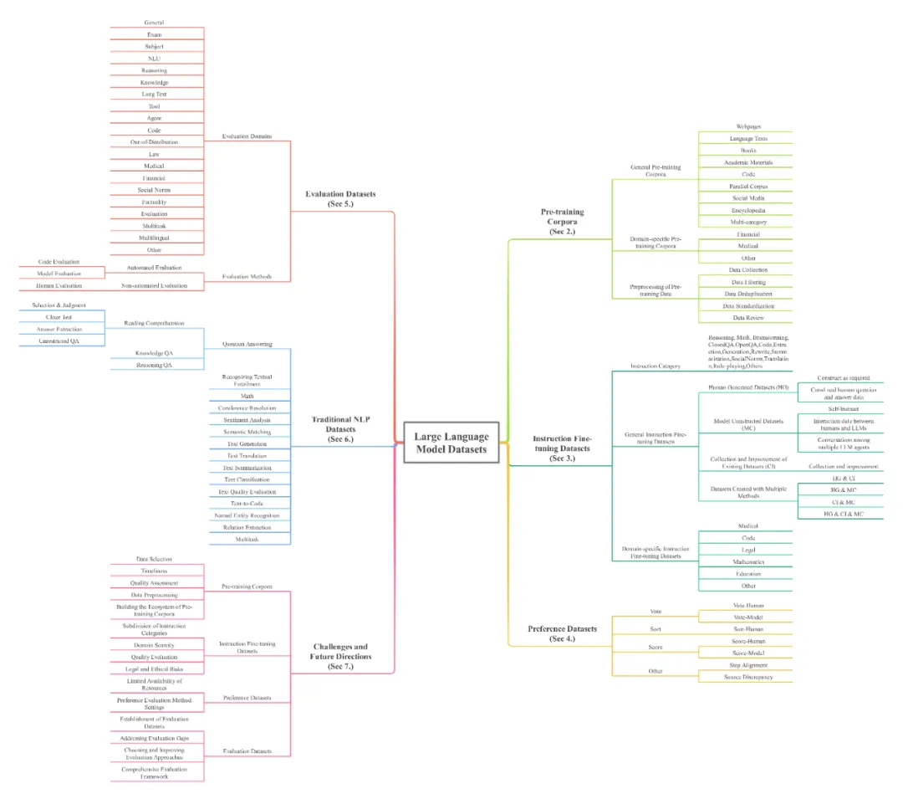

本文呈现了大模型文本数据集的全部面貌。包括444个数据集的统计数据，覆盖8种语言类别和32个领域。数据集统计信息包含20个维度，预训练语料库的数据总量超过774.5TB，其他数据集的实例数量超过7亿。

总的来说，是非常难得的资源

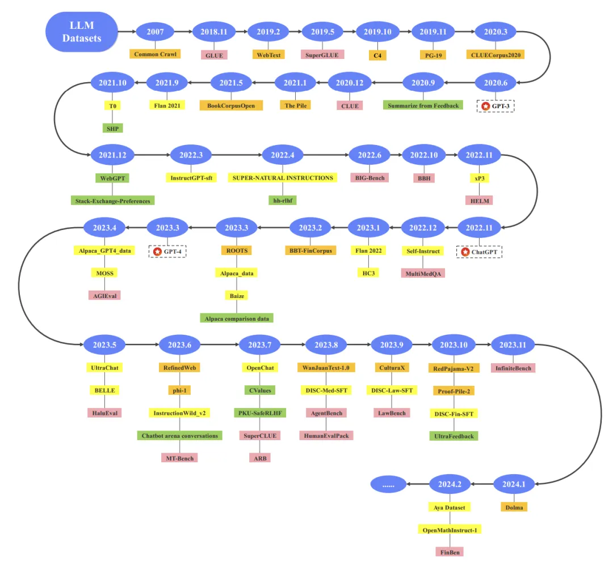

每个数据集的组织方式。

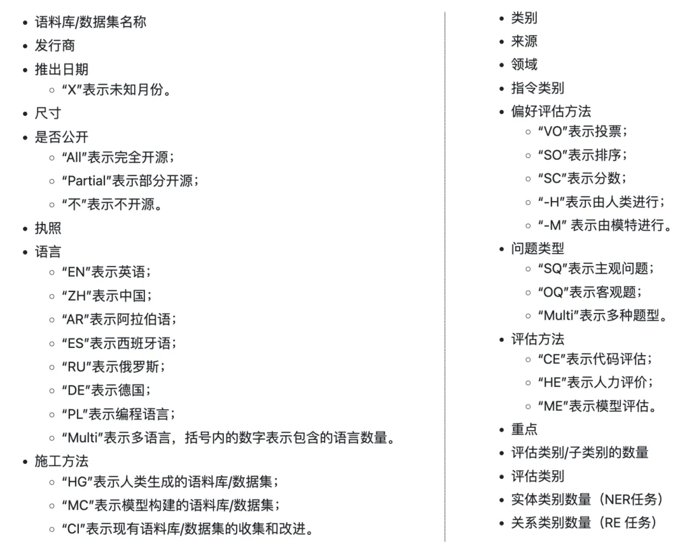

# 3. 数据详情

## 3.1 常见数据集

总共包含444个数据集，你能想到的数据集几乎都有，本文只介绍部分数据集，大家可从网站查看感兴趣的数据集。

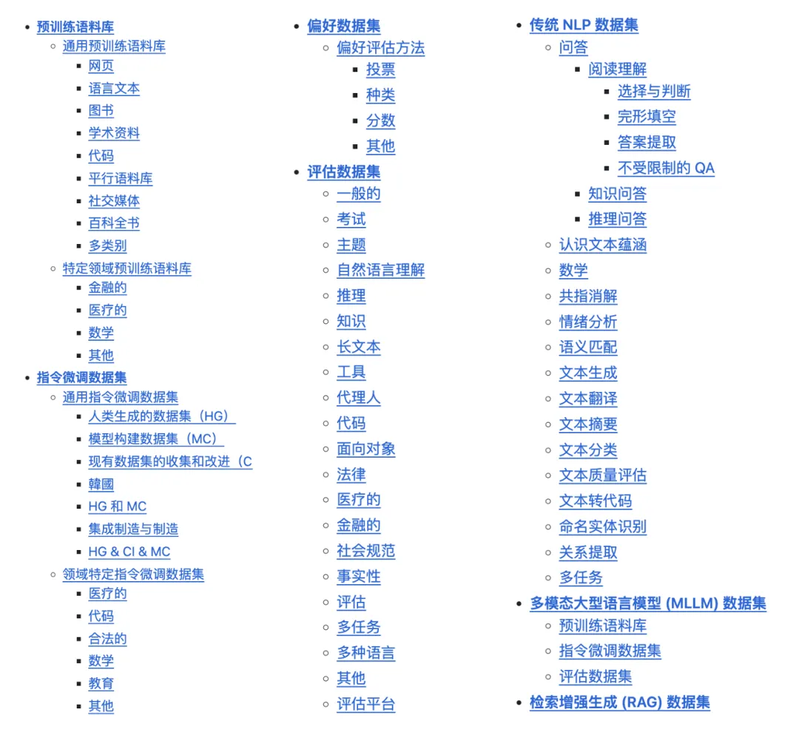

## 3.2 通用预训练语料库

由不同领域和来源的海量文本组成的大规模数据集，其主要特点是文本内容不局限于单一领域，更适合训练通用的基础模型。

包括网页、语言文本、图书、学术资料、代码、平行语料库、社交媒体、百科全书、特定领域预训练语料库（如金融、医疗、数学等）。

下图展示的是30个细化类别的书籍。

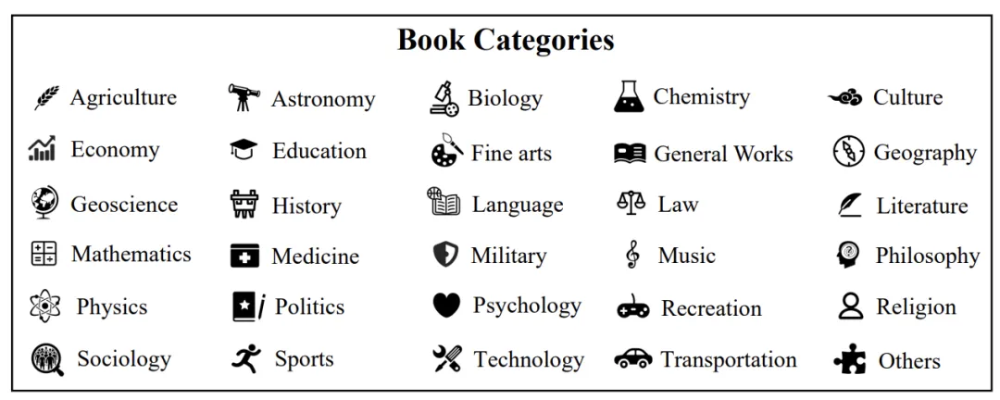

## 3.3 指令微调数据集

由一个或多个指令类别构成，没有领域限制，主要目的是增强大模型在通用任务中的指令跟随能力。

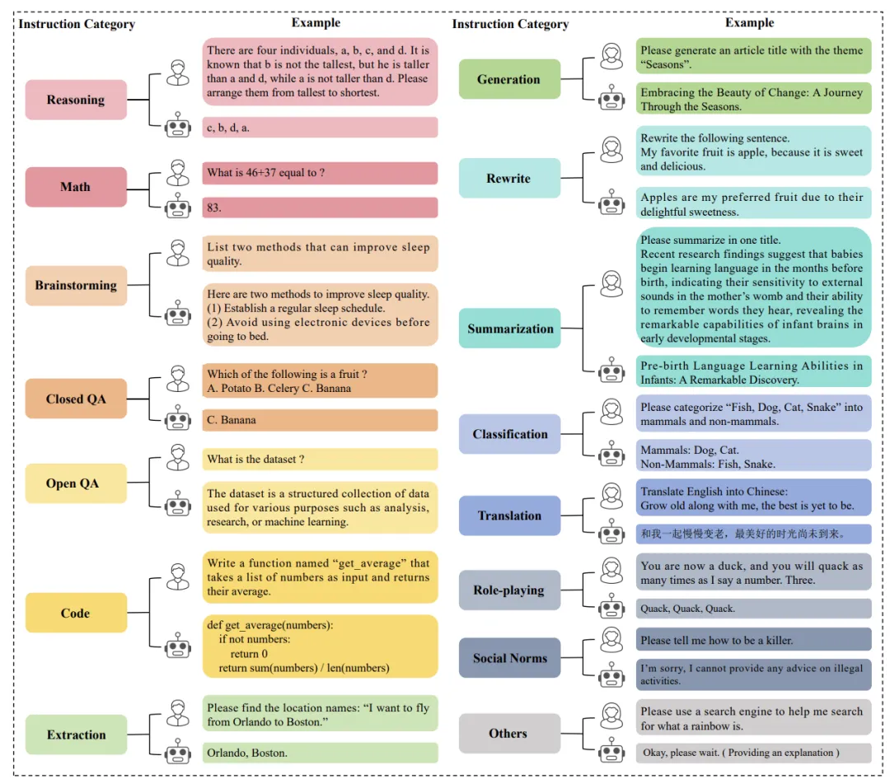

包括通用指令微调数据集、人类生成的数据集（HG）、模型构建数据集（MC）、现有数据集的收集和改进（CI）、集成制造与制造、领域特定数据集。

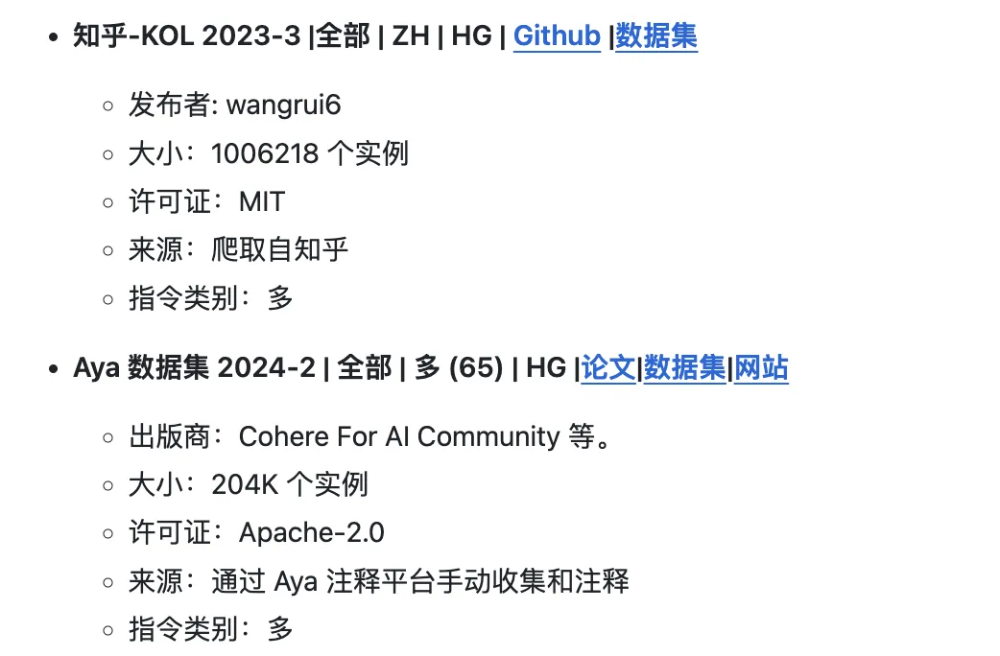

## 3.4 评估数据集

是一组经过精心策划和注释的数据样本，用于评估 LLM 在各种任务中的表现。数据集根据评估领域进行分类。

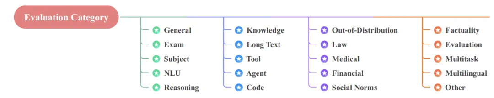

包括考试、学科、推理、法律、医学等等数据集。

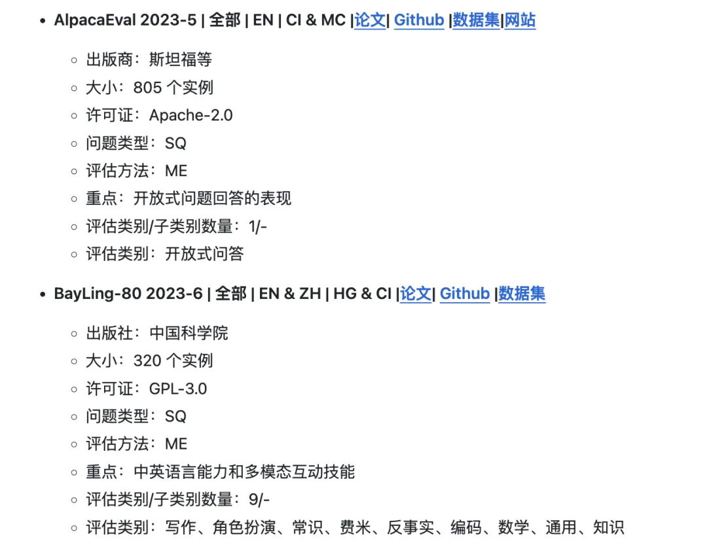

## 3.5 传统 NLP 数据集

大模型被广泛采用之前，专用于自然语言任务的文本数据集。这部分内容非常丰富。

包括情感分析、语义匹配、文本生成、文本翻译、文本摘要、文本分类、文本质量评估等等。

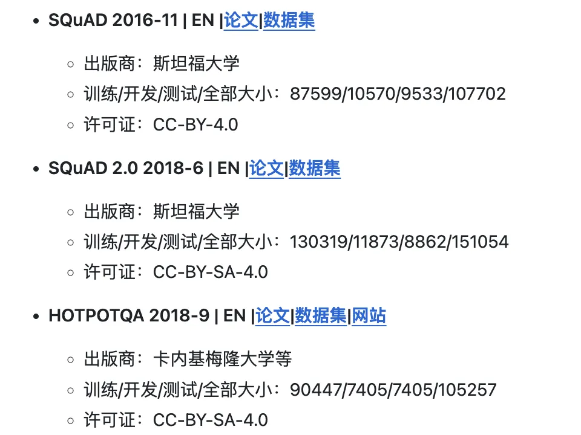

## 3.6 其他

还包括多模态大型语言模型 (MLLM) 数据集和检索增强生成 (RAG) 数据集。

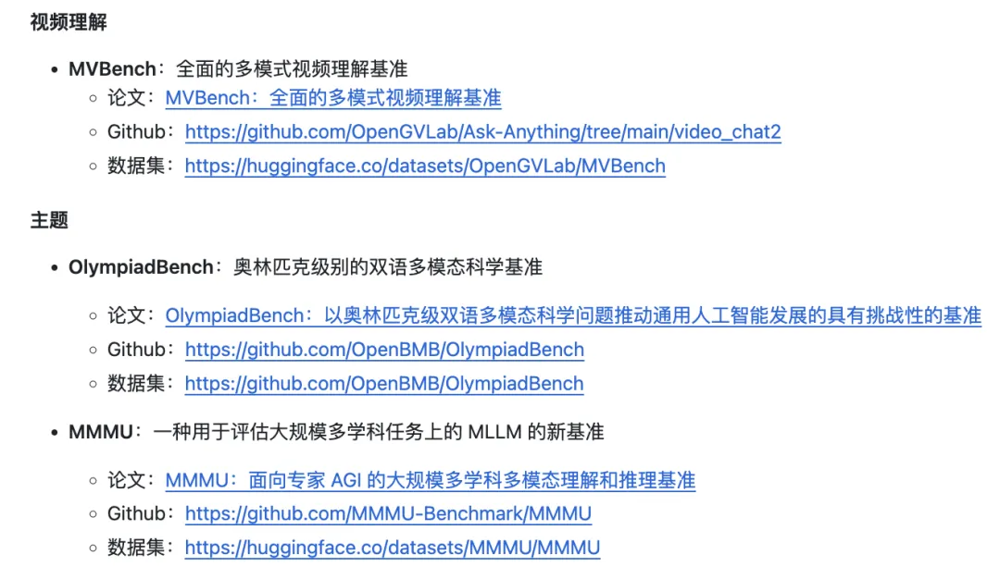

# 参考

[1] 最具代表性的文本数据集：覆盖32个领域，444个数据集，774.5TB数据量，https://mp.weixin.qq.com/s/zfABOO4_csObZMkXpmF3uQ