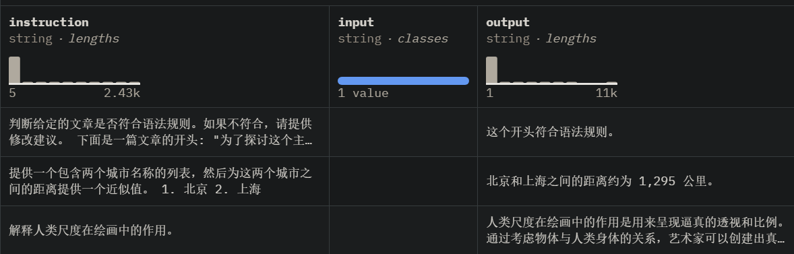

# 1. 中文
## 1.1 综合数据

1. BelleGroup/train_1M_CN
   - https://huggingface.co/datasets/BelleGroup/train_1M_CN
   - 917k条， 458M
   -  

2. MOSS数据
   - Github: https://github.com/OpenLMLab/MOSS/tree/main/SFT_data
   - https://huggingface.co/datasets/fnlp/moss-003-sft-data
   - 3G
   - 
   - 

3. c-s-ale/alpaca-gpt4-data-zh
   - https://huggingface.co/datasets/c-s-ale/alpaca-gpt4-data-zh
   - license: cc-by-sa-4.0
   - 48.8k条，35.1M
   - 论文：Instruction Tuning with GPT-4
   - 

4. FlagInstruct
   - 智源开源数据
   - Github: https://github.com/FlagOpen/FlagInstruct
   - Data: https://huggingface.co/datasets/BAAI/COIG/tree/main
   - 翻译指令：67,798
   - 考试指令：63,532, CoT数据
   - Human Value Alignment Instructions (34,471)
   - Counterfactural Correction Multi-round Chat (13,653)：平均5轮对话
   - Leetcode Instructions (11,737)

5. Alplca_zn_51k
   - https://github.com/enze5088/Chatterbox/tree/main/docs/datasets

6. Firefly-train-1.1M
   - (建议从Huggingface下载，modelscope存在问题) https://huggingface.co/datasets/YeungNLP/firefly-train-1.1M
   - Github (3.6k stars) https://github.com/yangjianxin1/Firefly
   - 模型（使用LLM pruner对Bloom词表裁剪，仅取出常用的中英文词表，大大降低了模型参数量）：https://huggingface.co/YeungNLP/firefly-bloom-1b4
   - 
   - 收集了23个常见的中文数据集，对于每个任务，由人工书写若干种指令模板，保证数据的高质量与丰富度，数据量为115万 。数据分布如下图所示：
   - 
   - 训练数据集的token长度分布如下图所示，绝大部分数据的长度都小于600：
   - 

7. 千万级指令微调数据集 InfinityInstruct
   - 数据集开源地址：
      - Flopsera: http://open.flopsera.com/flopsera-open/details/InfinityInstruct
      - DataHub: https://data.baai.ac.cn/details/InfinityInstruct
      - Huggingface: https://huggingface.co/datasets/BAAI/Infinity-Instruct
   - 300 万条经过模型验证的高质量中英文指令数据
   - 包括 Infinity-Instruct-7M 基础指令数据集和 Infinity-Instruct-Gen 对话指令数据集

8. IndustryInstruction1.0
   - 通过先进的数据合成技术，完成了包含汽车、航空航天、人工智能、交通运输、科技与研究、旅游与地理、住宿与餐饮、法律与司法、金融与经济、文学与情感、医学医药、教育与数学在内的10个新增行业领域的指令数据集通过先进的数据合成技术，完成了包含汽车、航空航天、人工智能、交通运输、科技与研究、旅游与地理、住宿与餐饮、法律与司法、金融与经济、文学与情感、医学医药、教育与数学在内的10个新增行业领域的指令数据集IndustryInstruction1.0
   - IndustryInstruction1.0: Flopsera：http://open.flopsera.com/flopsera-open/data-details/IndustryInstruction
   - Huggingface：https://huggingface.co/datasets/BAAI/IndustryInstruction
   - Datahub：https://data.baai.ac.cn/details/BAAI-IndustryInstruction
   - 采用较一般文本转QA对的方式更加先进的合成方式，提出了使用<预训练语料>合成，使用<行业名称>合成，使用<行业人物描述>+<行业名称>生成三种模式混合的方法，构建出指令种类分布更加广泛，更适合行业工作场景的高效指令数据集。
   - 通过使用Deita方法和RW模型分别对指令复杂性和回复质量，以及回复偏好性对生成的行业指令数据进行质量筛选，保证了本次指令数据集的高质量。

## 1.2 对话数据

1. 中文闲聊语料库LCCC
   - 论文名称：《A Large-Scale Chinese Short-Text Conversation Dataset》
   - 论文链接：https://arxiv.org/abs/2008.03946
   - 项目地址：https://github.com/thu-coai/CDial-GPT
   
   

2. ShareGPT
   - https://sharegpt.com/
   - 使用多轮对话历史记录,包括约9w条来自人类的提问和来自ChatGPT和其他聊天机器人的回复。
     我们通用能力的评测指标为MT-Bench。

3. Magpie-Qwen2-Pro-200K-Chinese：
   - https://modelscope.cn/datasets/AI-ModelScope/Magpie-Qwen2-Pro-

## 1.3 问答数据

1. 百度问答100w
   - https://github.com/CyberCommy/baidu-qa-100w

2. 知乎问答
   - https://huggingface.co/datasets/wangrui6/Zhihu-KOL
   
## 1.4 特定类别
### 1.4.1 代码
1. Code Alpaca
   - https://github.com/sahil280114/codealpaca
   - 旨在构建一个遵循指令，生成代码的LLaMA模型，构建方式完全基于Stanford Alpaca，
      包含20K对的代码数据，我们代码生成的评测指标为HumanEval。

### 1.4.2 数学
1. GSM8K RFT 
   - https://huggingface.co/datasets/gsm8k
   - https://arxiv.org/pdf/2110.14168v1.pdf
   - 是一个增强的数学推理数据集，它基于GSM8K数据集[4]并结合RFT策略整合了多条推理路径。
     训练集中包含7.5K个问题和110K个回答，我们所有实验数学的评测指标为GSM8k测试集分数。
   
2. YeungNLP/school_math_0.25M
   - https://huggingface.co/datasets/YeungNLP/school_math_0.25M
   - 25w, Belle开源

### 1.4.3 字词错误检测、纠正和文本润色

1. 序列猴子
   - 出自出门问问
   - 各5000条
   - 下载：http://share.mobvoi.com:5000/sharing/HXB6QPLAi

### 1.4.4 古诗

1. 序列猴子
   - 古诗今译
   - 出自出门问问
   - 共计逾680,000首
   - 下载：http://share.mobvoi.com:5000/sharing/WNpEqItCg

## 1.5 专有领域

1. 医疗类数据
   - https://huggingface.co/datasets/shibing624/medical
   - 预训练362k条，约1G
    
   - 微调2.07M条
     
   - 奖励模型4k条
     

2. 保险行业语料
   - Github (1k): https://github.com/chatopera/insuranceqa-corpus-zh
   
## 1.6 长上下文数据

## 1.8 语义消歧

1. 对话重写：
   - 1.64M 个数据
   - https://huggingface.co/datasets/infgrad/dialogue_rewrite_llm

2. 【utterance-rewriter 多轮会话改写数据】 
   - 2w个实例 微信人工智能模式识别中心（腾讯） 多轮对话中的共指关系和信息缺失问题的数据集和传统重写模型 
   - https://github.com/liu-nlper/dialogue-utterance-rewriter/tree/master
   - 数据格式: 
   - ```text
     question1 answer1 question2 question2_rewrited
     能给我签名吗 出专辑再议 我现在就要 我现在就要签名
     iphonex好不好 iphone不好用 为什么不好用 iphonex为什么不好用
     西安天气 西安今天的天气是多云转小雨25度到35度东北风3级 明天有雨吗 西安明天有雨吗
     秦始皇活了多久 50岁我确定 为什么 为什么确定秦始皇活了50岁
     ```

***

# 2. 英文

## 2.1 对话数据

1. ultrchat
   - https://huggingface.co/datasets/YeungNLP/ultrachat
   - 清华大学140w+对话数据

2. 200K-ChineseMagpie-Qwen2-Pro-200K-English：
   - https://modelscope.cn/datasets/AI-ModelScope/Magpie-Qwen2-Pro-200K-English

3. WildChat：
   - https://www.modelscope.cn/datasets/thomas/WildChat

## 2.2 特定类别
### 2.2.1 复杂指令

1. WizardLM_evol_instruct_V2_143k 
   - https://huggingface.co/datasets/YeungNLP/WizardLM_evol_instruct_V2_143k
   - 复杂指令143k

## 2.3 长上下文数据

1. Yukang/LongAlpaca-12k
   - 12k数据量， shortQA 3k, LongQA 9k
   - context length from 8k to 100k
   - https://huggingface.co/datasets/Yukang/LongAlpaca-12k/viewer

2. THUDM/LongWriter-6k
   - 6k数据量
   - https://huggingface.co/datasets/THUDM/LongWriter-6k
   - 论文：LongWriter: Unleashing 10,000+ Word Generation from Long Context LLMs
   - LongWriter-GLM-9B是智谱基于GLM4-9B(https://www.modelscope.cn/models/ZhipuAI/glm-4-9b)模型，通过构建长输出的训练数据而得到的模型
   - 从中选出了10%左右（666条）的高质量数据并基于这些数据做微调训练。在Qwen2-7b-instruct和GLM4-9B-Chat两个模型上，只需要3.7%训练计算消耗，就能获取了和原论文中，LongWriter-GLM-9B类似的性能提升

3. 精筛后的666条数据集构成的LongWriter-6K-Filtered数据集：（对上面的筛选）
   - https://www.modelscope.cn/datasets/swift/longwriter-6k-filtered

4. long-llm 
   - https://huggingface.co/datasets/namespace-Pt/projects/resolve/main/long-llm.tar.gz

# 参考

[1] 动手做个DialoGPT：生成式多轮对话模型, https://blog.csdn.net/xixiaoyaoww/article/details/108656532
[2] 百度QA100万数据集, https://mp.weixin.qq.com/s/SJQX2tNJ5kz3--ReWAbZDg
[3] 智源研究院行业数据集2.0升级发布，新增10类行业指令数据, https://mp.weixin.qq.com/s/EvW96o7hc4FBhjz2kY76HQ
